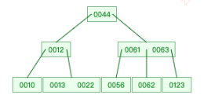
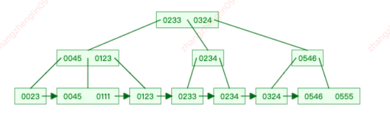

### 思想

1. 时间或空间复杂度

    从低阶到高阶有：O(1)、O(logn)、O(n)、O(nlogn)、O(n2)，几乎所有的都逃不开这几个。

    1. 最坏情况时间复杂度：代码在最理想情况下执行的时间复杂度。
    2. 最好情况时间复杂度：代码在最坏情况下执行的时间复杂度。
    3. 平均时间复杂度：用代码在所有情况下执行的次数的加权平均值表示。
    4. 均摊时间复杂度：在代码执行的所有复杂度情况中绝大部分是低级别的复杂度，个别情况是高级别复杂度且发生具有时序关系时，可以将个别高级别复杂度均摊到低级别复杂度上。基本上均摊结果就等于低级别复杂度。

2. 为什么数组要从 0 开始编号，而不是从 1 开始呢？

    从数组存储的内存模型上来看，“下标”最确切的定义应该是“偏移（offset）”。前面也讲到，如果用 a 来表示数组的首地址，a[0]就是偏移为 0 的位置，也就是首地址，a[k]就表示偏移 k 个 type_size 的位置，所以计算 a[k]的内存地址只需要用这个公式：

    `a[k]_address = base_address + k * type_size`

    而如果是 1 开始的话，要 k-1 \* 了，这样的话会多运算一次

    JVM 标记清除垃圾回收算法的核心思想就是，删除并不是真正的删除，而是标记它为已经删除，当没有更多的空间存储的时候，再触发一次真正的删除操作，减少数组里的移位。

    不足：

    1. 效率问题。标记和清理效率都不高，但是当知道只有少量垃圾产生时会很高效。
    2. 空间问题。会产生不连续的内存空间碎片。

3. 如何实现一个 LRU 缓存淘汰策略呢？

    1. 使用数组，简单方便，而且只有几十个数据，性能差距不大。

        进一个新数据，去数组里找它，找到了先 splice 出来，然后 unshift。

        如果没有找到，看数组长度，如果不够，就直接 unshift。如果已经够了，就 pop(),然后 unshift。

    2. 使用双向循环链表+散列表。

    这样的话，性能会更高。维护一个几十个数据的散列表。这样查询就是 O(1),删除，插入，都是 O(1)。但是空间复杂度是 O(n);

4. 递归需要满足的条件

    递归是一个非常重要的思考方式 递归的主要方式是要找到最小子式，就说这个式子具有通适性 其次呢是要找到递归基，就说终止的条件。 通常呢，分为减而治之，和分而治之。 如动态规划而言，其实是都需要用到的。

    1. 一个问题的解可以分解为几个子问题的解
    2. 这个问题与分解之后的子问题，除了数据规模不同，求解思路完全一样
    3. 存在递归终止条件
       写递归代码的关键就是找到如何将大问题分解为小问题的规律，并且基于此写出递推公式，然后再推敲终止条件，最后将递推公式和终止条件翻译成代码。

5. 递归和循环的区别

    递归要警惕递归爆栈，因为函数调用会用栈来保存临时变量，如果层级很深的话，一直压入栈，就会有堆栈溢出的风险。

    避免重复计算，可以通过一个数据结构（比如散列表）来保存已经求解过的 f(k)。当递归调用到 f(k)时，先看下是否已经求解过

    在时间效率上，递归代码里多了很多函数调用，当这些函数调用的数量较大时，就会积聚成一个可观的时间成本。在空间复杂度上，因为递归调用一次就会在内
    存栈中保存一次现场数据，所以在分析递归代码空间复杂度时，需要额外考虑这部分的开销，比如我们前面讲到的电影院递归代码，空间复杂度并不是 O(1)，而是 O(n)。

    用循环因为没有临时压栈，就不会爆

### 动态规划

[动态规划自己的文章](https://segmentfault.com/a/1190000039277735)

1. 跳青蛙高级斐波那契

    一只青蛙一次可以跳上 1 级台阶，也可以跳上 2 级……它也可以跳上 n 级。求该青蛙跳上一个 n 级的台阶总共有多少种跳法。

    ```js
    /*
    f(0) = 1;
    f(1) = 1;
    f(2) = f(1) + 1;
    f(3) = f(3-1) + f(3-2) + f(3-3) = 4
    f(4) = f(4-1) + f(4-2) + f(4-3) + f(4-4) = 4 + 2 + 1 + 1 = 8
    f(n) = f(n-1) + f(n-2) + f(n-3) + 。。。。f(n-n)
    f(n-1) = f(n-2) + ...
    f(n) = f(n-1) + f(n-1) = 2 \* f(n - 1);
    */
    function jumpFloorII(number) {
        if (number < 1) return 0;
        if (number === 1) return 1;
        return 2 * jumpFloorII(number - 1);
    }
    ```

2. 打家劫舍问题

    `dp[n] = Max(dp[n-1], dp[n - 2] + nums[n])` 

3. 硬币问题

    `dp[n] = dp[n] + dp[n - coins[j]];`

    硬币问题可以假设只有一个硬币，假设是 3

    那么dp8
    - 选它, 就是`dp[8-3=5] + currentCount`
    - 不选它就是`currentCount`

    那么多个硬币，只能走一次循环，因为每次都重来的话，会出现 1，5 5，1 算两次的情况。

    所以默认的循环就是从少到多，比如

    5,8 两个硬币，值为 13

    那么第一次走 5 硬币，除了 `dp[5]= 1,dp[10] = 1`,其他都是 0

    而第二次走 8 硬币，`dp[8] = 1,dp[13] = 0 + dp[5] = 1`;

    dp 初始化为 0，然后第一个是 1,比如，`dp[5] = 0 + dp[0]`。它是 1

4. 鸡生蛋蛋生鸡

    简化版
    自繁殖永生鸡，第一天有一只母鸡，每天都能下一只小母鸡，每只小鸡 3 天后都能成熟，然后第 4 天又能下小母鸡，问 N 天后有多少只鸡？

    ```js
    // f(1) = 1;
    // F(2) = 2;
    // F(3) = 3；
    // f(4) = 3 + 1 = 4;
    // f(5) = 4 + 2
    // 1大
    // 1大 1小-1
    // 1大 1小-1  1小-2
    // 1大 1小-1  1小-2 1小-3 = 1大
    // 2大 2小-1 1小-2  1小-3 = 1大
    // F(n) = 前一天的鸡f(n-1)  加上当前所有成熟的鸡下的数量，也就是3天前鸡的个数f(n-3)
    function getchick(n) {
        if(n < 4) {
            return n;
        }
        Var s1 = 1; s2=2;s3 = 3;
        for(var i = 4; i < n; i++) {
            var res = s1 + s3;
            s1 = s2;
            s2 = s3;
            s3 = res;
        }
        return res;
    }
    ```

    复杂版： 这次这个鸡，每天只能下蛋，然后呢，这个蛋要孵化 3 天，然后小鸡再 3 天，才能下蛋。所以 N 天 有多少只鸡

    ```js
    // f1 = 1;  1鸡
    // F2 = 1; 1鸡+ 1蛋-1
    // F3 = 1; 1 鸡 + 1蛋-1 + 1蛋-2
    // F4 = 2; 1鸡 + 1蛋-1 + 1蛋-2 + 1蛋-3 = 1小-1
    // F5 = 3; 1鸡 + 1小-1 + 1蛋-1 + 1蛋-2 + 1蛋-3 =1 小-1
    // F6 = 4; 1鸡 + 1小-1 + 1小-2 + 1蛋-1 + 1蛋-2 + 1蛋-3 =1 小-1
    // F7 =  5； 1鸡 + 1小-1 + 1小-2 + 1小-3 + 1蛋-1 + 1蛋-2 + 1蛋-3 =1 小-1
    // F8 = 6； 2鸡 + 1小-1 + 1小-2 + 1小-3 + 2蛋-1 + 1蛋-2 + 1蛋-3 =1 小-1
    // Fn = fn - 1 前一天鸡的数量 加上 能新孵化出鸡的成熟蛋并且又成熟的鸡，也就是6天前的鸡的数量 f(n-6)
    function getC(n) {
        var arr = [1, 1, 1, 2, 3, 4, 5];
        for (var i = 7; i < n; i++) {
            arr[i] = arr[i - 1] + arr[i - 6];
        }
        return arr[n];
    }
    ```

### 二叉树

```js
function TreeNode(val, left, right) {
    this.val = val === undefined ? 0 : val;
    this.left = left === undefined ? null : left;
    this.right = right === undefined ? null : right;
}
```

1. 前序遍历 DFS

    先中间节点，再左节点，如果有左节点继续，如果没有了跳出，访问右边节点

[filename](../algorithm/preorder.js ':include :type=code')

2. 中序遍历

    先左节点，然后中节点，然后右边节点。

[filename](../algorithm/inorder.js ':include :type=code')

3. 后序号遍历

    先左，后右，然后中

    后序的思路就是把左右中 反转成 中右左， 最后反转数组。

[filename](../algorithm/backorder.js ':include :type=code')

4. 层次遍历 BFS

    层次遍历就是一层一层的遍历，不存在逆序的情况，实现方式就是使用队列的方式,每次取队头，压队尾

    ```js
    function traverseCeng(root) {
        let arr = [];
        let crr = [root];
        while (crr.length) {
            let x = crr.shift();
            arr.push(x.val);
            x.left && crr.push(x.left);
            x.right && crr.push(x.right);
        }
        return arr;
    }
    ```

5. 根据前序遍历 + 中序遍历， 还原整颗树

    找到规律，就是前序遍历的第一个，就是树的顶点，那么拿这个顶点在中序数组中查找，找到了后，中序数组分割的左右。

    根据后序 + 中序是一样的道理，但是根据前序和后序是不可以的，除非是满 2 叉树，否则会有歧义

    ```js
    function buildTree(preorder, inorder) {
        if (!inorder.length || !preorder.length) return null;
        const fval = preorder.shift();
        const idx = inorder.lastIndexOf(fval);
        const node = new TreeNode(fval);
        const leftArr = inorder.slice(0, idx);
        const rightArr = inorder.slice(idx + 1);
        node.left = buildTree(preorder, leftArr);
        node.right = buildTree(preorder, rightArr);
        return node;
    }
    ```

6. 二叉搜索树

    根节点下标为 1，左孩子节点的下标，就是 i \* 2， 右孩子节点的下标，就是 i \* 2 + 1， 父节点都是 `Math.floor(i / 2)`

7. B 树， B+树

    数据库为啥都是 B 或 B+树，可以减少 IO 次数，主要因为数据量大，都在外存里。

    B 树也叫 B-树，这个减号不是减号，是分隔符

    和跳表是很像，跳表可能是参考 B+树弄出来的

    3阶B树
    

    M 阶树

    - 每个节点最多有 m 个子节点
    - 除了根节点和叶子节点之外，其他的每个节点最少有 m/2（向上取整）个孩子节点
    - 根节点至少有两个孩子节点，（除了第一次插入的时候，此时只有一个节点，根节点同时是叶子节点）
    - 所有的叶子节点都在同一层
    - 有 k 个子节点的父节点包含 k-1 个关键码

    假设有一个 5 阶 B 树，那么根节点的分支可以只有 2 个，至多有 5 个，其他的分支至少有 3 个，至多有 5 个

    每个节点最多有 4 个关键码，最少有 2 个关键码（根节点可以有 1 个）

    1. 所以插入的时候，会判断当前插入的位置的关键码是否超过了 4 个，如果超过了 4 个，就需要做 **上溢** 操作，去中位数，也就是 `idx = Math.floor(4 / 2)`的位置
       把中位数上移，它的左边的成为它的左孩子，右边成为它的右孩子，然后接着判断它上溢后的那一排是否需要再次上溢，直到根节点，如果根节点也上溢，树高就会加一。
    2. 删除的时候

8. B+ 树

    1. B+树改进了 B 树, 让内结点只作索引使用, 去掉了其中指向 data record 的指针, 使得每个结点中能够存放更多的 key, 因此能有更大的出度. 这有什么用? 这样就意味着存放同样多的 key, 树的层高能进一步被压缩, 使得检索的时间更短
    2. 当然了,由于底部的叶子结点是链表形式, 因此也可以实现更方便的顺序遍历, 但是这是比较次要的, 最主要的的还是第 1 点.

    3阶B+树
    

9. 红黑树

    // TODO
    后面再写吧，各种旋转

### 链表

1. 反转单链表问题

    遇到这样的问题，先不要慌，本质上很简单，有两种方法，一种是两两交换，一种是头插法

    1. 每次交换一个方向

        首先要声明一个 newHead 节点，默认是 null

        然后呢，while 当前的 node 存在

        因为等下 node.next 要改变方向，所以先存下来一个 next 作为临时变量

        存下来后，让 node.next 指向前面的 newHead，也就是 null

        然后让 newhead 和 node 都往后移一位即可。

        这样每次交换一个方向，最后的 newHead 就是尾巴节点。也就是新的头节点了。

        ```js
        let reverse = node => {
            let newHead = null;
            while (node) {
                // 临时取到next
                let next = node.next;
                // 指向改变
                node.next = newHead;
                // 统统往后移一位。
                newHead = node;
                node = next;
            }
            // 返回newHead
            return newHead;
        };
        ```

    2. 头插法

    采用头插法的话，需要先声明一个新的头结点。以及一个前置节点默认是 Null

    然后 while 循环 node

    同样要存下来 next，然后让 node.next 指向 pre。

    然后新的头节点的.next 就是 node。

    然后让前置节点和 node 都后移一位

    这样下次再进来，就是 node2,把它往前插。类似上面的换方向，但是思路不一样。

    ```js
    // 采用头插法
    let reverse = node => {
        let newHead = new NodeList();
        let pre = null;
        while (node) {
            let next = node.next;
            node.next = pre;
            newHead.next = node;

            pre = node;
            node = next;
        }
        // 返回newHead
        return newHead.next;
    };
    ```

### 排序

1. 快排

5. TopK 问题， 如何求解？

    求 TopK 类的问题，如果可以用内置函数的话，sort 直接就可以了，然后 slice

    如果不可以用内置的话，就采用快排的方式，快排就是比 target 小的放左边，比它大的放右边。时间复杂度是 O(nlogn);

    还可以用堆排序

6. 怎么建堆？

    一个数组，建立堆的时候，自下至上，这样可以用 O(nlogn)的方式完成建堆

    比如有 9 个数组，最小带叶根节点为 `Math.floor(9 / 2) - 1`;

    从它开始，判断它和孩子们大小，然后 swap。

    i -- 直到第一个元素建堆完成。

    本质上理解的方式，就是合并两个堆。

    删除的话，就是把第一个和最后一个交换，然后删除掉最后一个，对第一个进行 build

    插入的话，就把要插入的数据放在最前面，然后重建堆。？todo

### 字符串匹配

1. KMP

### 通用

1. 大数相加

[filename](../js/bigSum.js ':include :type=code')

2. 什么是摩尔投票算法？

    简单的来说，就是双方打仗，一换一，那么人多的那一方就会有人剩下来，也就会夺得最后的胜利。

    换成数组来说，那就是 1 2 1 2 2222 111 222 遇到不一样的，就互相抵消，遇到一样的，势力增加，显然，最后 2 获胜。

    [对应 leetcode 169 题](https://leetcode-cn.com/problems/majority-element/)

3. 需要需要分割 mid 的情况，到底是使用 math.floor 好还是 math.ceil 好？

    通常情况下，应该用 Math.ceil 好

    举个例子 [1,2].分割到这里的时候,

    如果用 ceil，那 mid=1.左边就是 slice(0,1) = [1]， 右边就是 slice(1) = [2]；

    这样分开后就是 [1] 和 [2]， 直接 return 即可

    如果用 floor,那 mid = 0,左边就是[],右边还是[1,2]。这样就不对了。就算可以把中间的割开，也最好用 ceil

    但是涉及到最大子序和这个，用 math.floor

4. avl 的平衡因子是怎么算的，自己背下来 leecode offer 55 题

    [leetcode55](https://leetcode-cn.com/problems/ping-heng-er-cha-shu-lcof/)

5. 查看二进制数里有多少个 1？

    可以拿这个数和 1 进行&操作，得到的值是 1，说明那个位就是 1，count++,然后 num 右移一位继续比较，出口条件是 num =0。

6. 篝火绕圈淘汰问题

    比如有 n 个人，从 0 开始，每次移动 m 位置，第 m 位置的那个人出局，问最后剩下的人的编号。

    这个题我看了几遍也没太能理解

    能记住的就是，当只剩下 2 个人的时候，用 m % 2,得到的编号就是最后留下的那个人，

    然后每次加一个人的时候，把这个编号加上 m 再次取余即可。

    干脆就记下来好了

    ```js
    var lastRemaining = function(n, m) {
        let result = 0;
        for (let i = 2; i <= n; i++) {
            result = (m + result) % i;
        }
        return result;
    };
    ```

7. 求两数之和，不准用加减乘除

    只能背下来这个公式了把。。。

    ```js
    var add = function(a, b) {
        if (a == 0) return b;
        if (b == 0) return a;
        return add(a ^ b, (a & b) << 1);
    };
    ```

8. 数组降维，写两个

    ```js
    while (arr.some(Array.isArray)) {
        arr = [].concat(...arr);
    }

    function flatMap(arr) {
        return arr.reduce(
            (pre, cur) => pre.concat(Array.isArray(cur) ? flatMap(cur) : cur),
            []
        );
    }
    ```

9. 柯里化

[filename](../js/currying.js ':include :type=code')

10. 判断一个数是不是 4 的指数幂

    ```js
    function is4mi(number) {
        const reg = /^10+$/;
        // 转换为4进制，如果只有10000+,那就是的，否则就不是的
        return reg.test(number.toString(4));
    }
    ```
