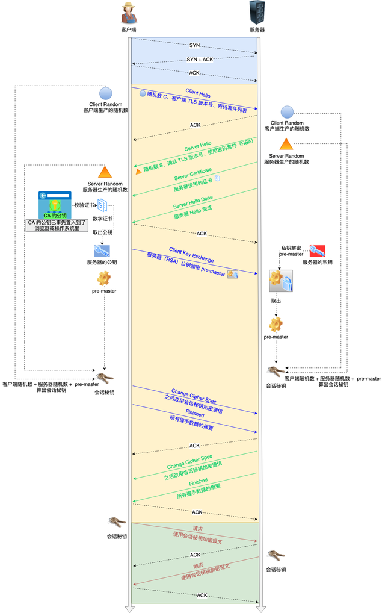

1. **UDP与TCP的区别**
<details open>

- **连接方式**  
  TCP是面向连接的协议，数据传输前需要通过三次握手建立连接，四次挥手释放连接。握手过程是：SYN → SYN-ACK → ACK；挥手过程是：FIN → ACK → FIN → ACK。  
  UDP则是无连接的协议，数据可以直接发送，不需要建立连接，适用于低延迟场景。

- **可靠性**  
  TCP通过序列号和数据分片编号，保证数据按顺序到达，利用ACK确认、超时重传和校验和等机制来确保数据的完整性和可靠性。  
  UDP不保证可靠性，数据可能丢失、乱序，适合实时性要求高但对丢包容忍的应用。

- **性能开销**  
  TCP头部大小为20字节（含选项字段可达60字节），包括序列号、确认号、窗口大小、校验和等字段。  
  UDP头部大小为固定8字节，仅包括源端口、目标端口、数据长度和校验和，因此具有较小的开销，适合需要高效数据传输的应用。

- **应用场景**  
  TCP常用于需要高可靠性的应用，如HTTP网页浏览、FTP文件传输、电子邮件（SMTP）。  
  UDP常用于对时延要求严格且容忍丢包的应用，如视频会议（Zoom）、DNS查询、在线游戏（实时动作游戏）。

---

2. **TCP滑动窗口机制**
<details open>

- **滑动窗口的作用**  
  通过滑动窗口，TCP实现流量控制和拥塞控制。接收窗口（rwnd）防止接收方缓冲区溢出，拥塞窗口（cwnd）控制发送方的发送速率，避免网络过载。实际发送窗口为`实际发送窗口 = min(rwnd, cwnd)`，保证数据在网络中平稳传输。

- **窗口收缩的场景**  
  在丢包的情况下，TCP会进行窗口收缩：
  - 如果出现三次重复ACK，cwnd会减半（进入快速恢复状态）。
  - 如果超时重传发生，cwnd会重置为1 MSS（进入慢启动重启状态）。
  另外，HTTP/2的多Stream机制会让窗口收缩影响所有请求的吞吐量，可能会导致全局性能下降。

- **窗口大小调优**  
  可以通过查看当前TCP窗口状态来进行调优，根据实际情况调整初始窗口大小，例如在高延迟网络中增加窗口大小。

---

3. **HTTP/2与HTTP/3的演进**
<details open>

- **HTTP/2的缺陷**  
  - TCP的队头阻塞问题：如果一个连接中有数据丢失，会导致整个连接中的所有Stream都被阻塞。  
  - 弱网情况下性能差：滑动窗口的收缩会导致所有请求的吞吐量下降。

- **HTTP/3（QUIC）的改进**  
  HTTP/3基于QUIC协议，相较于HTTP/2和传统TCP，具有以下优势：
  - **可靠性**：QUIC自定义了重传和排序机制，与TCP类似，但更加灵活。
  - **加密**：QUIC内置了TLS 1.3，支持0-RTT握手，而TCP则需要额外的TLS层。
  - **多路复用**：QUIC通过独立的Stream传输，避免了TCP中的队头阻塞问题。  
  - **连接迁移**：QUIC支持通过Connection ID保持连接，而TCP依赖于IP+端口来标识连接。

- **为什么QUIC选择UDP？**  
  1. **绕过中间设备干扰**：运营商常篡改TCP包头，使用UDP可以避开这些干扰。
  2. **灵活实现**：QUIC在用户态实现拥塞控制和流量管理，避免了TCP中因内核限制导致的瓶颈。

---

4. **弱网优化实战**
<details open>

- **启用TCP Fast Open（TFO）**  
  TFO可以在TCP握手阶段就开始发送数据，从而减少1-RTT的延迟。

- **调整拥塞控制算法**  
  可以通过调整系统的拥塞控制算法来优化网络传输，特别是高丢包网络中，使用BBR算法能显著提高传输效率。

- **HTTP/3部署示例（Nginx）**  
  在Nginx中启用HTTP/3支持，首先需要Nginx 1.25及以上版本，并在编译时添加`--with-http_v3_module`选项。

---

5. **综合对比表**
<details open>

- **HTTP协议版本对比**

| 特性           | HTTP/1.1           | HTTP/2            | HTTP/3（QUIC）       |
|----------------|--------------------|-------------------|----------------------|
| **底层协议**   | TCP                | TCP               | UDP                  |
| **并发能力**   | 6~8连接/域名       | 单连接多路复用     | 单连接多Stream       |
| **队头阻塞**   | 连接级             | TCP级             | 无                   |
| **握手延迟**   | 1~2 RTT            | 1~2 RTT           | 0~1 RTT              |

- **滑动窗口调优参数**

| 参数                 | 默认值            | 建议值（高延迟网络）|
|----------------------|-------------------|---------------------|
| **initcwnd**          | 10 MSS            | 20~30 MSS           |
| **tcp_window_scaling**| 1（启用）         | 1                   |
| **tcp_rmem_max**      | 212992字节        | 4194304字节（4MB）  |

---

6. **常用的 HTTP 状态码有哪些？**  
   <details open>

   - **2xx 请求成功**
     - **200 OK** 看的最多的，表示请求成功，服务器返回请求的内容。
     - **204 No Content** 请求成功，但是响应报文里不含实体的主体部分（比如 OPTIONS 请求就可以做 204）。(OPTIONS 也可以是 200，根据服务端来定。)
     - **206 Partial Content** 部分请求，比如在看B站的时候会有这样的请求，表示服务器只返回部分资源。

   - **3xx 重定向**
     - **301 Moved Permanently** 永久重定向，表示请求的资源已永久移动到新的位置，客户端应使用新的URI。
     - **302 Found** 临时重定向，表示请求的资源临时移动到新的位置，客户端继续使用原URI。301和302的区别在于，一旦设置了301，除非浏览器清除缓存，否则这个浏览器永远都会访问重定向的那个地址了；而302每次都会重新定向过去。
     - **304 Not Modified** 缓存，当客户端发起请求时，服务器返回此状态码表示资源未修改，可以使用缓存的版本。

   - **4xx 客户端错误**
     - **400 Bad Request** 请求报文语法错误，服务器无法理解请求。
     - **401 Unauthorized** 请求未授权，客户端需要进行身份验证。
     - **403 Forbidden** 被拒绝了，服务器理解请求但拒绝执行，通常是权限不足。
     - **404 Not Found** 找不到资源，表示请求的资源在服务器上找不到。
     - **405 Method Not Allowed** 请求方法不被允许（如使用POST时，资源不支持）。
     - **414 URI Too Long** 请求Url超长了
     - **413 Payload Too Large** 客户端发送的请求体（Payload）过大，服务器无法处理。请求body过大
     - **429 Too Many Requests** 请求过于频繁，超过了服务器设定的限制，客户端应等待一段时间再尝试。
     - **431 Request Header Fields Too Large** 请求头字段太大，服务器无法处理，通常是因为请求头（如Cookie）过大。

   - **5xx 服务器错误**
     - **500 Internal Server Error** 服务器内部错误，表示服务器发生了错误，无法完成请求。
     - **502 Bad Gateway** 网关错误，服务器作为网关或代理时，收到无效响应。
     - **503 Service Unavailable** 服务器服务不行了，表示服务器当前无法处理请求，通常是由于服务器过载或维护。
     - **504 Gateway Timeout** 超时，服务器作为网关或代理时，未及时从上游服务器获得响应。

---

7. **HTTP/1.1 协议中有哪些方法**  
    <details open>

   HTTP 方法的幂等性是指一次和多次请求某一个资源应该具有同样的副作用）（get 它本身不会对资源本身产生影响，因此满足幂等性。

   GET(幂等)、POST（非幂等）、HEAD（幂等）、PUT（幂等）、DELETE（幂等）、OPTIONS

---

8. **POST 与 GET 的区别**  
    <details open>

   - GET 请求会被浏览器主动 cache，而 POST 不会.
   - GET 请求只能进行 url 编码，而 POST 支持多种编码方式。
   - GET 参数通过 URL 传递，所以长度说有限制，而且因为在 URL 上，只能 ASCII 字符，POST 放在 Request body 中。
   - GET 比 POST 更不安全，因为参数直接暴露在 URL 上，所以不能用来传递敏感信息。所谓安全定义是给普通人看的，如果想要更安全，post 一样会被抓包。
   - get 是幂等的，post 是非幂等的。
   - get可以做http缓存，post不可以

   以下可以不用
   - GET 返回是无害的，POST 返回的时候会再请求一次。
   - GET 请求参数会被完整保留在浏览器历史记录里，而 POST 中的参数不会被保留。
   - 关于两个数据包的事情，100continue，这个不要说了，是错的，并不一定会发送两个数据包，不一样的。

---

9. **HTTP 请求头和响应头都有哪些内容**  
    <details open>

    HTTP 请求头包含了客户端向服务器发送的额外信息，用来描述请求的各个方面。

    **通用请求头**
    - `Accept`: 客户端能够处理的响应媒体类型。例如：`Accept: text/html, application/json`
    - `Accept-Encoding`: 支持的内容编码类型（如 gzip、deflate 等），用于告诉服务器可以使用哪些压缩算法。
    - `Accept-Language`: 客户端能够处理的语言。例如：`Accept-Language: en-US, en;q=0.9`
    - `Connection`: 控制当前连接的选项。常见值：`keep-alive` 或 `close`。
    - `Host`: 目标服务器的域名和端口。示例：`Host: www.example.com`
    - `User-Agent`: 客户端的浏览器或应用信息，服务器可以用来识别请求的客户端。示例：`User-Agent: Mozilla/5.0 (Windows NT 10.0; Win64; x64)`
    - `Referer`: 请求的来源页面（即上一个页面的 URL）。示例：`Referer: https://www.google.com/`
    - `Authorization`: 用于传递身份验证信息，如基本认证（Basic Auth）或者 Bearer Token。
    - `Cookie`: 客户端存储的 cookie 信息，会自动包含在请求中。

    **请求头（条件性）**
    - `If-Modified-Since`: 请求资源是否被修改过的时间。如果自某个时间之后未修改过资源，则返回 304 Not Modified 响应。
    - `If-None-Match`: 与 `ETag` 头结合使用，判断资源是否与指定的版本匹配。如果不匹配，则返回请求的内容。
    - `If-Range`: 如果资源未被修改，服务器将返回资源的部分内容；如果已被修改，则返回完整内容。

    **内容相关请求头**
    - `Content-Type`: 请求的内容类型，指定发送数据的格式。常见的值有：`application/json`、`application/x-www-form-urlencoded`、`multipart/form-data`。
    - `Content-Length`: 请求体的大小，单位是字节。
    - `Content-Encoding`: 请求体内容的编码方式（如 gzip、deflate）。

    **自定义请求头**
    - `X-Requested-With`: 主要用于标识 XMLHttpRequest 请求（通常是 AJAX 请求）。常见值为 `XMLHttpRequest`。

    ---

    HTTP 响应头包含了服务器返回给客户端的元数据，帮助客户端理解响应的内容和状态。

    **通用响应头**
    - `Cache-Control`: 控制缓存机制的响应头。常见值如：`no-cache`、`max-age=3600`、`public`、`private`。
    - `Content-Type`: 响应数据的媒体类型。例如：`Content-Type: application/json` 或 `Content-Type: text/html; charset=UTF-8`。
    - `Content-Length`: 响应体的大小，单位是字节。
    - `Date`: 响应发送的日期和时间。
    - `Server`: 服务器的类型或软件信息。例如：`Server: Apache/2.4.41 (Unix)`。
    - `Connection`: 控制连接的选项。例如：`Connection: keep-alive` 或 `Connection: close`。
    - `Transfer-Encoding`: 响应体的传输编码方式。例如：`Transfer-Encoding: chunked`（分块传输编码）。

    **条件响应头**
    - `ETag`: 资源的唯一标识符（通常是一个哈希值），与 `If-None-Match` 请求头一起使用来判断资源是否已被修改。但是如果服务器是负载均衡的，可能会返回多个不同的etag。
    - `Last-Modified`: 资源的最后修改时间。如果与请求中的 `If-Modified-Since` 头匹配，服务器可以返回 304 响应。

    **缓存相关响应头**
    - `Expires`: 资源过期时间，客户端如果在该时间之前请求相同资源，则可以从缓存中获取。
    - `Pragma`: 控制缓存行为的响应头。常见值为：`Pragma: no-cache`。
    - `Vary`: 告诉缓存服务器根据某些条件（如请求头中的 `Accept-Encoding`）来缓存不同版本的响应。

    **身份验证相关响应头**
    - `WWW-Authenticate`: 告诉客户端进行身份验证的要求，常见于 `401 Unauthorized` 错误响应。例如：`WWW-Authenticate: Basic realm="Restricted Area"`。
    - `Proxy-Authenticate`: 类似于 `WWW-Authenticate`，但用于代理服务器。

    **CORS（跨域资源共享）相关响应头**
    - `Access-Control-Allow-Origin`: 指定允许哪些源进行跨域请求。例如：`Access-Control-Allow-Origin: *`（允许所有域名）。
    - `Access-Control-Allow-Methods`: 指定允许的 HTTP 方法，如：`Access-Control-Allow-Methods: GET, POST, PUT`。
    - `Access-Control-Allow-Headers`: 指定允许的请求头，如：`Access-Control-Allow-Headers: Content-Type, X-Custom-Header`。

    **重定向响应头**
    - `Location`: 用于指示重定向的目标 URL，常见于 `301`、`302` 响应。例如：`Location: https://www.new-location.com`。

---

10. **HTTP 缓存机制流程**  
    <details open>

   分为强制缓存和协商缓存

   - 走强制缓存的情况下
     - cache-control，expires 这两个属性 前者优先于后者
     - cache-control 设置 max-age 的时候，低于这个过期时间，状态码会返回 200。
       像图片 这样的 比较小的，会进入 from membory cache, css， js 这样 比较大的会进 from disk cache，具体规则不一定，还是由浏览器去决定的，并不是一定这样的。
     - cache-control 设置为 private 的时候，只有本地缓存，走强缓存。
     - cache-control 设置为 no-cache 的时候，本地还是会先缓存下来，只是没有强制缓存，会走协商缓存
     - cache-control 设置为 no-store 的时候，啥缓存都没有，所有数据从服务端再拉取。
   - 走协商缓存的情况下（post 不支持）

     - 看 last-modified 和 etag，服务器响应请求的时候，会把 last-modified 或 etag 的值给客户端。
     - 客户端**下次**请求的时候，会带上 If-Modified-Since / If-None-Match，然后服务端进行比对，如果没有变动的话，直接返回 304，客户端自己用缓存数据。
     - 其中，etag 和 last-modified 都支持的话，服务器会优先选 etag。if-modified-since/if-none-match的值的内容就是响应的last-modified和etag的值
     - last-modified 的缺点是

       编辑了资源文件，但是文件内容并没有更改，这样也会造成缓存失效。

       Last-Modified 能够感知的单位时间是秒，如果文件在 1 秒内改变了多次，那么这时候的 Last-Modified 并没有体现出修改了。

     - 而 etag 是根据您文件内容生成的 hash 值，所以不会有上述问题。
     - 在性能上，Last-Modified 优于 ETag，也很简单理解，Last-Modified 仅仅只是记录一个时间点，而 Etag 需要根据文件的具体内容生成哈希值。
     - 如果你看不到if-none-match，说明你大概率开了浏览器开发者模式的

---

11. **HTTPS**  
    <details open>

   - https 比 http 多了个 ssl/tls 层，会对数据进行加密，对身份进行认证会更安全
   - tls层是ssl的继任者，ssl已经过时，现在是tls 1.3
   - https 默认端口号是 443，http 是 80
   - https 是需要有证书的

   对称加密，是指加密和解密用同一个密钥

   - 浏览器发送一个加密方法列表 list 和自己生成的一个随机数给服务器
   - 服务器发送一个加密方法和自己生成的一个随机数给浏览器
   - 现在利用这三个双方生成密钥。
   - 这个很容易被抓取，所以不太安全。

   非对称加密，在这种加密方式中，服务器手里有两把钥匙，一把是公钥，另一把是私钥，只有服务器自己知道。

   - 浏览器发送一个加密方法列表 list 和自己生成的一个随机数 client_random 给服务器
   - 服务器收到后，返回一个加密方法，自己生成随机数 server_random 和公钥给浏览器
   - 浏览器拿到公钥，服务器用私钥。这样浏览器发的数据，外面的人就无法抓取了。但是。服务器发的数据，外面的还是可以抓取的。

   结合

   - 浏览器发送一个加密方法列表 list 和自己生成的一个随机数 client_random 给服务器
   - 服务器收到后，返回一个加密方法，自己生成随机数 server_random 和公钥给浏览器
   - 浏览器接收后，再生成一个随机数 pre_random ，并且用服务器发来的公钥加密，然后到服务器。(敲黑板！重点操作！)
   - 然后服务器用私钥解密它。这个时候用这四个数据（3个随机数+一个加密方法）生成密钥，对称加密交互数据即可。
   - 这样第三方即使拿到浏览器生成的第二个随机数没有私钥也解不开。

   尽管通过两者加密方式的结合，能够很好地实现加密传输，但实际上还是存在一些问题。

   黑客如果采用 DNS 劫持，将目标地址替换成黑客服务器的地址，然后黑客自己造一份公钥和私钥，照样能进行数据传输。

   而对于浏览器用户而言，他是不知道自己正在访问一个危险的服务器的。

   事实上 HTTPS 在上述结合对称和非对称加密的基础上，又添加了数字证书认证的步骤。其目的就是让服务器证明自己的身份。

   这个时候，即使中间人想修改证书里的公钥也没用，因为这份证书还有一个用 CA 机构私钥签发的数字签名，这个签名客户端在

   拿到手后会用公钥解签，然后拿解开的 sig2 和自己用公开的 hash 加密证书送来的明文信息，只要被篡改过了，就不可能一样。

   总结就是 https 利用证书和非对称加密和对称加密的方式把数据加密而不被泄漏，然后为了防止中间有人更改公钥，要用 CA 证书去认证一下。

   完成的流程图如下。[好链接](https://blog.csdn.net/csdnnews/article/details/112504589)

   

---

12. **什么是 DNS 劫持**  
    <details open>

   运营商会把你访问的地址给跳到它要跳的地址。因为你访问域名解析的时候，通常这个服务是运营商提供的。给你解析一个他想跳的广告地址。

---

13. **HTTP2/3 对比 HTTP1.1**  
    <details open>

   - 二进制分帧，HTTP1.x 是文本协议，不管是啥样的请求格式，最终都是文本，而 http2 是二进制，用二进制协议解析效率会更高
   - 多路复用 这样的话基本就不会阻塞。
   - http1.1 的话，浏览器对同一域名下的下载并发不超过 6 个。超过 6 个的话，剩余的将会在队列中等待，这就是为什么我们要将资源收敛到不同域名下，这样的缺陷就会造成要创建多个 TCP 连接，。而 HTTP2 所有的请求都可以在一个 TCP 连接下， 分解成多个帧，然后乱序发送。
     而且 HTTP1.1 同一时间只能处理一个请求，所以可能会出现队头阻塞的问题，2.0 的并行也有效的解决了这个问题。本质实现方式就是利用二进制分帧来实现的。
   - 头部压缩 增强性能
   - 服务器推送
   
   http2也是有缺点的
   
   1.因为 HTTP/2 使用了多路复用，一般来说同一域名下只需要使用一个 TCP 连接。当这个连接中出现了丢包的情况，那就会导致 HTTP/2 的表现情况反倒不如 HTTP/1 了。

   在出现丢包的情况下，整个 TCP 都要开始等待重传，也就导致了后面的所有数据都被阻塞了。
   
   但是对于 HTTP/1 来说，可以开启多个 TCP 连接，出现这种情况反到只会影响其中一个连接，剩余的 TCP 连接还可以正常传输数据。
   
   所以HTTP3使用了基于UDP协议做的新的一个协议。解决了上述的问题。具体的不了解
   
   使用类似 TCP 快速打开的技术，缓存当前会话的上下文，在下次恢复会话的时候，只需要将之前的缓存传递给服务端验证通过就可以进行传输了

   连接迁移，比如从 wifi 切换到4g，ip会变，tcp 会重连，而用了quic协议的话，是利用sessionid来记住这个会话id。

   TCP 丢包了会重传，而 QUIC 则采用一种更主动的方案，每 n 个包额外发一个 校验和包 。 如果这 n 个包中丢了一个包，可以通过其他包和校验和恢复出来，完全不需要重传。

   [HTTP3介绍](https://zhuanlan.zhihu.com/p/114384277)
   
---

14. **什么是队头阻塞**  
    <details open>

    队头阻塞 是一种网络传输问题，尤其常见于基于 TCP 或 HTTP/1.x 的协议中，指的是 在一个数据流中，前面的数据包阻塞了后续数据包的传输，即使这些后续的数据包已经准备好被处理。当多个数据包在同一连接上按照顺序传输时，如果第一个数据包由于某种原因（如丢包、延迟或需要等待确认）被阻塞，后续的所有数据包也会被迫等待，直到第一个数据包处理完成。即便后续的数据包与第一个数据包无关，它们也无法继续传输，导致了整个队列的 “阻塞”。
    - TCP 的队头阻塞
    在 TCP 中，所有数据包（数据流）都按照顺序传输。如果发生丢包，TCP 会通过 重传机制 确保丢失的数据包被恢复。在丢包的情况下，TCP 需要等待 重传的数据包 被正确接收，才允许后续数据包继续传输。因为 TCP 是面向连接的且保证顺序的，这就导致了 队头阻塞。

    - HTTP/1.x 的队头阻塞
    在 HTTP/1.x 协议中，每个 TCP 连接只能处理一个请求—一个请求的响应完成后，才能开始下一个请求（即 流水线）。如果第一个请求因为某种原因（如网络延迟或慢响应）被阻塞，那么后续请求都必须等待，导致 队头阻塞。即使后续请求的响应完全准备好，仍然需要等待前面未完成的请求响应先被处理。所以http1.1用了pipeline，但是问题就是第一个场景，服务器处理一个请求太慢，这样，即使用pipeline模式把第二个请求也发送过去了，第二个请求比第一个请求先ready了，这个响应也不能发送，需要等到第一个完成后才行。第二个场景。服务器响应不慢，但是第一个请求太大了，传输很慢。 这样pipeline也还是有问题，第二个请求虽然很小，但是还是得等第一个传输完了，响应完了才行。所以还可以开多个TCP连接，当然就是TCP建立链接这个开销少不了。

    - HTTP/2 中的队头阻塞
    虽然 HTTP/2 引入了多路复用技术，可以通过单一连接并发发送多个请求和响应，但 队头阻塞问题依然存在，它主要体现在 流 级别的阻塞。如果一个流（请求）发生阻塞，它会影响同一流中的其他帧。
    多路复用的好处是可以创建多个流，同时处理自己的请求和响应，并且在一个tcp链接里，但是还是会有阻塞的情况。

---

15. **跨域的解决方案**  
    <details open>

   跨域是由于浏览器的同源策略造成的，同源就是指域名、协议、端口均相同。主要是为了安全。

   跨域请求能发出去，服务端能收到请求并正常返回结果，只是结果被浏览器拦截了

   常见的解决方案有

   1. jsonp，hack 行为，利用 script src 完成跨域，这样的话就只有 get 请求了
   2. postMessage，解决客户端两个窗口之间的通信，不能和服务端数据交互  

      A 窗口使用 window.postMessage(data,B)；

      B 窗口里 addeventlistenter('message', function(event) {
            event.data 就是那个数据。
      });
   3. cors,Cross-origin resource sharing，跨域资源共享，分为简单请求和非简单请求

      简单请求的话

      - 请求方法是以下三种方法之一：
        - HEAD,
        - GET,
        - POST,

      - HTTP 的头信息不超出以下几种字段：
        - Accept,
        - Accept-Language,
        - Content-Language,
        - Last-Event-ID,
        - Content-Type: application/x-www-form-urlencoded、 multipart/form-data、text/plain

      浏览器请求头里自动添加 `orgin`，然后服务器返回的响应里会多出几个 access-control-allow-xx 的东西，代表在白名单里，允许 cors

      其中代表性的就是 `Access-Control-Allow-Origin` ，代表可访问的域， * 就是接受任意域名

      非简单请求

      不满足上面的特征，就是非简单请求，比如 truck 后台的 contenttype 是 application/json

      浏览器会自动发一个 options 的请求，确定 OK 后，才会继续发请求

      如果想要解决这个问题的话，可以让服务端给返回头部 设置一个缓存 Access-Control-Max-Age: 120, 就是两分钟发一次。
   4. iframe。B 页面是 A 页面的一个 iframe，A 页面把数据变更填到 B 页面的 url 上。然后 B 页面监听 url 变化。
   5. nginx/node 配置反向代理，反向代理 之所以能解决跨域问题，是因为 服务端之间不存在跨域限制，跨域策略仅适用于浏览器端的请求。具体来说，反向代理通过让客户端的请求先到达一个与目标服务器相同域名的代理服务器，再由该代理服务器转发请求到目标服务器，最后把响应返回给客户端。
      ```js
      const Koa = require('koa');
      const proxy = require('koa-proxy');
      const app = new Koa();

      // 配置代理并重写路径
      app.use(proxy({
        // 目标服务器
        target: 'http://another-domain.com',  
        // 重写路径，去掉路径中的 "api/" 部分
        rewrite: (path) => path.replace(/^\/api/, ''),
      }));

      app.listen(3000, () => {
        console.log('Koa server running on http://localhost:3000');
      });

      ```

---

16. **script async 和 defer 的区别**  
    <details open>

    async 和 defer 都是立马下载 js，和 html 是异步的

    但是 async 下载完了会立马执行，如果这个时候 html 还没渲染完，还是会阻塞HTML的解析，也就是会阻塞domInteractive。而 defer 的话需要等待 domInteractive 结束后再执行。也就是说，domInteractive 完成后，开始构建cssrom，然后开始render,render第一个达成FCP，这个时候defer的脚本也在同步执行，而domcontentloaded需要等defer的脚本执行完才会触发。

---

17. **DOCTYPE 是啥，head 里面的东西代表啥**  
    <details open>

    DTD,就是 DOCTYPE 用来声明文档的解析类型，浏览器判断应该用哪种协议来解析，比如 html5 和 html4

    head 里可以放 title（title 是必须的），元数据 meta

    meta 里可以写 keywords，description，用于 SEO

    meta 里可以写 viewport，针对移动端，可以在 content 里定义最小最大缩放比例，宽高。

---

18. **浏览器渲染的主要线程与职责**  
    <details open>

    浏览器的渲染进程是多线程的,我们来看看它有哪些主要线程
    
    1. 主线程 (Main Thread)  
      - **职责**：主线程是浏览器中的核心线程，负责执行 JavaScript 代码、处理用户输入事件、更新 DOM 和渲染页面等任务。  
      - **参与过程**：  
        - 解析 HTML 和 CSS  
        - 执行 JavaScript  
        - 生成 DOM 和 CSSOM 树  
        - 计算布局  
        - 绘制页面内容  

    2. 渲染线程 (Rendering Thread)  
      - **职责**：渲染线程负责将 DOM 和 CSSOM 合并成渲染树，并计算布局、绘制页面内容。  
      - **参与过程**：  
        - 构建渲染树  
        - 进行布局（回流）  
        - 绘制（paint）页面元素  
        - 合成图层  
        - 渲染线程和主线程相互配合，确保页面内容正确渲染。  

    3. JavaScript 引擎线程 (JS Engine Thread)  
      - **职责**：执行 JavaScript 代码，处理脚本中的逻辑和操作。  
      - **参与过程**：  
        - 执行脚本中的代码（如事件处理、DOM 操作、网络请求等）  
        - 修改 DOM 和 CSSOM 树，并通知渲染线程进行更新  
      - **注意**：JavaScript 线程通常会阻塞渲染线程（即执行 JavaScript 时，页面渲染可能会被阻塞），所以性能优化时常考虑减小主线程负担。  

    4. 事件线程 (Event Thread)  
      - **职责**：处理 DOM 事件（如点击、鼠标移动、键盘输入等）并调度事件回调函数的执行。  
      - **参与过程**：  
        - 监听用户的交互行为，触发相应的事件处理程序  
        - 执行事件回调时，会将事件任务交给主线程执行  

    5. 定时器线程 (Timer Thread)  
      - **职责**：管理 `setTimeout` 和 `setInterval` 等定时器的执行。  
      - **参与过程**：  
        - 当定时器到期时，将相关任务放入任务队列中，等待主线程空闲时执行。  
        - 定时器线程本身不会直接影响渲染过程，但它影响主线程的执行节奏。  

    6. I/O 线程 (IO Thread)  
      - **职责**：处理与网络和文件系统的输入输出相关的任务（如网络请求、图片加载、字体加载等）。  
      - **参与过程**：  
        - 处理资源的获取（如从服务器获取 HTML、CSS、JS、图片、视频等）  
        - 下载资源后将其交给主线程处理或渲染线程渲染。  

    7. 合成线程 (Compositor Thread)  
      - **职责**：在渲染过程中，负责图层的合成。将多个图层合并并交给 GPU 进行渲染。  
      - **参与过程**：  
        - 如果一个页面使用了多图层（如动画、变换效果等），合成线程负责将这些图层合成并传递给 GPU 进行高效渲染。  
        - 合成线程加速了页面渲染，尤其在复杂的页面或动画效果较多的情况下。  

    8. GPU 线程 (GPU Thread)  
      - **职责**：负责在 GPU 上进行图形渲染，处理硬件加速的绘制任务。  
      - **参与过程**：  
        - 渲染线程或合成线程将图层合成后，GPU 线程负责实际的图像渲染工作。  
        - 这涉及到页面元素的像素绘制，包括 CSS 动画、WebGL、硬件加速等。  

---

19. **cookie, sessionstoreage， localstorage 区别**  
    <details open>

    - cookie 是和服务端交互时使用的，会带在请求头上，随着请求的增多，会造成性能浪费
    - cookie 的大小只有 4KB
    - cookie 可能会被篡改
    - cookie 里不设置 expires 的话，就是个会话型 cookie
    - cookie 里的属性 httponly，设置的话,js 就无法操作 cookie
    - cookie 里的 samesite
      - 设置为 strict，就是只允许当前 url 访问当前网址才会带 cookie。如果你是从 taobao.com 点击链接跳转到 baidu.com 的话，是无法获取 cookie 的。
      - 设置为 lax，就是 chrome 80 以后默认的，就是只允许导航到目标网址的 Get 请求，post,ajax,image 都不会携带。
      - 设置为 none，就没有限制了
    - cookie 里的 domain 和 path。就是确定这个 cookie 在哪个域下绑定。也就是说 cookie 是同站，和跨域的同源是不一样的。
    - cookie 里的 secure 属性，设置了就必须是 https
    - 跨域请求如果想要带上 cookie 的话，请求头里的 withCredentials 还要设置为 true。

    - localstorage 大小有 5M，持久化存储
    - sessionstorage 在窗口关闭后就没有了，所有的三个都受到同源的限制。

---

20. **浏览器渲染全流程**  
    <details open>

    网络：输入地址-构建请求-先查找强缓存-命中缓存的话用缓存。（HTTP 缓存机制）

    没有的话，进入 DNS 解析，检查是否有 dns 缓存，有的话直接用，没有的话还要去查找到对应网址的 IP 地址，在去查找 ip 的过程中如果有 CDN 缓存的话，会返回 CDN 缓存服务器的地址。然后建立 TCP 连接，通过三次握手的方式建立连接。

    1. 第一次握手：客户端给服务器发送一个 SYN（Synchronize信号） 报文。
    2. 第二次握手：服务器收到 SYN 报文之后，会应答一个 SYN+ACK 报文。
    3. 第三次握手：客户端收到 SYN+ACK 报文之后，会回应一个 ACK 报文。
    4. 服务器收到 ACK（Acknowledgment确认） 报文之后，三次握手建立完成。

    http情况下就可以通信了，https还需要说一下tls的加密过程。
    
    客户端发送 HTTP 请求，服务器得到请求后开始下发信息。

    解析：浏览器在得到了服务端回的 HTML 信息后，通过编译原理那套构建 DOM 树，同时，下载其中的 CSS 文件，CSS 文件下载完后，处理 CSS 生成 CSSOM 树。

    其中，如果解析过程中遇到 js 文件的话，会阻塞而去下载 js 的

    然后把 DOM 树和 CSSOM 树合成一个渲染树，然后通过 layout 去把标签的位置和内容渲染上去。

    然后根据渲染树来把各个节点绘制到屏幕上。

    绘制结束后，四次挥手后关闭连接。

---

21. **为什么三次握手不能两次搞定？**  
    <details open>

    因为第二次握手的时候，是服务端回 SYN+ACK 报文，在客户端收到这条消息后，确定了服务端的发送和接收能力是没有问题的。

    但是，并不能确认客户端接收有没有问题。也就是说，服务端并不知道客户端收到了这条消息了没有，所以必须要有第三次握手，这个特点也是 SYN 攻击的一种方式。

---

22. **什么是半连接队列（三次握手）**  
    <details open>

    服务端在二次握手后，就进入半连接队列，会占用部分资源。

---

23. **三次握手可以带数据吗？**  
    <details open>

    第三次可以，前两次不行，第三次是由客户端发起，其实也就证明了连接没问题，所以可以带数据，前两次的话都不能证明连接有没有问题，所以不能带数据。

---

24. **客户端和服务端连接通过后，中间要是断了怎么办？**  
    <details open>

    服务端会等到超时，然后发现没有客户端消息，会发送探测报文给客户端，如果多次发送都没有回应，就说明客户端不在了，就可以关闭连接。

---

25. **说说四次挥手**  
    <details open>

    四次挥手客户端和服务端都可以发起。

    假设客户端发起。

    第一次，客户端自己的数据发完了，发送关闭请求（FIN 连接释放报文），变成 FIN_WAIT1 状态，并关闭 TCP 连接，也就是不能再发数据了，并等待服务端确认。

    第二次，服务端收到消息后，由于不能保证自己数据已经处理完了，所以会先回一个 ACK 报文，表示我知道了，然后进入 CLOSE_WAIT 状态。这个时候客户端收到了会进去 FIN_WAIT2 状态。

    第三次，服务端搞定所有了，准备断开连接了，发送 FIN（连接释放报文）并改状态为 LAST_ACK，这时候服务端也不能发送消息了。

    第四次，客户端收到消息后，进入 TIME_WAIT 状态，并发送一个 ACK 报文，告诉服务端我关闭了。服务端收到后关闭自己。客户端等到 TIME_WAIT 事件到期后关闭连接。

---

26. **四次挥手为什么要有 TIME_WAIT 等待 2MSL（4 分钟）**  
    <details open>

    防止第四次服务端没收到，1MSL 就是单片段最大存活时间，如果服务端过了 1msl 没收到，会发送一个 fin 给客户端，客户端收到这个说明服务端没有收到上次的消息，于是重发并重置 time_wait。如果等 2MSL 服务端没反应，说明没问题，关闭连接。

---

27. **原生 ajax,fetch、axios**  
    <details open>

    ```js
    let xhr = new XMLHttpRequest();
    xhr.open('get', url);第三个参数是是否是异步，默认是。
    xhr.onreadystatechange = function() {
        if(xhr.status == 200 && xhr.readystate == 4){ // 4代表done，该请求
            //...
        }
    }
    xhr.send();
    xhr.abort();是可以暂停异步请求的
    ```
    原生 AJAX 不内置 Promise，因此你需要自己处理回调嵌套的问题，如果想实现
    ```js
    function xhrPromise(method, url, data = null) {
      return new Promise((resolve, reject) => {
        const xhr = new XMLHttpRequest();
        xhr.open(method, url, true);

        // 设置请求头，若需要发送 JSON 数据，可以使用这个
        if (method === "POST" || method === "PUT") {
          xhr.setRequestHeader("Content-Type", "application/json");
        }

        // 设置响应处理
        xhr.onload = function () {
          // 如果请求成功，返回解析的响应数据
          if (xhr.status >= 200 && xhr.status < 300) {
            resolve(xhr.responseText); // 你可以根据需要处理 xhr.responseText（比如 JSON.parse）
          } else {
            reject(new Error(`HTTP Error: ${xhr.status}`));
          }
        };

        // 错误处理
        xhr.onerror = function () {
          reject(new Error('Network Error'));
        };

        // 超时处理
        xhr.ontimeout = function () {
          reject(new Error('Request Timeout'));
        };

        // 发送请求
        xhr.send(data ? JSON.stringify(data) : null);
      });
    }

    ```

    fetch，基于 promise 设计的，所以对于 async,await 友好。

    两次 then，第一次返回一个 response 对象，要转 json。

    然后返回数据，正常情况下需要封装一下 body

    body 内容的话要根据 content-type 来的，默认的话就是 formdata 的那种，是拼接的。如果是 application/json 的话就直接 jsonstringify

    ```js
    function hanldeParams(params) {
        return Object.keys(params).reduce(function (result, key) {
            var val = params[key];
            if (val !== undefined && val !== null) {
                result.push(key + "=" + encodeURIComponent(isArray(val) || isPlainObject(val)
                    ? JSON.stringify(val)
                    : val));
            }
            return result;
        }, []).join('&');
    }
    ```

    axios 就是在原生的基础上用 promise 封装的，而且有强大的自定义功能，各种封装比较容易，且支持跨端，SSR必备
    对比

    - XMLHttpRequest 对象上有一个 `abort()` 方法，调用这个方法即可中断一个请求。此外 XHR 还有 `onabort` 事件，可以监听请求的中断并做出响应。
    - fetch 想要中断的话
      ```js
      const controller = new AbortController()
      const signal = controller.signal
      ```
      然后请求的时候，fetch 第二个参数里要带上 `signal`，然后 `controller.abort` 即可，会比 Xhr 麻烦，但可以封装一下。
    - 可以利用 `abortcontroller` 和 `signal` 打断一个 promise 哦。[链接如下](https://codesandbox.io/embed/zq1929r1x?module=%2Fsrc%2FCheckout.js)
    - 对于超时请求，xhr 有现成的 timeout,设置好后，在 ontimeout 可以处理，而 fetch 的话，其实有了 abort，可以 settimeout，或者 promise.race。
    ```js
    function fetchWithTimeout(url, timeout) {
      const controller = new AbortController();
      const signal = controller.signal;

      const timeoutId = setTimeout(() => {
        controller.abort();  // 超时取消请求
      }, timeout);

      return fetch(url, { signal })
        .then(response => {
          clearTimeout(timeoutId);  // 清除超时计时器
          return response.json();
        })
        .catch(error => {
          if (error.name === 'AbortError') {
            throw new Error('Request timed out');
          }
          throw error;
        });
    }

    fetchWithTimeout('https://jsonplaceholder.typicode.com/posts', 5000)
      .then(data => console.log(data))
      .catch(error => console.error(error));

    ```
    - axios可以用CancelToken来取消请求
    ```js
    // 创建一个 CancelToken
    const cancelTokenSource = axios.CancelToken.source();

    // 发起请求时，传入 cancelToken
    axios.get('https://jsonplaceholder.typicode.com/posts', {
      cancelToken: cancelTokenSource.token
    })
      .then(response => {
        console.log('Response received:', response);
      })
      .catch(error => {
        if (axios.isCancel(error)) {
          console.log('Request canceled:', error.message);
        } else {
          console.log('Error:', error);
        }
      });

    // 取消请求
    setTimeout(() => {
      cancelTokenSource.cancel('Request has been canceled');
    }, 1000);

    ```

---

28. **load 和 DomContentLoaded 区别**  
    <details open>

    - DomContentLoaded 正常是 DOM 解析完就触发了，而load是所有资源加载完毕才会触发
    - css 加载不会阻塞 DOM 树的解析,因为本来就是并行的
    - css 加载会阻塞 DOM 树的渲染，因为最终两者要合成一个渲染树，但是并不会影响DCL的触发时机。
    - css 加载会阻塞后面 js 语句的执行、为了防止渲染出现不可预期的结果,浏览器设置 GUI 渲染线程与 JavaScript 引擎为互斥的关系。由于 js 可能会操作之前的 Dom 节点和 css 样式，因此浏览器会维持 html 中 css 和 js 的顺序。因此，样式表会在后面的 js 执行前先加载执行完毕。所以 css 会阻塞后面 js 的执行。否则要是先走了 js，js 操作了样式了，然后 css 再加载的话，那样式就会出现问题了。

    - **如果页面中同时存在 css 和 js，并且存在 js 在 css 后面，则 DOMContentLoaded 事件会在 (css 加载完)(这句其实不严谨)后才执行。
      因为啥，因为 css 会阻塞 js，js 会阻塞 dom 解析，所以，DOMContentLoaded 才会等待 css。但是这个仅存在于同步脚本，毕竟同步脚本的话，dcl触发时机得在js执行后了。所以肯定在css后，只是和css没啥关系。**
    - 其他情况下，DOMContentLoaded 都不会等待 css 加载，并且 DOMContentLoaded 事件也不会等待图片、视频等其他资源加载。

      [这个链接说的非常好](https://www.cnblogs.com/Bonnie3449/p/8419609.html)

---

29. **浏览器的 GC 机制,内存泄漏的几种方式**  
    <details open>

    内存泄漏多了会导致内存溢出从而服务器变慢到崩溃，内存泄漏通常就是 GC 不行之类所导致的，

    常见的内存泄漏有

    1. conole.log，通过该方法写出来的，都不会被回收，所以我们需要再webpack操作下
    2. 闭包，闭包利用了作用域链，即使出了调用栈也能引用到
    3. DOM 泄漏，就是某些 DOM 在执行删除更新操作后，没有释放其引用。因为有可能其他地方也用到了，这属于强引用。你需要把它手动置为null。
    4. 计时器忘记清除/事件监听忘记清除

    GC机制有：
    - 引用计数
      引用计数就是用到这个变量的时候+1，然后出栈用不到的时候减 1，但是循环引用会导致引用计数不对，就会因为一直加一直减，永远不会为 0。
    - 标记清除，现在浏览器基本都是这个策略，其基本思想是通过遍历对象的引用图，标记可达的对象，并清除不可达的对象。标记阶段去遍历，可访问的就是活跃的，不可访问的就是垃圾，清除阶段去把不可访问的给清理掉。
      不能完全避免，可以优化自己的代码，比如使用弱引用的，weakMap 这样的东西。

---

30. **V8的内存回收机制是怎么回事？**  
    <details open>

    V8 引擎采用 分代回收（Generational Garbage Collection） 机制来管理内存。该机制根据对象的生命周期来分配内存和进行回收。V8 将内存划分为两个主要区域：年轻代（Young Generation） 和 老年代（Old Generation）。

    - 年轻代（Young Generation）特点：
        1. 存储生命周期较短的对象。大部分新创建的对象都位于年轻代。
        2. 年轻代回收频率较高，因为很多对象在创建后很快就会被销毁。
        3. 超出分配的阈值后就会触发，正常是2-8MB

    - 年轻代回收方式：
      * 年轻代的垃圾回收采用 复制算法（Copying Algorithm）。
      * 年轻代内存被划分为两个区域：From Space 和 To Space。
      * 在回收过程中，存活的对象会从 From Space 复制到 To Space 中，清理掉不再使用的对象。
      * 回收后， From Space 会被清空， To Space 会成为新的活动区域。

    - 老年代（Old Generation）特点：
        1. 存储生命周期较长的对象（例如，长时间存活的对象或者大的数据结构）。
        2. 一旦对象在年轻代存活了足够长的时间，它们会被晋升到老年代。
        3. 超出分配阈值或者是有年轻代晋升就会触发，正常是200MB-1GB

    - 老年代回收方式：
      * V8 在老年代采用 标记-清除（Mark-and-Sweep）算法来进行垃圾回收。
      * 在标记阶段，V8 会扫描所有对象，标记出存活的对象。
      * 在清除阶段，V8 会清理那些没有被标记的对象，释放其占用的内存。

    - 年轻代晋升方式：
      如果每次gc都扫不死它，它就会晋升。

---

31. **service worker/ PWA（渐进式应用）**  
    <details open>

    可以拦截 HTTP 请求进行修改，可以做离线存储，可以做缓存。但是容易遇到很多坑，出问题影响大，降级难。现在多数大厂都不用了。

    由 navigator.serviceWorker.register（‘sw.js’）注册一个，然后再对应的 sw.js 里写各种拦截，缓存的代码。

    sw.js，配合 cacahestorageApi(window.caches)，配合 fetch，这就是一个完整的 pwa

    Service Worker 是一种独立于主线程之外的 Javascript 线程。它脱离于浏览器窗体，因此无法直接访问 DOM。这样独立的个性使得 Service Worker 的“个人行为”无法干扰页面的性能，这个“幕后工作者”可以帮我们实现离线缓存、消息推送和网络代理等功能。我们借助 Service worker 实现的离线缓存就称为 Service Worker Cache。

    Service Worker 的生命周期包括 install、active、working 三个阶段。一旦 Service Worker 被 install，它将始终存在，只会在 active 与 working 之间切换，除非我们主动终止它。这是它可以用来实现离线存储的重要先决条件。

    ```js
    // Service Worker会监听 install事件，我们在其对应的回调里可以实现初始化的逻辑
    self.addEventListener('install', event => {
        event.waitUntil(
            // 考虑到缓存也需要更新，open内传入的参数为缓存的版本号
            caches.open('test-v1').then(cache => {
                return cache.addAll([
                    // 此处传入指定的需缓存的文件名
                    '/test.html',
                    '/test.css',
                    '/test.js'
                ])
            })
        )
    })
    // Service Worker会监听所有的网络请求，网络请求的产生触发的是fetch事件，
    // 我们可以在其对应的监听函数中实现对请求的拦截
    // 进而判断是否有对应到该请求的缓存，实现从Service Worker中取到缓存的目的
    self.addEventListener('fetch', event => {
        event.respondWith(
            // 尝试匹配该请求对应的缓存值
            caches.match(event.request).then(res => {
                // 如果匹配到了，调用Server Worker缓存
                if (res) {
                    return res;
                }
            // 如果没匹配到，向服务端发起这个资源请求
            return fetch(event.request).then(response => {
                    if (!response || response.status !== 200) {
                        return response;
                    }
                    // 请求成功的话，将请求缓存起来。
                    caches.open('test-v1').then(function(cache) {
                        cache.put(event.request, response);
                    });
                    return response.clone();
                });
            })
        );
    });
    ```

---

32. **常见的HTTP攻击有哪些？**  
    <details open>

    1. XSS 攻击，跨站脚本攻击，cross site scripting
      - 攻击
        1. XSS有存储型攻击，比如在评论区发执行脚本，那么这段脚本就被存储起来了，其他用户打开就会执行，如果他写了个盗取你的 cookie 的，就会直接发送给对方。
        2. XSS还有反射性攻击，比如在 url 上的某参数上写脚本，然后如果前端没处理直接显示的话，就会执行该脚本,但是对于这种攻击方式来说，如果用户使用 Chrome 这类浏览器的话，浏览器就能自动帮助用户防御攻击。但是我们不能因此就不防御此类攻击了，因为我不能确保用户都使用了该类浏览器。
      - 防御
        1. 就是不能相信任何用户的输入，一定要对用户的输入进行转码或者过滤
        2. 限制其他域的资源加载和数据提交
        3. 利用 HttpOnly 来防止 js 读取 cookie。

    2. CSRF 跨站请求伪造
      - 攻击 
        1. 就是利用用户自己的 cookie 信息，让用户自己去点击，来去请求一些关键数据请求。其实这个就类似于现在的分享点赞之类的，只不过一个是光明正大的，一个是伪造的。
        2. 比如用户自己登录了淘宝网站，有了淘宝 g.alian.com 的 cookie。然后呢，然后黑客自己也有一个网站 B，你在访问 B 的时候，它里面可能会有隐藏标签，实际就是指向淘宝的地址，比如转账啊之类的，引导用户自己点击，所以浏览器cookie要设置samesite

      - 防范
        1. 关键请求需要验证码，增强交互，
        2. 利用请求头的 referer，验证是否是自己白名单里的地址过来的。
        3. 添加 token 验证. 因为虽然它能让你点击假的东西，但是从这里发送的请求，是不可能带有用户的token的，因为它根本不在正确的页面下，而只有cookie 后端是验证不通过的
        4. cookie 里的 samesite 属性，设置为 strict 或者是 lax 都可以避免。
    3. SYN DDOS攻击
      - 攻击
        1. 就是利用大量不存在的 IP 地址的和服务端建立 TCP 连接，第三次握手频频得不到，导致服务端的半连接队列爆了至崩溃。
        
      - 防御
        1. 解决方案就是缩短超时时间。或者是增加半连接上限。或者使用SYN Cookies：在接收到SYN包时，不立即分配资源，而是通过计算一个特殊的Cookie来进行验证，避免占用服务器资源。

---

33. **location 下有哪些常用属性**  
    <details open>

    以这个链接为例子
    `https://www.ly.cn/product/?app=SUIBIAN#/cart?page_source=sxgouwuche`

    - hash 返回哈希部分 `#/cart?page_source=sxgouwuche`
    - host 返回主机名和端口 `www.ly.cn`
    - href 返回完整的 url
    - pathname 返回 url 路径名 `/product/`
    - port 返回端口
    - protocol 返回协议
    - search 返回？后面的 ?app=SUIBIAN
    - origin 返回 URL 的协议，主机名和端口号 `https://www.ly.cn`
    - 正常的拼接就是 orgion + pathname `https://www.ly.cn/product/`

---

34. **navigator 对象下有哪些常用属性**  
    <details open>

    用于访问浏览器、操作系统、硬件等信息

    常见的有 userAgent， online（判断是否有网） cookieEnabled 是否允许 cookie，platform 浏览器所在的系统平台

---

36. **CDN 的作用和原理**  
    <details open>

    [CDN优化方案](https://juejin.cn/post/6884033194308403208)

    CDN 作用就是有缓存，用于提升性能，以及缓解源的压力。

    1. 首先访问本地的 DNS（用于解析域名为 ip 地址） ，如果没有命中，继续递归或者迭代查找，直到命中拿到对应的 IP 地址。（HTTPS 默认是没有 DNS 缓存的）
    2. 拿到对应的 IP 地址之后服务器端发送请求到目的地址。注意这里返回的不直接是 cdn 服务器的 IP 地址，而是全局负载均衡系统的 IP 地址
    3. 全局负载均衡系统会根据客户端的 IP 地址和请求的 url 和相应的区域负载均衡系统通信
    4. 区域负载均衡系统拿着这两个东西获取距离客户端最近且有相应资源的 cdn 缓存服务器的地址，返回给全局负载均衡系统
    5. 全局负载均衡系统返回确定的 cdn 缓存服务器的地址给客户端。
    6. 客户端请求缓存服务器上的文件

---

37. **回源是什么意思？**  
    <details open>

    当 cdn 缓存服务器中没有符合客户端要求的资源的时候，缓存服务器会请求上一级缓存服务器，以此类推，直到获取到。

    最后如果还是没有，就会回到我们自己的服务器去获取资源。这个整体过程就是回源

    那都有哪些时候会回源呢？没有资源，资源过期，访问的资源是不缓存资源等都会导致回源。

    如果一瞬间全部都回源，可能全都打到根服务器，根服务器瞬时压力过大就会崩溃，这也是缓存雪崩的一种方式。所以要做限流和熔断处理。

---

38. **理解 WebSocket 协议的底层原理、与 HTTP 的区别**  
    <details open>

    HTTP 通信只能由客户端发起。HTTP2 支持服务端推送。

    SOCKET 可以由服务端通知，是长链接。

    1. 建立在 TCP 协议之上，服务器端的实现比较容易。
    2. 与 HTTP 协议有着良好的兼容性。默认端口也是 80 和 443，并且握手阶段采用 HTTP 协议，因此不容易屏蔽，能通过各种 HTTP 代理服务器。
    3. 数据格式比较轻量，性能开销小，通信高效。
    4. 可以发送文本，也可以发送二进制数据。
    5. 没有同源限制，客户端可以与任意服务器通信。
    6. 协议标识符是 ws（如果加密，则为 wss），服务器网址就是 URL。
    7. 通常情况下，为了避免超时断连，我们会采用一个心跳包的形式，来告知我们还在，别断线。

---

39. **DOM,BOM 区别**  
    <details open>

    js 由三种组成

    1. ECMAScript(核心) 　　描述了 JS 的语法和基本对象
    2. DOM 是文档对象模型，处理网页内容的方法和接口。是 W3C 的标准； [所有浏览器公共遵守的标准]
    3. BOM 是浏览器对象模型，提供与浏览器交互的方法和接口。各个浏览器厂商根据 DOM 在各自浏览器上的实现;[表现为不同浏览器定义有差别,实现方式不同]，window 就是 BOM 的，不同的宿主环境可能会有不同的 BOM API
       `window.history / window.navigator / window.screen / window.location` 都是 BOM

---

40. **cookie session token**  
    <details open>

    - cookie呢它的缺点，首先，数据比较大，每次请求都带，浪费，其次呢，一旦被劫持，数据别人都知道了，就说显式的不太合适。
    - session,前端登录完了后，后端会生成一个 sessionid 并 set 到 cookie 里，session 是存储在 tomcat 容器中，所以如果后端及其有多台的话，多机器之间是无法共享 session 的，可以用 spring 提供的分布式 session 解决方案，把 session 存到 redis 中去。
    - sessionid 的使用就是前端会自动带 session 在 cookie 上，服务端会匹配 id，实现一一对应。
    - token，token 是服务端将用户信息经过 base64url 编码后，返回给客户端，前端会存下这个 token，每次用户发生需要登录太的请求的时候，前端会带上 token 参数，服务端在拿到这个 token 信息后解密就知道用户是谁了，这个方法叫做 JWT（json web token），token 由于是前端带的，所以适用于分布式微服务。
    - Token 可以避免 CSRF 攻击(也是因为不需要cookie了)
    - 简单 token 的组成： uid(用户唯一的身份标识)、time(当前时间的时间戳)、sign（签名，token 的前几位以哈希算法压缩成的一定长度的十六进制字符串）
    - 但是这里的token其实和sessionId也没啥区别

    - 后续再看这个问题， session 不管是存在 cookie 上，还是前端把对应的 sessionid 带过去，主要原因是，因为它只有一个 sessionid，服务端拿到 sessionid 后，就会通过这个 id，去自己的 hashmap 缓存上，找到用户信息，来判断是否登录，这个是缓存。而用 redis 集群的话，请求先打到第一个服务器上，然后由它来统一分发，这样的好处就可以共享了，但是缺点是一旦这个挂了，都要重新登录。
    而 token 的话，就是把用户信息，直接加密存起来，这样解密后直接就知道这个用户是谁了。这样也就啥也不用存了，唯一的缺点是用户信息肯定不能存太多，不然也不是很安全。他在用户请求的时候，会直接把过期时间放在 jwt 上，然后再带回来的时候，匹配即可。而且有自己的私钥，没那么容易被破解的。

    - 其实用JWT的形式也是可以加密的，一来我们用https，本来就是密文，二来，jwt内部也可以有时间戳和签名，而且可以利用密钥加解密

---

41. **301 和 302 对 SEO 的影响**  
    <details open>

    301 重定向指永久的将某个网站的全部链接或网站的某个页面的链接，指向一个新的网站地址或网站中的页面地址，这也意味着旧页面的权重也会被转移到新的网站地址中。
    被转移的包括以下三个方面：

    - 页面的排名

    - 页面的权重

    - 页面的流量

    - 页面的流量价值
      如果想要永久性的将某个旧的链接跳转到新的网站链接上去，则推荐使用 301 重定向。
      302 重定向对网站 SEO 的影响
      如果你想让一个网站的链接，临时或短时间内跳转到别一个链接时，推荐使用 302 重定向。
      302 重定向在一般在以下情况下被使用：

    1. 网站发生故障时，给出新的临时地址让用户访问
    2. 测试网站的新功能或网站页面时
    3. 网站需要长时间的维护和修改时
    4. 网站收录作弊时

    302 重定向时，会保留旧页面的网页排名，页面权限，网页流量价值等，而指向的页面，不会累积任何的页面权重。

---

42. **Restful 接口和 graphql 对比**  
    <details open>

    什么是restful，就是一眼就知道它是干嘛的

    举个例子`https://api.example.com/users`，这样的一个接口，我通过get获取，post创建,put更新,delete删除。就是用HTTP方法来替代名称。
    而graphql呢，是
    ```js
    {
        hero {
            name
            height
        }
    }
    {
        "hero": {
            "name": "Luke Skywalker",
            "height": 1.72
        }
    }
    ```
    你请求啥，就回给啥样的数据结构。而且代码即文档，只用一个请求，完成所有想做的事情。
    缺点是查错麻烦，要一个一个对接口看。因为都是一个接口，而且需要后端弄，主要是后端弄，前端用。

---

43. **API网关和BFF**  
    <details open>

    使用node + graphql做一个中间服务，就属于BFF。BFF是为前端高度定制的网关，而API网关谁都可以调用

    网关的话
    1. 客户端将与应用后台如何划分微服务完全隔离
    2. 客户端将与决定服务实例位置的问题完全隔离
    3. 为每一种客户端提供最佳的 API
    4. 开发只需要专注于自己的业务逻辑，不需要关注非业务逻辑，比如登陆等非业务代码
    5. 用网关把不同业务线的接口包装一下，然后吐到前端这里来，简化了前端的逻辑

    ```js
    _chl: 渠道
    _mt: 接口方法
    _sm: md5，加密方法
    _st: 1615371098891
    _sig: 1dab8eea2f3097841128c913b54d4de9
    ```
    通常会有这些公共参数，而且网关接口返回的时候，还需要验签，来确保数据的准确性，防止被篡改

    `return md5(content + _wtk + _st) === sig;`

    这段就是比较接口返回内容 + 一个 salt + 一个时间戳 和 接口返回的 sig 进行md5比对。如果黑客不知道你的规则的话是不可能破解的。

---

44. **SSE协议**  
    <details open>

    SSE协议就是Websocket的单向版本

    [阮一峰的这个链接讲的很清楚](https://www.ruanyifeng.com/blog/2017/05/server-sent_events.html)
    
    主要就是由服务端，来进行推送数据给客户端，这样你就不用轮训了。比如有个业务场景，知道数据会变，又不用socket的情况下，就需要服务端推送给你
   
    比如数据大屏？推送通知？用法的话非常简单
   
    缺点，SSE 要求服务器与浏览器保持连接。对于不同的服务器软件来说，所消耗的资源是不一样的。
   
    Apache 服务器，每个连接就是一个线程，如果要维持大量连接，势必要消耗大量资源。
   
    Node 则是所有连接都使用同一个线程，因此消耗的资源会小得多，

    **SSE是服务端向客户端推送“数据”，而HTTP2的 serverpush 可以推送静态资源文件**
   
    客户端
    ```js
    // 一个EventSource实例会对HTTP服务开启一个持久化的连接，以text/event-stream 格式发送事件, 会一直保持开启直到被要求关闭。
    var source = new EventSource(url, { withCredentials: true }); // 里面的这个设置只有这个属性，带cookie，没别的配置了
    source.addEventListener('open', function (event) {
     // ...
    }, false);
    // 客户端收到服务器发来的数据，就会触发message事件，可以在onmessage属性的回调函数。
    source.addEventListener('message', function (event) {
     var data = event.data;
     // handle message
    }, false);

    source.close() 可以关闭连接
    ```
    服务端
    ```js
    var http = require("http");
    http.createServer(function (req, res) {
     var fileName = "." + req.url;

     if (fileName === "./stream") {
       res.writeHead(200, {
         "Content-Type":"text/event-stream",
         "Cache-Control":"no-cache",
         "Connection":"keep-alive",
         "Access-Control-Allow-Origin": '*',
       });
       res.write("retry: 10000\n");
       res.write("event: connecttime\n");
       res.write("data: " + (new Date()) + "\n\n");
       res.write("data: " + (new Date()) + "\n\n");

       interval = setInterval(function () {
         res.write("data: " + (new Date()) + "\n\n");
       }, 1000);

       req.connection.addListener("close", function () {
         clearInterval(interval);
       }, false);
     }
    }).listen(8844, "127.0.0.1");
    ```
   
    看到这里，我想到了一个好用处，就是二维码登陆，可以换轮训为这个

    new的时候，把URL上带一个我的这个PC打开的专属TOKEN，这样服务器收到后就可以通过token知道我是谁

    然后根据token自己定时去取我这个token对应的映射下的数据，谁已经扫码了，还是已经confirm了

    这样前台就不需要轮训了。只需要接受即可。

---

45. **V8的排序算法了解吗？**  
    <details open>

    数组小于10的时候，插入排序，因为插入排序是稳定的算法，而且小于10的时候，综合速度也不错

    数组大于10的时候，快速排序

    

    因为这个，所以，数组打乱的时候，用sort会有问题。

    真正的乱序代码
    ```js
    function shuffle(a) {
        for (let i = a.length; i; i--) {
            let j = Math.floor(Math.random() * i);
            [a[i - 1], a[j]] = [a[j], a[i - 1]];
        }
        return a;
    }
    ```

---

46. **为什么Websokcet本来就是长链接，还需要心跳包检测呢？**  
    <details open>

    理论上来说是不需要的，但是因为ws应用层的长链接是建立在传输层tcp之上的，tcp也有自己的keep-alive机制，因为中间某些节点会为了减轻自己的负担，会断开长时间不通信的链接，而且tcp心跳时间很长，这样如果真的断开了，是不能及时发现的，所以需要应用层加心跳。

47. sw和workerbox啥区别？这里面有啥门道？
