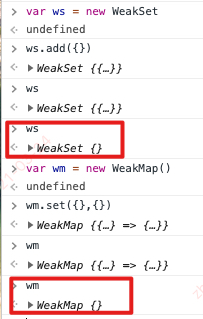
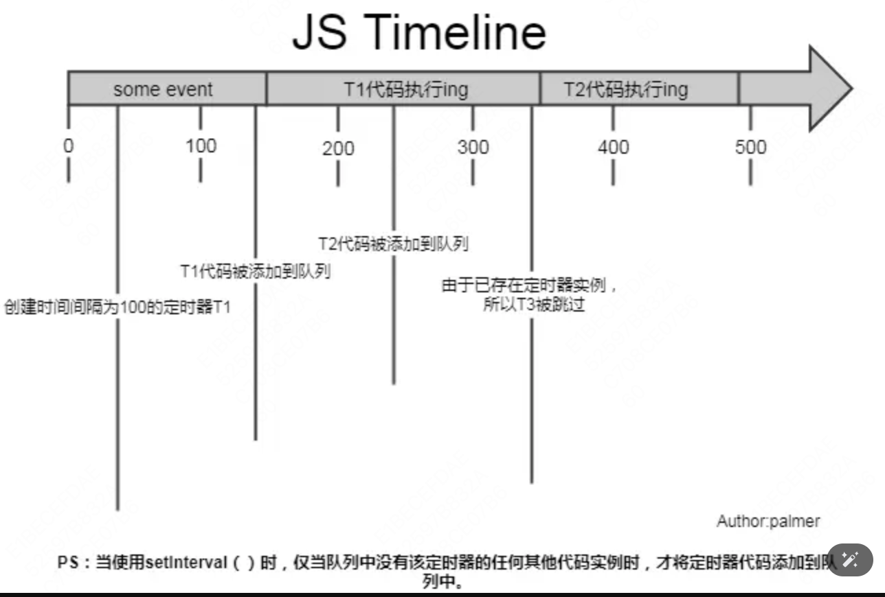

1. JS 中基本数据类型有哪些?
    <details open>

    Number、String、Boolean、Null、Undefined、Symbol(es6)、BigInt(es11)
    原始类型的值直接存储在栈内存中，访问速度快。与原始类型相对的是引用类型，包括 Object、Array、Function 等。引用类型存储的是内存地址，值是可变的。

2. ECMAscript 发展进程中，都有哪些东西的添加？
    <details open>

    - es6 增加的最多。包含类，模块，迭代器，生成器、箭头函数、反代理和数据类型
    - es7 只包含少量语法层面增强，比如 includes,和指数操作符
    - es8 增加了异步函数 async/await 和 Object.values/Object.entries 等
    - es9 增加 promise.finally 和异步迭代、剩余和扩展属性
    - es10 增加了 flat/flatMap，固定了 sort 的顺序等等

3. `ES6`中暂时性死区`TDZ`是什么？
     <details open>

    暂时性死区就是说如果函数外面写了一个 let a = 1;
    结果里面用的时候，先用了 a，又声明了 let a，会报错，因为它会形成一个封闭作用域。
    而且，用了`let`的话，就代表`typeof`不是绝对安全的了。

4. BABEL 是怎么编译 let 的？
     <details open>

    如果对应变量没有相关性的话，会直接给变成`var`，但是如果有类似于多个相同的，不同地方引用的话，就是改变量名，使内外层的变量名称不一样。

5. 什么是标签模板？模板字符串函数的参数你知道是啥吗？
     <details open>

    标签模板就是在模板字符串前面加个函数，然后通过函数处理这个模板字符串。

    函数里的参数第一个就是非变量的数组合集，后面的参数是...，代表各个参数。

    实际上这个功能意义我觉得不大，因为进了函数处理后，我要先把它拼接起来。那我为什么不直接把整个字符串拿到后在用函数处理一下呢？

6. weakmap 用过吗？ 知道它的使用场景吗？
     <details open>

    `weakmap`就是弱引用，这样对于`gc`会更友好，而且只支持对象，但是它不可迭代，使用场景的话，比如写一个偏向公共的类

    在计算机程序设计中，弱引用与强引用相对，是指不能确保其引用的对象不会被垃圾回收器回收的引用。

    一个对象若只被弱引用所引用，则被认为是不可访问（或弱可访问）的，并因此可能在任何时刻被回收。

    比如你用 weakmap set 的一个 key,这个 key 设置为 null 后，你就没办法获取到它的值了

    可以利用它实现私有变量。store = new WeakMap(); 比如在`constructor`里，把传进来的值`set`进`this`里，

    ```js
    const privateData = new WeakMap();
    class Person {
        constructor(name, age) {
            privateData.set(this, { name: name, age: age });
        }

        getName() {
            return privateData.get(this).name;
        }

        getAge() {
            return privateData.get(this).age;
        }
    }

    export default Person;
    ```

    然后写个 get 方法，那么这些 props 只能通过 get 获取了。

7. Set WeakSet Map WeakMap
    <details open>

    首先，Set 和 Map 都很相似，只是 API 略有不同，Set 是通过 add 加值，Map 是通过 set 加值

    然后就是 Set 的 entries 的话，是[key, key] 这样的结构，而 Map 是[key, val]的形式

    Set 更多会操作数组，Map 更多的操作对象, Weak 这些结构的话，一是弱引用，二正因为弱引用，所以不可迭代。

    

8. class 中把方法写 constructor 里和写外面区别是什么？class 转 es5
     <details open>

    [ES6 系列之 Babel 是如何编译 Class 的(上)](https://juejin.cn/post/6844903704873664520)

    写在外面就是它的原型函数

    写在里面就是它的内置函数

    class 写静态方法或属性，可以利用 static 或者是 A.xxx

    ```js
    class Person {
        static sayHello() {
            return 'hello';
        }
        static name = 'kk';
    }
    // 或者是
    Person.sayHello = function () {
        return 'HELLO';
    };
    Person.name = 'kk';

    Person.sayHello(); // 'hello'

    var kevin = new Person();
    kevin.sayHello(); // TypeError: kevin.sayHello is not a function

    // ES5

    function Person() {}

    Person.sayHello = function () {
        return 'hello';
    };
    Person.name = 'kk';

    Person.sayHello(); // 'hello'
    ```

    **类不能直接执行，Person()会报错**

9. 私有变量的实现方式
     <details open>

    - 最新的提案可以直接前面写#，这样就成为了私有变量
    - 或者使用`weakmap`，把 this set 进去。
    - 或者是原来的闭包的方式
    - 或者使用`Symbol`,这样外面根本无法使用。但是可以通过 `Object.getOwnPropertySymbols`来获取 symbol

    ```js
    var dd = Symbol('aaa');
    var obj = {};
    obj[dd] = 'haha';
    // {Symbol(): "haha"}
    ```

10. 装饰器
     <details open>

    装饰器的话，从函数的角度来看，如果只是作用在`class`组件上的话，其实和`HOC`没多少区别，

    - 作用在`class`组件的话，它的第一个参数`target`指向的就是这个类组件，可以利用这个来写 controller()
    - 作用在类下的方法的话，它的第一个参数是类的原型，第二个参数就是方法名，第三个参数就是一个`description`对象，下面会有枚举，`value`,可写这样的属性.
    - 作用在类下的 get name() {} 这样的话，第三个参数就不会有 value 这样的东西了。第三个参数会有 set get。这里就说到了数据描述符和存储描述符互斥的问题了。
    - 如果直接作用在一个属性上的话，第三个参数是没有 value 或 set get 的，因为那个属性不是在原型本身上的，是在实例化的时候才会有，而装饰器是在编译阶段就执行的，所以也就没有。
      直接作用在类上面，比如

    ```js
    @weapon
    class AAA {}
    ```

    这样的形式，`weapon`这个函数里的第一个参数，就是这个类，也就是这个函数

    而只要在类里面，所有的`target`，也就是装饰器的第一个参数，都是这个类的原型。

    可以发现，这些装饰器函数，都在实例化前就全部打印了

    说明啥，说明是在编译阶段就给弄进去了，所以更不可能指向实例了，因为那时候还没有，所以指向的是原型

    第二个参数，目前看来都是`name`，也就是对应的方法名

    第三个参数，就是`description`。也就是对象的描述。

    ```js
    @property
    name = 'jansen';
    @wrapee
    arrowfn= () => {

    }
    ```

    `property`作用在`name`上第三个参数有/`wrapee` 作用在`arrowfn`上第三个参数有

    ```js
    configurable: false
    enumerable: true
    可枚举，如果设置为false,以下3种迭代不会发现这个name
    * for..in循环  ：只遍历对象自身的和继承的可枚举的属性
    * Object.keys方法 ：返回对象自身的所有可枚举的属性的键名
    * JSON.stringify方法：只串行化对象自身的可枚举的属性
    * Object.assign()(ES6）:只拷贝对象自身的可枚举的属性
    使用这个Object.getOwnPropertyNames，可以破解，详情见对比No.36
    initializer: ƒ () 初始化，return初始化的值。
    writable: true 是否可写，设置为false，原地实现readonly
    ```

    ```js
    @setget
    get selfname() {
    }
    ```

    `setget`作用在`get selfname`上，第三个参数有

    ```js
    configurable: true;
    enumerable: false;
    get: ƒ();
    set: undefined;
    ```

    可以发现，它没有 writable，它只有 set 和 get

    ```js
    @deprecate("我已经废弃了")
    callBad() {
    }
    ```

    `deprecate`作用在`callbad`方法上，第三个参数有

    ```js
    configurable: true;
    enumerable: false;
    value: ƒ(params);
    writable: true;
    ```

    方法有个 value，可以在 value 里说我废弃啦。

    有的有 value,有的有 set get， 其实就是因为一个是数据描述符，一个是存取描述符，它内部帮你排斥好了。
    这两种是不可以混合使用的，使用会报错。
    具体所有类型的我都写在了 decoratorTest 上了，可以去看。

11. HOC 和 renderprops
     <details open>

    HOC 和 renderprops 其实都是属于增强组件

    HOC 就是接受一个组件作为参数，返回一个新的组件。应用的话，就举例子，比如利用 HOC，结合 hook 和 context，自己写一个 connect 函数。

    ```js
    function hoc(params) {
        return function (component) {
            return function (props) {
                return <Component />;
            };
        };
    }
    ```

    上述的就是接受一个参数，然后返回一个 hoc 函数，hoc 然后接受一个组件，然后返回一个新组件。

    如果好多页面都有一样的代码，比如请求同一个方法，constructor 初始化一个数据的话，可以用 HOC 包一个新组件。这样复用代码。

    HOC 的好处有

    - 支持`ES6`，光这一项就战胜了`mixins`
    - 复用性强，`HOC`是纯函数且返回值仍为组件，在使用时可以多层嵌套，在不同情境下使用特定的`HOC`组合也方便调试。
    - 同样由于`HOC`是纯函数，支持传入多个参数，增强了其适用范围。
      缺点是
    - 当有多个`HOC`一同使用时，无法直接判断子组件的`props`是哪个`HOC`负责传递的。在里面的组件只接受`props`。也不知道这是几级传下来的。
    - 嵌套比较深，阅读起来会有一点障碍

    render Props

    就是把组件当成 props，直接传给子组件，这样就有点像依赖反转，逻辑抽象在外面，然后根据不同的情况，传不同的组件下去。

    ```js
    <ProductData render={({ products }) => <ProductList products={products} />} />
    <ProductData
        render={({ products }) => <ProductTable products={products} />}
    />
    <ProductData render={({ products }) => (
        <h1>
            Number of Products:
            <strong>{products.length}</strong>
        </h1>
    )} />
    ```

    然后再 ProductData 组件的 render 方法里，`render() { this.props.render(this.state.data) }`

    [hoc vs renderprops vs hook](https://jishuin.proginn.com/p/763bfbd36ecc)

12. 箭头函数和普通函数的区别
     <details open>

    - 箭头函数的 this 是透传的
    - 箭头函数不能作为构造函数，所以就不能用 new
    - 箭头函数不能用 arguments，只能用...args
    - 箭头函数没有原型属性
    - 箭头函数不能通过 apply.call.bind 改变 this。

13. 为啥 let 用 window 访问不到
    <details open>

    let 在全局中创建的变量存在于一个块级作用域（Script）中,它与 window(Global)平级,
    var 在全局中创建的变量存在于 window(Global)中;

    const 和 let 会生成块级作用域，可以理解为

    ```js
    let a = 10;
    const b = 20;
    相当于：
    (function(){
            var  a = 10;
            var b = 20;
    })()
    ```

    ES5 没有块级作用域的概念，只有函数作用域，可以近似理解成这样。
    所以外层 window 必然无法访问。

14. 为什么 for > forEach > map
    <details open>

    其实这三个循环方法并不完全等价：

    1. for 循环当然是最简单的，因为它没有任何额外的函数调用栈和上下文；
    2. forEach 其次，因为它其实比我们想象得要复杂一些，它的函数签名实际上是 `array.forEach(function(currentValue, index, arr), thisValue)`它不是普通的 for 循环的语法糖，还有诸多参数和上下文需要在执行的时候考虑进来，这里可能拖慢性能；
    3. map 最慢，因为它的返回值是一个等长的全新的数组，数组创建和赋值产生的性能开销很大。

15. 类数组加上 push 方法，length 会增加， 因为 push 设计的就是一个通用的[mdn](https://developer.mozilla.org/zh-CN/docs/Web/JavaScript/Reference/Global_Objects/Array/push#description)

16. 什么是 BOM？
    <details open>

    BOM 其实就是浏览器的扩展，通常把任何特定于浏览器的扩展都归于 BOM 里

    - 弹出新窗口的能力
    - 移动和缩放和关闭窗口能力
    - navigator 对象，提供浏览器信息
    - location 对象，提供地址信息
    - screen 对象，提供屏幕信息
    - performance 对象，提供浏览器内存占用，时间统计等信息
    - 对 cookie 的支持
    - XMLHttpRequest

17. reduce 方法知道吗？
     <details open>

    用于处理数组，比较好用。可以用来拼接字符串，求和,数组降维以及其他一些需要的数据操作

    `reduce((accumulator, currentValue, currentIndex, array))`

    第一个大参数里的 第一个参数是聚合，第二个是当前的值，第三个是当前的 index，第四个是原始 array。

    第二个参数是初始值，如果没给的话，默认使用第一个值，这也是为什么如果空数组 reduce 的时候，如果不给初始值会报错的原因。

18. array.some, array.every 方法里只写个 Array.isArray 是啥意思
     <details open>

    array.some 里本来就是写一个函数用的，会把每一个参数自动投放进去，Array.isArray 不正好是一个函数吗？

    但是反过来说，如果只写个 Array.map(parseInt) 就要小心了，因为我 parseInt 收两个参数，正好第二个是进制，也就是说，0,1,2 执行过来的话

    结果应该是 1，NaN, NaN， 因为 3 如果执行 2 进制，因为 2 进制里没有 3，所以解析不了。0 的话就当它是 10 进制

19. 你知道迭代器吗？如何自己写一个简单的迭代器
     <details open>

    迭代器就是一个拥有 next 方法的对象，每次调用会返回一个结果对象，该对象上有两个属性，`value`和`done`
    自己实现一个就是

    ```js
    function createIterator(items) {
        var i = 0;
        return {
            next: function () {
                var done = i >= items.length;
                var value = !done ? items[i++] : undefined;

                return {
                    done: done,
                    value: value
                };
            }
        };
    }
    ```

20. 你知道生成器吗？
     <details open>

    生成器，就是 Generator ，它就是一个状态机。

    ```js
    function* helloWorldGenerator() {
        yield 'hello';
        yield 'world';
        return 'ending';
    }
    var hw = helloWorldGenerator();
    ```

    以上的 hw，可以通过 for of 遍历，但是不会看到 ending，只能遍历 yield 出来的，如果不用，就是 hw.next()，

    - next 方法里其实可以带参数，该参数就会被当作上一个 yield 表达式的返回值。这样可以无限执行。

    ```js
    function* f() {
        for (var i = 0; true; i++) {
            var reset = yield i;
            if (reset) {
                i = -1;
            }
        }
    }

    var g = f();

    g.next(); // { value: 0, done: false }
    g.next(); // { value: 1, done: false }
    g.next(true); // { value: 0, done: false }
    ```

    - `yeild *`是一个比较有意思的语句，它可以用来在生成器里，执行另外一个生成器函数。

    ```js
     function* foo() {
         yield 'a';
         yield 'b';
     }
     function * bar() {
         yield 'x';
         yield* foo();
     }
     for of bar(), 会执行,x,a,b
    ```

    - 实际上，任何数据结构只要有 Iterator 接口，就可以被 (yield*) 遍历, 当然，前提是外层有 function* ，不然你也用不了 yield 啊
    - 扩展运算符...默认调用 Iterator 接口
    - 如果是作为对象属性的话，直接方法前跟 \* 即可

    ```js
     let obj = {
         * myGeneratorMethod() {
             ···
         }
     };
    ```

21. for of, for in 的区别
     <details open>

    for of 就是可以遍历拥有 iterator 属性的对象或数组,
    他们的原型上都会有一个 Symbol.iterator 的属性,
    typeof 它是一个函数。

    所以如果自己想让对象也能 for of 的话，可以自己写一个

    ```js
    obj[Symbol.iterator] = function* () {
        yield* Object.entries(this);
        // 或者
        for (let [key, val] of Object.entires(this)) {
            yield { key, val };
        }
    };
    // 使用自己的方法
    obj[Symbol.iterator] = function () {
        var arr = Object.entries(obj).map((item) => ({
            key: item[0],
            val: item[1]
        }));
        return createIterator(arr);
    };
    ```

    对于一个数组来说，object.keys 和 object.values 是一样的。

    object.entires 是一个 key,val 数组。

    for in 主要用于遍历对象的属性，当然也可以用来遍历数组元素

22. fetch 怎么用，如何封装一下它
     <details open>

    - `fetch`算是新一点的`api`，用法简单点
    - 通过`promise`链的方式来输出数据,
    - 封装的话就是把`header`封装下，然后把结果封装下就可以了,
    - 要提的就是`header`下的`body`部分，`post`的话需要自己拼装的,
    - 然后`credentials`需要写`include`，代表可以带`cookie`参数,
    - mode:"cors",是走 cors 模式跨域
    - 不过`fetch`不支持`node`，所有如果是有`ssr`的话，可以用`axios`

23. Object.freeze（浅冻结）Object.seal 区别，如何深冻结一个对象？
     <details open>

    - Object.freeze 是把对象的属性冻结，不能修改不能添加不能删除，但是是浅冻结
    - Object.seal 是封闭一个对象。是可以修改属性的值的（前提是本来就可写）。但是不能删除不能新增。

    所以`seal`比`freeze`少一个限制修改属性值。所以更像是封闭对象结构。

    ```js
    // 深冻结
    function deepFreeze(object) {
        const keys = Reflect.ownKeys(object);
        for (let k of keys) {
            typeof object[k] === 'object' && deepFreeze(object[k]);
        }
        return Object.freeze(object);
    }
    ```

24. Object.defineProperty,Proxy 对象,Reflect 对象
     <details open>

    ```js
    Object.defineProperty(obj, 'prop1', {
        value: 1,
        // 数据是否可写,默认false,如果上了false,非严格模式下数据不会有任何变化。
        // 但是严格模式下会报错。prop1 is readonly
        writable: true,

        set:function() {}
        get:function() {}

        enumerable: 是否是可枚举的，默认是false，通过字面量创建的默认是true。

        configurable: 是否可以配置

     })

    ```

    set，get 不能和 value,writable 同时出现。因为前者是存取描述符，后者是数据描述符，强行会报错。

    除了`value`, `writable`以外其他属性是否可以配置。`configurable`当且仅当 `configurable`为 `true`时，该属性才能够被改变，也能够被删除（`delete`），默认为 `false`

    此外，`descriptor`这里所有属性都是非必须的，但是，只要写了`defineProperty`，至少要给第三个参数一个空对象。

    应用实例，`Vue`之前就是靠它来实现数据监控的。

    如果某个属性你不想让人用了，可以给它的 get 下添加个 console.warn。

    defineProperty 不能监控数组的变化，而且只能监听对象的属性。如果一个对象很多属性，需要遍历。

    像 Vue 里，他监控数组的方式是复写数组的方法， `push() pop() shift() unshift() splice() sort() reverse()`

    ```js
    const aryMethods = [
        'push',
        'pop',
        'shift',
        'unshift',
        'splice',
        'sort',
        'reverse'
    ];
    const arrayAugmentations = [];
    aryMethods.forEach((method) => {
        // 这里是原生Array的原型方法
        let original = Array.prototype[method];
        // 将push, pop等封装好的方法定义在对象arrayAugmentations的属性上
        // 注意：是属性而非原型属性
        arrayAugmentations[method] = function () {
            console.log('我被改变啦!');
            // 调用对应的原生方法并返回结果
            return original.apply(this, arguments);
        };
    });
    ```

    proxy 相当于一个中间层，proxy 是直接监听对象的，而且可以操作的 handler 很多，比如 set,has,get,apply,call 等等。它比 defineProperty 强大很多。<b>至于属性也是对象的情况下，两者都还是需要递归监听的。</b>

    举个例子

    ```js
    var obj = { name: 1, sex: 'male', in: { k: 1, d: 2 } };

    var cc = new Proxy(obj, {
        set(target, key, val, receiver) {
            const pre = '强制改成';
            return Reflect.set(target, key, pre + val, receiver);
        },
        get(target, key, receiver) {
            console.log('我听到我被动了');
            // 可以在这里判断get出来的是不是对象，然后递归proxy？
            return Reflect.get(target, key, receiver);
        }
    });
    ```

    在上面这个代码里，访问 cc.name，会触发 log， 访问 cc.in.k，也会触发

    修改 cc.name 会被加上一个 ‘强制改成’，但是修改 cc.in.k，不会，因为修改 cc.in.k，cc.in 是一个对象引用类型，所以不会变。而 get 之所以会触发，是因为访问 `cc.in.k`，也就等于访问到了`cc.in`了啊，所以才会触发的。

    里面好多方法第三个参数其实就是一个新的 OBJ 指向。

    如果一个属性不可配置（configurable）且不可写（writable），则 Proxy 不能修改该属性，否则通过 Proxy 对象访问该属性会报错。

    可以利用它，写一个年龄自增

    ```js
    var obj = {
        name: 'aaa',
        age: 1
    };
    var ss = new Proxy(obj, {
        get(target, key, recevier) {
            if (key === 'age') {
                let vv = target[key];
                Reflect.set(target, key, vv + 1, recevier);
                return vv + 1;
            }
            return Reflect.get(target, key, recevier);
        }
    });
    ```

    Reflect 和 Proxy 是一对。正常取值，甚至可以替代关键字符，比如 in 或者 delete 这样的。

    它可以分为一部分是是原来存在 Object 上的方法，将它转义到了 Reflect 上，并作了小改动，让方法更加合理。

    另一部分是将原来操作符的功能，变成函数行为。

    ```js
    // 老写法 'assign' in Object // true
    // 新写法 Reflect.has(Object, 'assign') // true
    // 老写法 Function.prototype.apply.call(Math.floor, undefined, [1.75]) // 1
    // 新写法 Reflect.apply(Math.floor, undefined, [1.75]) // 1
    // 旧写法 delete myObj.foo;
    // 新写法 Reflect.deleteProperty(myObj, 'foo');
    // new 的写法 const instance = new Greeting('张三');
    // Reflect.construct 的写法 const instance = Reflect.construct(Greeting, ['张三']);
    var myObject = {
        foo: 1,
        bar: 2,
        get baz() {
            return this.foo + this.bar;
        }
    };
    var myReceiverObject = {
        foo: 4,
        bar: 4
    };
    Reflect.get(myObject, 'baz', myReceiverObject); // 8
    ```

25. Number.isNaN 和 isNaN 的区别
     <details open>

    - isNaN 意思是这个是不是不是一个数字，比如它是 isNaN('abc') 就是 true。
    - Number.isNaN 只有 Number.isNaN(NaN)才是 true
    - Number.isNaN 是 es6 的，如果自己写的话，就是利用 typeof NaN 是 number 来写

26. String.raw
    <details open>

    如果一串字符串，里面有\n 之类的，可能会被转译，如果不想让它被转译，想直出，
    用`String.raw`abc \n ss``,会把换行符号也返回出来，就是一个未加工的值，实际应用感觉没有。

27. 描述一下事件传播
    <details open>

    当事件发生在`DOM`元素上时，该事件并不完全发生在那个元素上。

    从`window`开始，一路向下传递到目标元素，这叫捕获阶段

    然后从目标元素传递回`window`，这叫冒泡阶段。

    `addeventlistener`就是监听目标用的，然后第三个参数是`boolean`类型，默认`false`是冒泡阶段，`true`就是捕获阶段。

    事件传播到了目标后，触发的顺序按照 声明的顺序来，也就是说，完全可能是先冒泡后捕获。

    阻止冒泡使用的是`e.stoppropagation`,阻止捕获用的是`e.stopImmediatePropagation`

28. 适合事件捕获的场景有哪些？
    <details open>

    1. 事件足够「抽象」：比如 load 事件，本身的定义就是基于父元素的内容，捕获阶段处理它会更加直观
    2. 事件足够「特别」：比如 scroll 事件，这是个触发很频繁的事件，因为操作是连续的，捕获阶段可以减少性能损失
    3. 事件足够「反常」：比如定义一个点击事件，让用户以为可以点击到某个元素但实际上父元素想发挥一个阻拦层区域效果的时候

29. JavaScript 中的虚值是什么
    <details open>

    `const falsyValues = ['', 0, null, undefined, NaN, false];`
    这里面的都是虚值，虚值就是在转化成 boolean 时为 false 的值。

30. Object.create 创建出来的对象和正常的区别是什么？如何创建一个没有原型的对象？
    <details open>

    通过 Object.create 创建出来的对象的原型指向传入的对象，也就是说

    ```js
    function P() {
        this.name = 'kk';
    }
    P.prototype.sex = 'm';
    var bb = Object.create(P);
    bb.__proto__ == P; // true
    var cc = Object.create(P.prototype);
    cc.__proto__ == P.prototype; // true
    var a = new P();
    ```

    根据这个特性，可以看出来，Object.create 和 new 还是有区别的，new 多了一个 call 的过程,a 会有 name 属性，而 cc 没有。
    但是，直接创建一个新的空对象的话，那就一样了。以下三下是一样的。

    ```js
    var obj = {};
    var obj = new Object();
    var obj = Object.create(Object.prototype);
    ```

    很多时候，就是只想要一个干净的对象，不需要原型，用于节省性能的话，直接 Object.create(null) 就可以了；

    Object.create 的第二个参数和 defineproperty 第二个一样。也就是说，上述想给 cc 来个 name,咋办

    ```js
    Object.create(P.prototype, {
        name: {
            value: 'kk',
            writable: true
        }
    });
    ```

    那么，写一个 object.create 的简单 polyfill 版本(不支持第二个属性)

    ```js
    Object.create2 = function (proto) {
        function F() {}
        F.prototype = proto;
        return new F();
    };
    ```

31. new 关键字有什么用？它到底做了啥？
    <details open>

    new 和构造函数创造一个对象。

    ```js
    var obj = {};
    obj.__proto__ = Obejct.prototype;
    Object.call(obj);
    ```

    其实从这段代码就可以看出，虽然最后创建出来的对象是一致的，但是多赋值了一次，obj.\_\_proto\_\_ = Object.prototype,因为字面量创建的本来就是个对象了。所以，还是字面量方式更好

32. 手写一个 promise
    <details open>

    - 第一步，先写这里的回调函数 三个状态，then 里的函数可以不传。
    - 第二步，回调里是可以写异步的，也就是说，到了 then 里可能还在 pending
    - 第三步，p 是一个链式调用的，所以要包装一个 promise2 return 出来 并且里面的执行需要 try catch，抓错。
    - 第四步，防止 then 里返回 promise 本身，以及返回的还是一个 promise，需要加一个判断函数。如果是本身，reject，如果是 promise，继续 then，最后 resolve。
    - 第五步，加 catch 方法，其实就是调用 this.then(null,rejectCallBack);
    - 第六步，原型上加一个 Resolve 和 Reject 方法，就是调用自己，new Promise()执行对应的方法
    - 第七步，all 方法，all 方法返回的所有 promise 结果的合集，然后做一个下标，挨个执行 promise，然后 index++,最后 index = promise.length 的时候，resolve(result);
    - 第八步，race 方法，这个直接挨个执行 then，resolve 即可。这也说明 race 其他的还是会跑完的。只不过不管结果而已。

    [promise](https://zhenglin.vip/js/promise.js)

33. 事件委托的原理
    <details open>

    因为事件传播正常是先捕获后冒泡，那么捕获/或者冒泡的时候，一定会经过目标元素的上级，这就是事件委托的原理。

34. 原型、作用域、原型链、作用域链
    <details open>

    - js 本质上一切皆对象，每个对象都要有原型，这也是为什么有继承关系。
    - 原型链的话就是比如某个 a 是继承于 A，那么 a 怎么能找到 A 就是通过原型链，instanceof 实际上就是个原型链查找。
    - 作用域就是遍历或者函数能作用的范围，作用域链就是某一个变量在某个地方使用到了，在编译的过程中，会保留一条它的作用域链，让它能够通过该作用域链找到对应的自己那个属性。
    - 函数有一个内部属性 [[scope]] ,当函数创建的时候，就会保存所有的父变量对象到其中。
    - [[scope]] 可以理解为所有父级变量对象的层级链

35. instanceof 原理是啥？
    <details open>

    instanceof 其实就是利用原型链去查找，找到了就返回 true
    自己写一个就是

    ```js
    while (left.__proto__) {
        if (left.__proto__ === right.prototype) {
            return true;
        }
        left = left.__proto__;
    }
    return false;
    ```

    但是 instanceof 并不是安全的，因为可以复写

    ```js
    class PrimitiveString {
        static [Symbol.hasInstance](x) {
            return typeof x === 'string';
        }
    }
    console.log('hello world' instanceof PrimitiveString); // true
    ```

36. null,undefined,未声明的变量的区别
    <details open>

    - 未声明的变量就是不用 let ,var, const 关键字的比如直接写 a = 2;这样的，如果是在严格模式下，会报错
    - undefined 就是这个变量已经声明，但是没有赋值，所以会是 undefined.
    - 函数作用域下 undefined 可以被重写，这也是为什么最好用 void 0 替代的原因。
    - null 的话只能显式的被赋值，标识空值。
    - null == undefined；没有隐式转换。

37. foreach 和 map 的区别
    <details open>

    foreach 是遍历数组中的元素，没有返回值，通常需要修改原始数组的时候可以用 foreach, 如果直接`item = 2`， 这样 foreach 也不会改变原数组的，是没有意义的，只有`item.a = 2`,这样才是有意义的，虽然 map 也会改变，但是约定

    map 的话就是生成一个新的数组。如果不想修改原数组可以用 map

    上述两个方法都会跳过稀松数组。

    foreach 不能打断，如果要强行打断，就用 try catch，想要打断的循环可以用 for, for of, every 返回 false, some 返回 true。

    foreach 不能用 await，无法保证顺序，而 for of 就可以，因为用的是迭代器。

38. 宿主对象和原生对象的区别
    <details open>

    - 原生对象是由 `ECMAScript`规范定义的 `JavaScript`内置对象，比如`String`、`Math`、`RegExp`、`Object`、`Function`等等。
    - 宿主对象是由运行时环境（浏览器或 `Node`）提供，比如`window`、`XMLHTTPRequest`等等。比如`Node`的`process`,`setImmediate`。

39. call,apply,bind 区别
    <details open>

    - call 第二个参数是一个一个的
    - apply 第二个参数是数组
    - bind 是和 call 一样，但是生成了一个新的函数。
    - 实现 bind 就更简单了，context 不用动，传递下 this 函数，然后 return 个 function，参数和之前的组合一下，调用 apply 就可以了。
    - call 比 apply 快，因为 apply 内部还要判断参数是不是数组，还需要获取数组 length 等等，而 call 就没这些事

40. 事件循环 event loop
    <details open>

    我们知道`JavaScript`的一大特点就是单线程，而这个线程中拥有唯一的一个事件循环。

    在`promise`之前，`js`其实是没有异步的，`settimeout`是宿主环境的。

    `JavaScript`代码的执行过程中，除了依靠函数调用栈来搞定函数的执行顺序外，还依靠任务队列(task queue)来搞定另外一些代码的执行。

    事件循环分为宏任务和微任务，其中宏任务就是如同 `settimeout,setInterval，requestAnimationFrame, MessageChannel`

    而微任务就是 `promise.then,MutationObserver`

    在 Node 中，又有些不一样，就单从 API 层面上来理解，Node 新增了两个方法可以用来使用：微任务的 process.nextTick 以及宏任务的 setImmediate。

    setTimeout 和 setImmediate 的区别的话就是 settimeout 是时间延迟，setImmediate 是循环延迟。

    timers 阶段会执行 setTimeout 和 setInterval 回调，并且是由 poll 阶段控制的。同样，在 Node 中定时器指定的时间也不是准确时间，只能是尽快执行。

    ```js
    setTimeout(() => {
        console.log('setTimeout');
    }, 0);
    setImmediate(() => {
        console.log('setImmediate');
    });
    ```

    这段代码的执行顺序是不一定的

    - 首先 setTimeout(fn, 0) === setTimeout(fn, 1)，这是由源码决定的
    - 进入事件循环也是需要成本的，如果在准备时候花费了大于 1ms 的时间，那么在 timer 阶段就会直接执行 setTimeout 回调
    - 那么如果准备时间花费小于 1ms，那么就是 setImmediate 回调先执行了

    但是如果写在 IO 里面的话，就是 setImmediate 先执行了，因为这个就等于在 poll 阶段，队列为空，立马去执行后者

    两者最主要的区别在于浏览器中的微任务是在每个相应的宏任务中执行的

    而 nodejs 中的微任务是在不同阶段之间执行的。如果是老的 Node 版本，就是先执行完宏任务，在一次性清空微任务，新版本就是在每个阶段里，清空微任务

    关于 process.nextTick 的一点说明
    process.nextTick 是一个独立于 eventLoop 的任务队列。
    在每一个 eventLoop 阶段完成后会去检查这个队列，如果里面有 nextTick，会让这部分任务优先于其他微任务执行。

    用两个例子论证上面的说法

    ```js
    setTimeout(()={
        console.log("time1");
        process.nextTick(()=>{
            console.log("nextTick2");
        });
    });
    console.log("start")
    process.nextTick(()=>{
        console.log("nextTick1");
        setTimeout(()={
            console.log("time2");
        });
    });
    // node10以上 start nexttick1 time1 ntick2 time2
    // node10以下 start nexttick1 time1 time2 tick2

    setTimeout(() => {
        console.log("time1");
        Promise.resolve().then(()=>{
            console.log("pthen1");
        });
    });

    setTimeout(()=>{
        console.log("time2");
        Promise.resolve().then(()=>{
            console.log("pthen2");
        });
    });
    // node9 time1 time2 pthen1 pthen2
    // node10 time1 pthen1 time2 pthen2
    ```

    以前就是宏任务执行完，清空微任务，现在就是每个小宏任务里，执行完对应的微任务。

    关于 await

    ```js
    await 要分开看;
    // await 前面的代码
    await bar();
    // await 后面的代码
    // 其中 await 前面的代码 是同步的，调用此函数时会直接执行；
    // 而 await bar(); 这句可以被转换成 Promise.resolve(bar())；
    ```

    await 后面的代码 则会被放到 Promise 的 then() 方法里。

    还有，比如微任务相当于是添加到宏任务里来的。如果一个 promise 里不写宏任务的话，那外面的 settimeout 可以等死。

    ```js
    setTimeout(() => {
        console.log('1');
    }, 0);
    setTimeout(() => {
        console.log('2');
    }, 2500);
    var now = Date.now();
    var d = new Promise((resolve, reject) => {
        while (Date.now() - now < 2000) {}
        console.log('3');
        resolve('4');
    });
    d.then((res) => {
        console.log(res);
        var now = Date.now();
        return new Promise((resolve, reject) => {
            while (Date.now() - now < 2000) {}
            console.log('5');
            resolve('6');
        });
    }).then((res) => console.log(res));
    ```

    这段的话，settimeout 要在 4s 后才能执行，加多少个 then 都得等 then，因为他们属于同一个宏任务下没执行完的微任务。

    把上面 node 的那个例子改造一下

    ```js
    var now = +new Date();
    setTimeout(() => {
        console.log('time1');
        Promise.resolve().then(() => {
            while (Date.now() - now < 2000) {}
            console.log('pthen1');
        });
    });

    setTimeout(() => {
        console.log('time2');
        Promise.resolve().then(() => {
            console.log('pthen2');
        });
    });
    ```

    输出是 time1, 2s 后输出 pthen1, time2, pthen2，一样论证了 settimeout 等待。

41. 如何实现一个深拷贝（[Object xxxx]）[loadsh](https://github.com/lodash/lodash/blob/4.17.15/lodash.js#L11087)
    <details open>

    基本完整版本参见 [deepCopy.js](https://zhenglin.vip/js/deepcopy.js)

    如果不需要 function 的话，可以异步使用一个 MessageChannel

    ```js
    function structuralClone(obj) {
        return new Promise((resolve) => {
            const { port1, port2 } = new MessageChannel();
            port2.onmessage = (ev) => resolve(ev.data);
            port1.postMessage(obj);
        });
    }
    ```

42. typeof null 为啥是 object？
    <details open>

    原理是这样的，不同的对象在底层都表示为二进制，在`Javascript`中二进制前三位用来表示 `TYPE_TAG`

    而正巧 Object 类型的前三位就是 0

    null 在设计的时候是一个空指针，它的二进制表示全为 0，自然前三位也是 0，所以执行 typeof 时会返回"object"。

43. 什么是闭包，闭包经典问题解法有哪几种？
    <details open>

    闭包就是函数内可以访问函数外的变量，就属于闭包。但是我们常说的，是属于调用栈出栈了，依然能够中找到那个变量。

    闭包本质上就是作用域链的问题，闭包就是当函数可以记住并访问所在的词法作用域时，就产生了闭包，即使函数是在当前词法作用域之外执行。

    比如通常就会利用闭包做一个封闭作用域，创建内部变量，使得这些变量不能被外部随意修改，同时又可以通过指定的函数接口来操作。

    ```js
    const Counter = (function () {
        let count = 0;
        return {
            increment: () => {
                return count++;
            }
        };
    })();
    Counter.increment();
    ```

    - 用 let 封闭作用域
    - 用 settimeout 第三个参数就是传给 settimeout 里面的函数的入参。

44. 实现继承的几种方式
    <details open>

    - 原型链继承
      `sub.prototype = new Parent();`
      缺点 1 就是 Parent 的原型大家共享了，一荣俱荣。2 在创建 Child 的实例时，不能向 Parent 传参

    - 寄生组合继承

    ```js
    function Sub() {
        Super.apply(this, arguments);
    }
    Sub.prototype = Object.create(Super.prototype, {
        constructor: {
            value: Sub,
            enumerable: false,
            writable: true,
            configurable: true
        }
    });
    // 或者
    Sub.prototype = Object.create(Super.prototype);
    Sub.prototype.constructor = Sub;
    ```

    - 类继承
      `xx extends`

    普通继承和类继承是有区别的，es5 是借助构造函数实现，实质上是**先创造子类的实例对象 this，然后再将父类的方法添加到这个 this 上去**

    而 es6 的继承机制完全不同，实质上是**先创造父类的实例对象 this（所以必须先调用 super 方法，）然后再用子类的构造函数修改 this。**

    es6 在继承的语法上不仅继承了类的原型对象，还继承了类的**静态属性和静态方法**。

    ```js
    // ES5
    function P() {}
    P.getName = function () {
        return 'h';
    };
    function C() {
        P.apply(this, arguments);
    }
    C.prototype = Object.create(P.prototype);
    C.prototype.constructor = C;
    C.getName(); // Uncaught TypeError: C.getName is not a function

    //ES6
    class A {}
    A.getName = function () {
        return 'h';
    };
    A.getName(); // "h"
    class B extends A {}
    B.getName(); // "h" 没有报错哦
    ```

    生成实例化对象的时候，如果是原生对象，类实例化出来可以继承到，而 es5 的不行。

    通过代码来解释

    ```js
    function MyArray() {
        Array.call(this);
    }

    MyArray.prototype = Object.create(Array.prototype, {
        constructor: {
            value: MyArray,
            writable: true,
            configurable: true
        }
    });

    var colors = new MyArray();
    colors[0] = 'red';
    colors.length; // 0

    class MyArray extends Array {
        constructor() {
            super();
        }
    }

    var arr = new MyArray();
    arr[0] = 12;
    arr.length; // 1
    ```

    在不是继承原生构造函数的情况下，A.call(this) 与 super() 在功能上是没有区别的

    但是如果是**原生对象**，就不行了，是拿不到内部属性的

45. 手写 call, apply, bind 出来
    <details open>

    call 和 apply，就是传一个上下文进去，没有就赋值 window

    然后 call 和 apply 的执行函数，赋值给 context，相当于传递上下文

    找一个中间值,Symbol('fn')就可以了。

    [Object(this)的原因](https://stackoverflow.com/questions/44079391/what-is-the-purpose-of-doing-objectthis/44080309)

46. 正则
    <details open>

    - \s 空格
    - \w 包括下划线在内的单个字符
    - [A-Za-z0-9_]
    - \b 单次边界
    - \i 忽略大小写

    实例属性有

    - reg.flags ,返回 flags 属性中的标志以字典序排序（从左到右，即"gimuy"）。 u 是编码方面的。

    ```js
    // polyfill
    if (RegExp.prototype.flags === undefined) {
        Object.defineProperty(RegExp.prototype, 'flags', {
            configurable: true,
            get: function () {
                return this.toString().match(/[gimuy]*$/)[0];
            }
        });
    }
    ```

    - reg.source， 返回正则本身，不包含 i g 那些
    - reg.global, 是否用了 g
    - reg.ignoreCase, 是否用了 i， 大小写
    - reg.multiline , 是否用了 m 多行标志

47. 千位分割符正则
    <details open>

    第二种`reg = /(\d)(?=(\d{3})+$)/g`， 这样就可以用 `str.replace(/(\d)(?=(\d{3})+$)/g, '$1,')`了

    第三种 `str.replace(/\d(?=(\d{3})+$)/g, (target)=> target + ',')`

    `reg = /\d(?=(\d{3})+$)/g`

    `str.replace(reg, '$&,')`

    拆解来说，第一个，必须要有一个\d，用来占一个数字，防止出现 ,233,333 这样的情况

    关于 `?=` 的意思，就是用了这个，就是正向预查， `\d(?=)` 就是指前面有一个数字，后面满足啥啥条件的

    这样的情况下，字符串会从前往后匹配，并不是从后往前匹配，不过关系其实不大。

    至于结束的时候加个\$，可以用一组例子来解释。

    ```js
    var str = '12345678';
    var reg = /\d(?=(\d{3})+8)/g;
    str.replace(reg, '$&,');
    ```

    如果是这个样子，就是前面有数字，后面有 3 个数字+8 进行匹配。

    假设是从后往前匹配

    第一个，到了 4 的时候，是不是就是 4 前面有数字，后面是 567+一个 8 呢？

    所以 4 是满足条件的，4 就是第一个遇到的条件值，replace 就是 4 后加,

    然后继续，到了 1 的时候，后面是 234+567+8，是不是等于\d{3} \* 2 + 8 呢，所以 1 后加, 通过。

    假设是从前往后匹配，一样的。就是先找到 1，后找到 4 而已。只是从后往前好理解一点而已

    这里理解最容易出问题的就是(\d{3})+ 这里，会让人觉得每 3 位匹配一次一样，实际上不是的，是按照上述说的来匹配的。

    所以答案是`1,234,5678`

    那么，后面加结束符号是啥意思呢？

    ```js
    var str = '12345678';
    var reg = /\d(?=(\d{3})+8$)/g;
    str.replace(reg, '$&,');
    ```

    如果你不加的话，123456789，依然会匹配成`1,234,56789`,如果加了结束符号，就是必须以 8 为结尾了。

    那我们看回本题

    ```js
    var str = '12345678';
    var reg = /\d(?=(\d{3})+)/g;
    str.replace(reg, '$&,');
    ```

    如果我没有加这个\$符号的话，我们的答案会是 1,2,3,4,5,678

    来看看为啥，从前往后查找对不对

    先看 1，1 后面是 2345678，有两组 d3+8，你说满足条件吗？它后面有 d3 啊，那就是满足，所以 1 后面加逗号

    后续的一样的，到了 5 的时候后面有一组 d3，也加逗号，到了 6 的时候，6 后面没有 d3，所以不加了

    那么如果我加了\$结束符号

    ```js
    var str = '12345678';
    var reg = /\d(?=(\d{3})+$)/g;
    str.replace(reg, '$&,');
    ```

    就是，前面有一个数字，后面有若干个 d3，并且直接就是以这个 d3 结尾的。

    所以 1 后面是两组 d3+8,就满足不了，也就必须是 d3 的倍数。

    所以答案是 12,345,678。 也就是本题的答案

    至于替换的，就是满足的 replace 的值, 就是$&子串，$1 是第一个匹配上的，$2是第二个匹配到的，$&是子串，不是子表达式们

    $1、$2、...、$99 与 regexp 中的第 1 到第 99 个子表达式相匹配的文本。

    $& 是与 regexp 相匹配的子串。

    如果让你实现 get(ob, 'name.sex.k[a][b]'),就不能用$&的了

48. observer 的几个 API
    <details open>

    - Intersection Observer，可以用它来做懒加载，比使用 getBoundingClientRect()的好处是它的性能会更好。也可以用于广告曝光统计等场景。

    ```js
    // 两个参数，一个 callback,一个 options，opts 里可以设置根元素和边界大小。
    const observer = new IntersectionObserver(
        (entries) => {
            entries.forEach((entry) => {
                if (entry.isIntersecting) {
                    console.log('元素进入视口，Do something');
                }
            });
        },
        {
            root: null, // 设置为视口
            rootMargin: '0px 0px -50px 0px', // 视口的扩展范围
            threshold: [0, 0.5, 1] // 触发回调的交叉比例
        }
    );

    const target = document.querySelector('#lazy-load');
    observer.observe(target); // 开始观察目标元素
    ```

    - MutationObserver 利用它可以检测 DOM 节点元素，比如禁止删除水印功能。

    ```js
    const observer = new MutationObserver((mutations) => {
        mutations.forEach((mutation) => {
            console.log('DOM 发生变化', mutation);
        });
    });
    mutationObserver.observe(content, {
        attributes: true, // Boolean - 观察目标属性的改变
        characterData: true, // Boolean - 目标节点或子节点树中节点所包含的字符数据的变化
        childList: true, // Boolean - 目标节点（如果subtree为true，则包含子孙节点）添加或删除新的子节点。默认值为false。
        subtree: true, // Boolean - 目标以及目标的后代改变都会观察，就是如果这个值为true,其他属性为true后就会都包含子节点。
        attributeOldValue: true, // Boolean - 表示需要记录改变前的目标属性值
        characterDataOldValue: true // Boolean - 设置了characterDataOldValue可以省略characterData设置
        // attributeFilter: ['src', 'class'] // Array - 观察指定属性
    });
    ```

    - Resize Observer, 用于监听元素尺寸的变化。

    - PerformanceObserver，监控浏览器性能，回调里上报指标。

    ```js
    const observer = new PerformanceObserver((list) => {
        const entries = list.getEntries();
        entries.forEach((entry) => {
            console.log('性能指标', entry);
        });
    });

    observer.observe({ entryTypes: ['paint', 'resource', 'longtask'] });
    ```

49. requestIdleCallback 和 requestAnimationFrame 的区别
    <details open>

    浏览器一帧里 16ms 要完成的任务，当 Eventloop 执行完 Microtasks 后，会判断 document 是否需要更新，假设浏览器是 60Hz 的刷新率，每 16.6ms 才会更新一次。

    1. 执行 JavaScript。包括定时器回调（如 setTimeout、setInterval）。事件回调（如 click、keydown）。微任务（如 Promise.then、MutationObserver）。更新 DOM 或 CSSOM。
    2. 检查窗口变化，resize 和 scroll 事件自带节流功能，至少每 16ms 才会触发一次，避免频繁触发导致性能问题。
    3. 检查 media query，检查是否有 CSS 的 media query 条件发生变化，如有变化，浏览器会重新计算样式并更新页面。
    4. 执行动画相关任务，动画通常通过 requestAnimationFrame 或 CSS 动画实现。
    5. 执行 requestAnimationFrame 回调，requestAnimationFrame 的回调会在下一帧开始前执行，确保动画的流畅性。
    6. 执行 IntersectionObserver 回调，用于检测元素是否进入视口（可见区域）。
    7. Layout（布局），浏览器会重新计算页面元素的布局，包括重新计算元素的尺寸和位置。
    8. Paint（绘制），浏览器会重新绘制页面元素，将计算好的样式和布局信息应用到页面上。
    9. Composite（合成），浏览器会将绘制好的页面元素合并成最终的屏幕显示。
    10. 执行 requestIdleCallback 回调，requestIdleCallback 的回调会在浏览器有空闲时间时执行。

    以上就是一帧中可能会做的事情。如果在一帧中有空闲时间，还会去执行 requestIdleCallback 回调。

    `requestAnimationFrame`的回调会在每一帧确定执行，属于高优先级任务，而`requestIdleCallback`的回调则不一定，属于低优先级任务。

    假如在一帧 1000/60~= 16ms，这一帧没用完，还有空闲的话，就可以 requestIdleCallback 来执行想要执行的任务。

    推荐放在 requestIdleCallback 里面的应该是微任务（microTask）并且可预测时间的任务。它的第二个参数就是执行的最晚时机。

    缺点的话是 requestIdleCallback 的 FPS 只有 20, 一秒只有 20 次调用。

50. 为什么 js 是单线程的？
    <details open>

    因为 JS 是用来处理页面中的用户交互以及操作 DOM，css 的。
    如果它是多线程的话，可能会造成 UI 冲突。
    上操作锁的话，会增大复杂性，所以设计之初就是选择了单线程。

51. 为什么 js 会阻塞页面加载
    <details open>

    因为 JS 可以操作页面，如果不阻塞的话，可能会导致数据不一致。

52. for in, Object.keys,Object.getOwnPropertyNames,Reflect.ownKeys 区别
    <details open>

    - for in 遍历会把原型上的属性遍历出来。
    - Object.keys 不会把原型上的属性遍历出来。
    - Object.getOwnProPropertyNames 不会把原型上的属性遍历出来，但是即使自己下的不可枚举属性，也是可以遍历出来的。
    - Reflect.ownKeys 不会把原型上的属性遍历出来，不可枚举属性，但是 Symbol 是可以遍历出来，
      相当于 Object.getOwnPropertyNames(target).concat(Object.getOwnPropertySymbols(target))

53. 为何 try 里面放 return，finally 还会执行，理解其内部机制
    <details open>

    try catch finally 是一个特殊的语法块。

    finally 里面的东西会在 try 的 return 里具体的 return 之前运行，什么叫具体的 return 呢？

    就是如果 try 里 return 的是一个函数执行，那就会先执行这个函数，直到真正看到 return 一个值的时候，执行 finally 并先 return

    ```js
    function justLog(){
        console.log('来自justLog的打印');
        return '来自justLog的return'
    }
    function fn() {
        try {
            console.log('try块内log');
            return justLog();
        } catch (error) {
            console.log('catch块内log');
            return 'catch中的return语句';
        } finally {
            console.log('finally块内log====');
            return 'finaly中的return';
        }
        return '一般情况下的return';
    }
    console.log(fn()); 结果就是trylog,justlog,finallylog,finally return。
    ```

    利用这个，可以在一个函数中间插入点东西执行。比如上面的 justLog 中间想在 return 前处理个数据，就可以利用 try catch finally 来搞。

54. 看看这一段代码如何输出
    <details open>

    ```js
    function interview(callback) {
        setTimeout(() => {
            if (Math.random() < 0.1) {
                callback('success');
            } else {
                throw new Error('fail');
            }
        }, 200);
    }

    try {
        interview(function () {
            console.log('smile');
        });
    } catch (e) {
        console.log('cry', e);
    }
    ```

    这段代码并不会输出`cry ERROR: fail`，而会直接抛出到最外层，`VM20921:4 Uncaught Error: fail at <anonymous>:4:61`

    也就是说，没有被`try catch`捕获，原因是 调用栈的问题，`setTimeout` 由于滞后执行，导致我的 `try catch` 块其实都执行完了，我都出栈了，`setTimeout` 的回调函数才 `push` 进来，也就是说，同一时间 `call stack` 数组就是 1。如果没有 `setTimeout` ，那`call stack` 数组就是 2

    其实就是事件循环的原因，还记得`react setstate` 是怎么回事吗？ `try catch finally`,里面也是异步操作。

55. base64 的编码原理
    <details open>

    - `btoa('abc') = 'YWJj'` base64 编码 byte to ascii
    - `atob('YWJj') = 'abc'` base64 解码 ascii to byte
    - 如果需要支持中文的话，需要先 encodeURLComponent 一下。

    Base64 的编码方法要求把每三个 8bit 的字节转换成四个 6bit 的字节。相当于 3 个字符变 4 个字符。所以会变大 33%左右。

    base64 由字母 a-z、A-Z、0-9 以及+和/, 再加上作为垫字的=, 一共 65 字符组成一个基本字符集, 其他所有字符都可以根据一定规则, 转换成该字符集中的字符。

    如果要编码的二进制数据不是 3 的倍数，最后剩下一个或者两个字节 Base64 会在末尾补零，再在编码的末尾加上一个或者两个‘=’。

    ```js
    function base64Encode(str) {
        const chars =
            'ABCDEFGHIJKLMNOPQRSTUVWXYZabcdefghijklmnopqrstuvwxyz0123456789+/';
        let binary = '';
        let result = '';

        // 1.第一步将字符串转换为二进制，每个字符不足8位的填充0到8位。
        for (let i = 0; i < str.length; i++) {
            // charCodeAt就是转成ASCII，a就是97
            // 然后转二进制，高位补0。
            binary += str.charCodeAt(i).toString(2).padStart(8, '0');
        }

        // 2. 把这一长串二进制，按 6 位分组，不够末尾补0，然后用这个chars转码。
        for (let i = 0; i < binary.length; i += 6) {
            const chunk = binary.slice(i, i + 6).padEnd(6, '0');
            const index = parseInt(chunk, 2);
            result += chars[index];
        }

        // 3. 因为我们是4个一组，所以取模4，补充 '=',假如你就一个字符，那你按6位分组，你起码也有2个6字节的吗，那还剩2个，就直接==。所以最多加2个等号。
        while (result.length % 4 !== 0) {
            result += '=';
        }

        return result;
    }

    console.log(base64Encode('abc')); // 输出 "YWJj"
    ```

56. 几种进制的相互转换计算方法，在 JavaScript 中如何表示和转换
    <details open>

    - 十进制转其他进制
      xx.toString(radix); radix 2 ~ 36 的整数，默认是 10
    - 其他进制的整数转 10 进制。parseInt('8 进制的数', 8); 如果有小数的话，不处理。 所以如果小数也要的话，自己写一个函数，把小数的部分拆出来，这样小数就会转换回 10 进制。

    ```js
    // 二进制转十六进制
    const binary = '11111111';
    const decimal = parseInt(binary, 2); // 转为十进制
    const hex = decimal.toString(16); // 转为十六进制
    console.log(hex); // 输出 "ff"

    const arr = ['1', '0', '1']; // 二进制小数 0.101
    const decimal = arr.reduce((all, item, idx) => {
        return all + Number(item) * Math.pow(2, -(idx + 1));
    }, 0);

    console.log(decimal); // 输出 0.625
    ```

57. 位运算有哪些呢？
    <details open>

    - 这里插一个\*\*， 就是乘方，不过它是右结合的， 4\*\*3\*\*2 会先求 3\*\*2
    - 9，二进制是 1001。 8，二进制是 1000
    - & 按位与 9&8 = 8
    - | 按位或 9|8 = 9
    - ^ 异或，异或的意思就是位上是一样的就是 0，不一样的就是 1。 9 ^ 8 = 0001 = 1
    - ~ 按位非，就是取反， 0 变 1，1 变 0。 这个因为符号位的问题，所以不好写，~9 = -10
    - << 左移一位 将 a 的二进制形式向左移 b (< 32) 比特位，右边用 0 填充。 9 << 1 = 10010 = 18
    - (>>) 有符号右移一位 将 a 的二进制表示向右移 b (< 32) 位，丢弃被移出的位。根据符号位填充，正数填 0，负数填 1。
    - (>>>) 无符号右移一位 将 a 的二进制表示向右移 b (< 32) 位，丢弃被移出的位，并使用 0 在左侧填充。这两个很不好计算，一般还是别用了。

58. 如何利用异或来交换 2 个数
    <details open>

    ```js
    let a = 9,
        b = 8;
    a = a ^ b; // a = 1001 ^ 1000 = 0001（1）
    b = a ^ b; // b = 0001 ^ 1000 = 1001（9）
    a = a ^ b; // a = 0001 ^ 1001 = 1000（8）
    console.log(a, b); // 输出 8, 9
    ```

59. 利用按位&来检查一个数字是否是奇偶数
    <details open>

    n&1 因为这个是转换二进制计算的，而 1 的二进制假如是 4 位就是，0001，最后一位是 1，如果你的数字是奇数，那么你最后一个一定是 1，如果是偶数，最后一个一定是 0，那么&1，结果是 1 就是奇数，是 0 就是偶数。

60. 12.toString()为什么会报错
    <details open>

    因为 js 在编译的时候，12.会解析成一个数字，它会认为 toString 就是后面的小数，解决办法就是 12..toString()就可以了。

61. 写代码要不要加分号，不加分号有哪些情况会出问题？（IIFE 为啥前面加分号或者！号）
    <details open>

    有些语句会自动加分号，有些不会。
    主要是在词法分析阶段会出毛病。
    真正会导致上下文解析出问题的 token 有 5 个。

    - 括号（认为是参数要执行）
    - 方括号（认为是数组或者是对象属性）
    - 正则开头的斜杠（和前面的字符串组起来了）
    - 加号，减号（这更不用说了）

    所以如果 IIFE 前面不加，就会被误认为要执行，所以最好加个分号用来阻断。

62. while 和 do while 的区别是什么？
    <details open>

    使用 while 的话必须满足条件才能进行，而 do while 的话是不管条件满足与否，都会先执行一次 do

    ```js
    let count = 0;
    do {
        console.log(count);
        count++;
    } while (count < 3);
    ```

63. 零宽空格
    <details open>

    零宽空格就是看不到任何迹象，实际上却占用一个位子

    ```js
    var str = '\uFEFFabc\u200B';
    str = abc;
    str.length = 4;
    // \uFEFF或者是\u200B。可以给代码加个料，别人复制了后肯定用不了。
    ```

64. 0.1+0.2 为什么不等于 0.3
    <details open>

    因为 JavaScript 使用的是 64 位双精度浮点数编码，它的符号位占 **1**位(0 代表正，1 代表负),指数位占 **11** 位，尾数位占 **52** 位。
    然后 0.1+0.2 在转换成二进制的时候，会因为出现无限循环的情况导致精度丢失，因为只取 64 位固定长度。
    `0.1` 的二进制表示是 `0.0001100110011001100110011001100110011001100110011001101...`（无限循环）。
    `0.2` 的二进制表示是 `0.001100110011001100110011001100110011001100110011001101...`（无限循环）
    所以 `0.1+0.2 = 0.30000000000000004`

65. JavaScript 可以存储的最大数字、最大安全数字，超过了咋办？
    <details open>

    - Number.MAX_VALUE 可存储的最大数字 == (Math.pow(2,53) - 1) \* Math.pow(2, 971) 。 971 = 1023 - 52； 971 是 指数偏移量（1023）2 的 10 次方-1， 减去 尾数位数（52）
    - Number.MAX_SAFE_INTEGER 最大安全值 == Math.pow(2,53) - 1;
    - 一旦超过安全最大值精度就开始不准了。所以解决办法就是用 bigint 或者是变成字符串，小数字的话可以转换成整数。通常和钱相关，可以先乘 100，转成分。

    ```js
    console.log(Number.MAX_VALUE); // 1.7976931348623157e+308`
    console.log(Number.MAX_VALUE + 1); // Infinity`
    ```

66. 什么是 bigInt?
    <details open>

    BigInt 是一种新的数据类型，用于当**整数值**大于 Number 数据类型支持的范围时。这种数据类型允许我们安全地对大整数执行算术操作。

    在 JS 中，所有的数字都以双精度 64 位浮点格式表示，那这会带来什么问题呢？

    这导致 JS 中的 Number 无法精确表示非常大的整数，会出现丢失精度的问题。

    给大数字后面加个 n 就可以了，但是缺点是不能表示小数，而且兼容性一般，所以一般都会用 bignumber.js 或者其他第三方库。

67. 理解词法作用域和动态作用域
    <details open>

    词法作用域 和 动态作用域 是两种不同的作用域规则，它们决定了变量的访问方式。JavaScript 使用的是 词法作用域。

    词法作用域（Lexical Scope）是指变量的作用域在代码定义时就已经确定，而不是在代码运行时决定。

    ```js
    function outer() {
        const a = 10;
        function inner() {
            console.log(a); // 10
        }
        return inner;
    }
    const fn = outer();
    fn(); // 输出 10
    // inner 函数定义在 outer 函数内部，因此可以访问 outer 的变量 a。
    // 即使 inner 在 outer 的外部调用，仍然可以访问 a，因为作用域链在定义时已经确定。
    ```

    而动态作用域（Dynamic Scope）是指变量的作用域在代码运行时决定，而不是在代码定义时确定。
    如下是伪代码，JS 不支持

    ```js
    let a = 10;

    function outer() {
        let a = 20;
        inner();
    }

    function inner() {
        console.log(a); // 如果是动态作用域，输出 20；如果是词法作用域，输出 10
    }

    outer();
    ```

68. this 的原理以及几种不同使用场景的取值
    <details open>

    this 是一个指针，指向当前执行上下文的对象。
    它的值在函数调用时动态确定。

    - call、apply、bind 可以显示的修改函数的 this 指向，显式指定的对象
    - 全局上下文
      this 指向 window,严格模式下为 undefined
    - 直接调用函数
      this 指向 window,严格模式下为 undefined
    - 作为对象的方法调用
      obj.foo()。 this 指向对象 obj
    - DOM 事件的绑定
      onclick 和 addEventerListener 中 this 默认指向绑定事件的元素。
    - new 构造函数绑定，当函数通过 new 关键字调用时，this 指向新创建的实例对象。
    - 箭头函数
      箭头函数没有 this, 在箭头函数里的 this 会指向 外层的非箭头函数的 this。

69. Object.is 和 === 的区别
    <details open>

    Object 在严格等于的基础上修复了一些特殊情况下的失误，具体来说就是+0 和-0 它修正为 false，NaN 和 NaN 修正为 true，在实际开发中，优先使用 ===，只有在需要处理 +0 和 -0 或 NaN 的特殊情况时，才使用 Object.is。

    ```js
    // +0 和 -0 的比较
    console.log(Object.is(+0, -0)); // false
    console.log(+0 === -0); // true

    // NaN 的比较
    console.log(Object.is(NaN, NaN)); // true
    console.log(NaN === NaN); // false

    // 其他情况
    console.log(Object.is(42, 42)); // true
    console.log(42 === 42); // true
    console.log(Object.is('foo', 'foo')); // true
    console.log('foo' === 'foo'); // true
    ```

70. addEventListener 第三个参数是啥?
    <details open>

    false 是冒泡，true 是捕获，默认是冒泡
    参数也可以是个对象的形式

    - capture: 是否在捕获阶段执行（默认 false）,
    - once: 是否只执行一次（默认 false）
    - passive: 是否禁止调用 event.preventDefault()（默认 false）。

71. 如何写一个自定义事件
    <details open>

    ```js
    var ev = new Event("look", {"bubbles":true, "cancelable":false});
    document.addEventListener('look',()=>{
        ...
    })
    document.dispatchEvent(ev);

    var event = new CustomEvent('name', {
        detail: {
            key: 'val'
        },
        bubbles: ,
        cancelable:
    });
    xx.addEventListener('name', () => {
        // do
    })
    xx.dispatchEvent(event);

    // CustomEvent 比 event 多了个 detail 属性，基本可以混用，除非要传自定义数据

    ```

72. array.slice(), arr.splice, str.substr, str.substring
    <details open>
    1. slice start：起始索引（包含）。end： 结束索引（不包含）
    2. splice start：起始索引（包含）。deleteCount: 要删除的数量。 ...items：要插入的元素
    3. substr start：起始索引（包含）。length: 要提取的字符数量
    4. substring start：起始索引（包含）。end: 结束索引（不包含）

    ```js
    const arr = [1, 2, 3, 4, 5];
    console.log(arr.slice(1, 3)); // [2, 3]
    console.log(arr.slice(-2)); // [4, 5]

    const arr = [1, 2, 3, 4, 5];
    console.log(arr.splice(1, 2)); // [2, 3]（删除了 2 和 3）

    var str = 'helloworld';
    str.substr(2, 3); // llo
    str.substring(2, 3); //l
    str.substring(2, 2); //''
    ```

73. 像掘金，复制的时候会有掘金版权声明，如何做到的
    <details open>

    先监听用户复制，然后在回调函数里通过 getSelection 拿到复制的文本，当文本大于一定 Length 的时候，添加版权声明，然后把新的值 set 到剪切板里去。

    ```js
    document.addEventListener('copy', (event) => {
        // 获取用户选中的文本
        const selectedText = window.getSelection().toString();

        // 自定义版权声明
        const copyrightText = `
    ------------------------------
    本文内容来自掘金
    原文链接：https://juejin.cn
    版权所有，转载请注明出处。
    ------------------------------
    `;

        // 拼接选中的文本和版权声明
        const newContent = selectedText + copyrightText;

        // 修改剪贴板内容
        event.clipboardData.setData('text/plain', newContent);

        // 阻止默认复制行为
        event.preventDefault();

        console.log('复制内容已添加版权声明');
    });
    ```

74. vue 双向绑定的原理 2.0
    <details open>

    利用 Object.defineProperty， 在 get 的时候判断当前值有没有被添加过，没有添加过的话就添加订阅，在初始化的时候 watch，回调里就是 update dom 的方法。然后在 set 的时候，就会通知各订阅更新。然后各订阅收到消息后，调用自己的 update 方法，就是 watch 的回调。完成 update。然后 dom 元素比如 input 发生改变的话，给 input 上一个监听，改变的时候同时改变你 defineproperty 的值就完成双向绑定了。

75. vue 双向绑定原理 3.0
    <details open>

    其实就是把上面的方法换成 proxy

    [vue](https://zhenglin.vip/js/vue.js)

76. 数组和链表的对比
    <details open>

    - 数组静态分配内存，链表动态分配内存
    - 数组在内存中是连续的，而链表不一定是连续的
    - 数组利用下标定位，时间复杂度是 O(1)，链表只能一个一个查，时间复杂度是 O(n).
    - 数组插入或者删除动作的的时间复杂度是 O(n),链表的话是 O(1)。因为数组删除或者是插入后要移位。而链表直接解除或者添加即可。不过唯一缺点是它有一个额外的域，存放内存中下一节点的地址。

77. 微信小程序是怎么做到只展示最近的 20 个的？如何实现一个 LRU？
    <details open>

    利用一个双向循环链表，每次新插数据的时候，先查询，如果查到了，把数据移到链表头部，当数据满了，就将链表尾部的丢弃。这个算法叫 LRU。
    比数组好的是，查询阶段，都是 O(n)，但是在移位阶段的时候，链表是 O(1)，数组是 O(n),删除尾部都是 O(1)

    ```js
    class Node {
        constructor(key, value) {
            this.key = key;
            this.value = value;
            this.prev = null;
            this.next = null;
        }
    }

    class LRUCache {
        constructor(capacity) {
            this.capacity = capacity; // 缓存容量
            this.map = new Map(); // 哈希表，用于快速查找节点
            this.head = new Node(null, null); // 虚拟头节点
            this.tail = new Node(null, null); // 虚拟尾节点
            this.head.next = this.tail; // 初始化链表
            this.tail.prev = this.head;
        }

        // 获取缓存数据
        get(key) {
            if (!this.map.has(key)) {
                return -1; // 如果缓存中没有该数据，返回 -1
            }
            const node = this.map.get(key);
            this._moveToHead(node); // 将访问的节点移动到链表头部
            return node.value;
        }

        // 插入或更新缓存数据
        put(key, value) {
            if (this.map.has(key)) {
                const node = this.map.get(key);
                node.value = value; // 更新节点的值
                this._moveToHead(node); // 将节点移动到链表头部
            } else {
                const newNode = new Node(key, value);
                this.map.set(key, newNode); // 添加到哈希表
                this._addToHead(newNode); // 添加到链表头部
                if (this.map.size > this.capacity) {
                    this._removeTail(); // 如果超过容量，删除链表尾部节点
                }
            }
        }

        // 将节点移动到链表头部
        _moveToHead(node) {
            this._removeNode(node); // 先从链表中移除节点
            this._addToHead(node); // 再添加到链表头部
        }

        // 从链表中移除节点
        _removeNode(node) {
            node.prev.next = node.next;
            node.next.prev = node.prev;
        }

        // 添加节点到链表头部
        _addToHead(node) {
            node.next = this.head.next;
            node.prev = this.head;
            this.head.next.prev = node;
            this.head.next = node;
        }

        // 删除链表尾部节点
        _removeTail() {
            const tailNode = this.tail.prev;
            this._removeNode(tailNode); // 从链表中移除
            this.map.delete(tailNode.key); // 从哈希表中删除
        }
    }

    // 测试
    const lru = new LRUCache(3);
    lru.put(1, 'A');
    lru.put(2, 'B');
    lru.put(3, 'C');
    console.log(lru.get(1)); // 输出 'A'
    lru.put(4, 'D'); // 插入新数据，导致最少使用的 2 被移除
    console.log(lru.get(2)); // 输出 -1（2 已被移除）
    console.log(lru.get(3)); // 输出 'C'
    console.log(lru.get(4)); // 输出 'D'
    ```

78. MessageChannel 是啥，vue 的 nexttick 实现原理是什么
    <details open>

    MessageChannel 是 HTML5 提供的一个 API，用于在同一个线程中创建两个端口（port1 和 port2）之间的通信。它的主要作用是实现 异步任务调度 和 双向通信。

    ```js
    myNextTick(fn){
        const ch = new MessageChannel();
        // 只有两个端口，一个 port1,一个 port2。正好叫这样。
        const port1 = ch.port1;
        const port2 = ch.port2;

        // 接受来自port1的postMessage
        port2.onmessage = (() => {
            fn();
        })
        port1.postMessage(1);

    }

    ```

    这也是 vue2.4 以前的 nexttick()实现方式。
    vue2.5 后，用的是 MutationObserver

    ```js
    function mynextTick(func) {
        var textNode = document.createTextNode('0'); //新建文本节点
        var that = this;
        var callback = function (mutationsList, observer) {
            func.call(that);
        };
        var observer = new MutationObserver(callback);
        observer.observe(textNode, { characterData: true });
        textNode.data = '1'; //修改文本信息，触发dom更新
    }
    ```

    原因就是用微任务替代宏任务。

    以上实际是其中的一部分，实际上，`nexttick` 改了很多次。
    Vue.nextTick 的作用是将一个回调函数延迟到下一个 DOM 更新周期之后执行。

    第一版的 nextTick 实现 timerFunc 顺序为`MutationObserver, setImmediate,setTimeout`

    第二版的实现为 `setImmediate, Messagechannel, setTimeout`

    最后一版本是`Promise.then,MutationObserver, setImmediate,setTimeout`

79. 一般我们写计时器/倒计时为啥要用 setTimeout 而不是 setInterval？
    <details open>

    ```js
    //倒计时
    function countdown(seconds) {
        let remaining = seconds;

        function tick() {
            if (remaining <= 0) {
                console.log('倒计时结束！');
                return; // 停止计时器
            }

            console.log(`剩余时间：${remaining} 秒`);
            remaining--; // 每秒减少 1
            setTimeout(tick, 1000); // 递归调用，每秒更新
        }

        tick(); // 启动倒计时
    }

    // 启动倒计时
    countdown(100);

    //动态计时器
    function dynamicTimer(callback, getInterval) {
        let timerId;

        function tick() {
            callback(); // 执行回调函数
            const interval = getInterval(); // 动态获取间隔时间
            timerId = setTimeout(tick, interval); // 递归调用
        }

        timerId = setTimeout(tick, getInterval()); // 启动计时器

        // 返回一个对象，提供停止计时器的功能
        return {
            stop: () => clearTimeout(timerId)
        };
    }

    // 测试
    let count = 0;
    const myTimer = dynamicTimer(
        () => {
            console.log('计时器触发', new Date());
            count++;
        },
        () => 1000 + count * 500
    ); // 每次间隔时间递增 500ms

    // 停止计时器（例如 10 秒后停止）
    setTimeout(() => {
        myTimer.stop();
        console.log('计时器已停止');
    }, 10000);
    ```

    setInterval 有两个缺点：

    1. 使用 setInterval 时，某些间隔会被跳过；比如这个执行任务很慢，结果等到 T3 要加入队列的时候，T2 还没开始执行，所以会被跳过。这就是丢帧，丢帧就会少执行一次，所以时间就不准了。
    2. 可能多个定时器会连续执行；比如 T1 执行完，没有空的时间，所以 T1 执行完立即执行 T2
    3. setInterval 没办法动态调整间隔时间。

    

    每个 setTimeout 产生的任务会直接 push 到任务队列中；而 setInterval 在每次把任务 push 到任务队列前，都要进行一下判断(看上次的任务是否仍在队列中，如果有则不添加，没有则添加)。

80. 实现 get(obj, 'a.b.c', 0), 类可选链
    <details open>

    ```js
    // get(obj, 'a.b.c', 0);
    function get(data, path, defaultVal) {
        path = path.split('.');
        // for 版本
        for (var i = 0, len = path.length; i < len; i++) {
            if (data == null) return defaultVal;
            data = data[path[i]];
        }
        return data;
        // reduce版本
        return (
            path.reduce(
                (map, cur) => (map && map[cur] ? map[cur] : undefined),
                obj
            ) || defaultVal
        );
        // 可选链
        return (
            path.split('.').reduce((acc, key) => acc?.[key], obj) ?? defaultVal
        );
    }
    ```

81. 原始类型的转换优先级是什么？
    <details open>

    对象在转换类型的时候，会调用内置的 [[ToPrimitive]] 函数，对于该函数来说，算法逻辑一般来说如下：

    - 如果已经是原始类型了，那就不需要转换了
    - 调用 x.valueOf()，如果转换为基础类型，就返回转换的值
    - 调用 x.toString()，如果转换为基础类型，就返回转换的值
    - 如果都没有返回原始类型，就会报错

    ```js
    let a = {
        valueOf() {
            return 0;
        },
        toString() {
            return '1';
        },
        [Symbol.toPrimitive]() {
            return 2;
        }
    };
    1 + a; // => 3
    ```

    需要注意的是，只有发生需要转换的时候，才会执行，比如 ==, + - 之类的，如果是 === 根本不会进这里

    所以如果需要达到 `a===1 && a===2 && a===3` 这样的条件，是只能通过数据劫持的 get 才能做到

    ```js
    let value = 1;

    Object.defineProperty(window, 'a', {
        get() {
            return value++;
        }
    });
    // Proxy
    let value = 1;

    const a = new Proxy(
        {},
        {
            get() {
                return value++;
            }
        }
    );
    ```

    额外提问，如果是`a==1 && a==2 && a==3`，除了上述写法怎么实现呢？
    可以用 valueOf、也可以默认 a 是个数组，然后用 toString

82. 隐式转换
    <details open>

    - 主要需要知道几点，转 String 的时候
    - String([]) = '';
    - String([1,2]) = '1,2';
    - String([null]) = '';
    - String([undefined]) = '';
    - 转 boolean 的时候
      假值只有 false、null、undefined、空字符、0 和 NaN，其它值转为布尔型都为 true。
    - 转 number 的时候
      Number(只有在字符串里由非数字的时候)NaN

        数组空转 0，数组有一个数字就转它，数组有多个就是 NaN

    `{} + {} = '[object Object][object Object]';`
    `2 * {} = NaN`

    - 核心：遇到 == 的时候

    1. null == undefined 特例
    2. 如果两边是同类型的，特例`NaN == NaN返回false`，其他就比同类型是否真的一样。
    3. Number 和 String 比较的话，String 转 number;
    4. 如果有 Boolean 类型的话，优先转 Boolean 为 Number;
    5. 如果有任何一方是对象的话，转成原始类型，转换原始类型参照上题
       

    例子：
    `[] == !{} // true`

    左边是对象，右边是 false，false 转数字是 0，[].tostring = ''; '' 转数字是 0。

83. 为啥[]是调用.toString 而不是 ValueOf?
    <details open>

    这个提问本身是错的，不是没有调用，而是调用 valueOf() 后返回了对象本身，不符合原始类型，所以继续调用 toString,
    valueOf() 原始值的情况：
    Number、Boolean、String、Date、Symbol。
    其中 Date 返回毫秒，其他都返回自身。这样你就明白为啥+new Date()为啥会返回毫秒了，因为你用了+，实际上触发了它的隐式转换。调用了 valueOf()。
    valueOf() 返回对象本身的情况：
    普通对象、数组、函数。
    自定义行为：
    可以通过重写 valueOf() 方法改变默认行为。

84. 如何给映射类型加上反映射？

    <details open>

    比如`CartType.B2C = 1`,我也希望能知道`CartType[1] = 'B2C'`,避免需要再次匹配的情况

    写法也很简答

    ```js
    let CartType = {};
    CartType[(CartType['B2C'] = 1)] = 'B2C';
    ```

    这样写即可

85. e.target 和 e.currentTarget 有什么区别

    <details open>

    e.target 指向触发事件的具体元素，如果事件发生在子元素上，e.target 会指向子元素，而 e.currentTarget 指向绑定事件的元素，在事件委托中，它很可能就是 Body 或者是其他的 content。

86. 如果一个悬浮球，结构是 div>div>span，如何判定我是否点到了悬浮球，假如 div 上有个 class？
    <details open>

    首先，为啥需要判定？为啥不直接在悬浮球上添加事件？是因为这个悬浮球是动态追加的，所以要用事件委托。

    由于事件是冒泡的，所以通过 e.target 肯定点到的是 span 标签，但是我可以通过 e.target.parentNode，做一个 while 判断。如果最后都不等于，return false,否则，return true;

    还可以利用 e.composedPath，它会返回一个数组，包含事件传播路径中的所有节点。然后利用 includes 来判定你是不是点到了悬浮球。

    ```js
    document.addEventListener('click', (event) => {
        const ballElement = document.getElementById('ball'); // 假设悬浮球的 ID 是 'ball'
        if (event.composedPath().includes(ballElement)) {
            console.log('点击到了悬浮球');
        } else {
            console.log('没有点击到悬浮球');
        }
    });

    let isDragging = false;

    // 动态生成悬浮球
    function createBall() {
        const ballElement = document.createElement('div');
        ballElement.id = 'ball';
        ballElement.style.width = '50px';
        ballElement.style.height = '50px';
        ballElement.style.backgroundColor = 'red';
        ballElement.style.position = 'absolute';
        ballElement.style.top = '100px';
        ballElement.style.left = '100px';
        ballElement.style.borderRadius = '50%';
        ballElement.style.cursor = 'pointer';
        document.body.appendChild(ballElement);

        // 添加拖动逻辑
        ballElement.addEventListener('mousedown', (event) => {
            isDragging = false; // 初始化拖动状态
            const startX = event.clientX;
            const startY = event.clientY;

            const onMouseMove = (moveEvent) => {
                isDragging = true; // 标记为拖动
                const deltaX = moveEvent.clientX - startX;
                const deltaY = moveEvent.clientY - startY;
                ballElement.style.transform = `translate(${deltaX}px, ${deltaY}px)`;
            };

            const onMouseUp = () => {
                document.removeEventListener('mousemove', onMouseMove);
                document.removeEventListener('mouseup', onMouseUp);
            };

            document.addEventListener('mousemove', onMouseMove);
            document.addEventListener('mouseup', onMouseUp);
        });

        // 添加点击逻辑
        ballElement.addEventListener('click', (event) => {
            if (isDragging) {
                event.stopPropagation(); // 阻止冒泡，避免误判为点击
                console.log('拖动悬浮球');
            } else {
                console.log('点击悬浮球');
            }
        });
    }

    // 动态生成悬浮球
    createBall();
    ```

87. async await 对比 promise

    <details open>

    - async/await 优点：

    1. 它做到了真正的串行的同步写法，代码阅读相对容易
    2. 对于条件语句和其他流程语句比较友好，可以直接写到判断条件里面
    3. 处理复杂流程时，在代码清晰度方面有优势

    - async/await 缺点：

    1. 无法处理 promise 返回的 reject 对象，要借助 try...catch...
    2. 用 await 可能会导致性能问题，因为 await 会阻塞代码，也许之后的异步代码并不依赖于前者，但仍然需要等待前者完成，导致代码失去了并发性。需要用 promise.all
    3. try...catch...内部的变量无法传递给下一个 try...catch...,Promise 和 then/catch 内部定义的变量，能通过 then 链条的参数传递到下一个 then/catch，但是 async/await 的 try 内部的变量，如果用 let 和 const 定义则无法传递到下一个 try...catch...，只能在外层作用域先定义好。
    4. 但 async/await 确确实实是解决了 promise 一些问题的。更加灵活的处理异步
    5. 而且可以用 await to。

    - promise 的一些问题：

    1. 一旦执行，无法中途取消，链式调用多个 then 中间不能随便跳出来
    2. Promise 内部如何执行，监测起来很难，当处于 pending 状态时，无法得知目前进展到哪一个阶段（刚刚开始还是即将完成）

88. Promise 中的 then 的第二个参数处理错误和 catch 有什么区别？
    <details open>

    首先，建议使用 catch 来捕获错误，而不是 then 的二参，因为 catch 定义很明确，区别如下

    1. 如果在 promise 主体里发生了 reject 或者是报错，如果 then 的二参或者是 catch 都写的情况下，只会在 then 的二参里被捕获
    2. 如果你在第一个 then 里发生了任何错误，如果你写的是二参，是无法捕获错误的，而写了 catch 的情况下，catch 是可以捕获的，也就是说，catch 的捕获范围更广

89. axios 中的是怎么实现响应拦截或者请求拦截的？
    <details open>

    ```js
    // 请求拦截是.request
    // 响应拦截器
    instance.interceptors.response.use(
        (response) => {
            // 处理成功的响应
            return response;
        },
        (error) => {
            // 处理错误
            console.error('捕获到错误:', error);
            return Promise.reject(error);
        }
    );
    ```

    这些拦截是支持链式调用的，比如第一个响应拦截就处理正确的信息，第二个响应拦截专门上报错误信息。如果是想做到封装使用，不是内部封装哈，就是类似 Nuxt，可以用 onError,onResponse,onRequest
    就是可以这么写

    ```js
    instance.onError = function (callback) {
        this.instance.interceptors.response.use(undefined, (error) => {
            callback(error);
            return Promise.reject(error);
        });
    };
    ```

    而 axios 核心支持链式调用，靠的是

    ```js
    this.interceptors.response.forEach(function pushResponseInterceptors(
        interceptor
    ) {
        chain.push(interceptor.fulfilled, interceptor.rejected);
    });
    while (chain.length) {
        promise = promise.then(chain.shift(), chain.shift());
    }
    ```

90. 看如下一段代码，p 和 d 到底是什么？

    ```js
    var p = new Promise((resolve, reject) => {
        resolve('ok');
    });
    var d = p.then((res) => {
        // throw new Error('err')， 一样的
        return Promise.reject('err');
    });

    d.catch((err) => {
        console.log(err);
    });
    ```

    p 是`Promise {<fulfilled>: "ok"}`
    d 是`Promise {<rejected>: "err"}`
    也就是说，d 拥有改变 promise 的能力，其实 就是 then 也好，catch 也好，都是返回一个 `new promise`,所以 d 拿到的是新的 promise 的状态，如果.then 里返回的 return 222,那么 d 就是`Promise {<fulfilled>: "222"}`，还是个 promise
