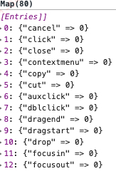
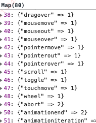
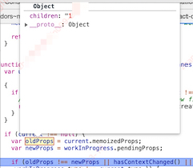
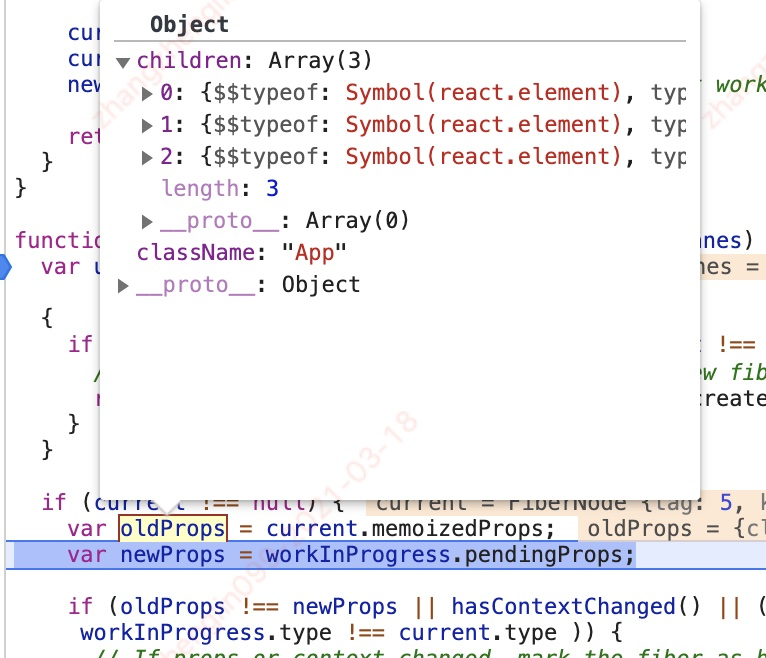
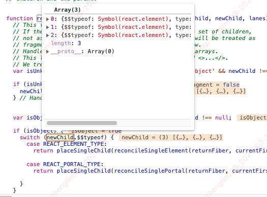
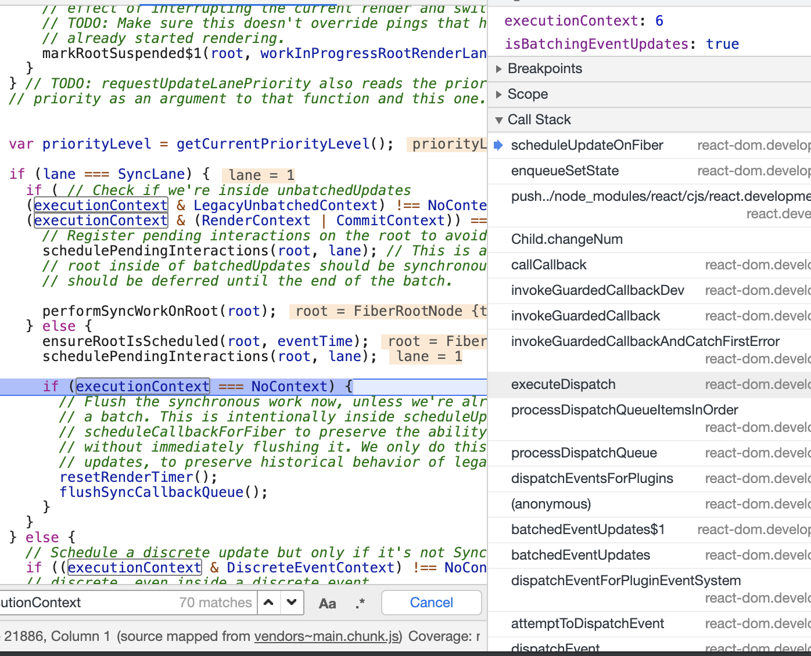
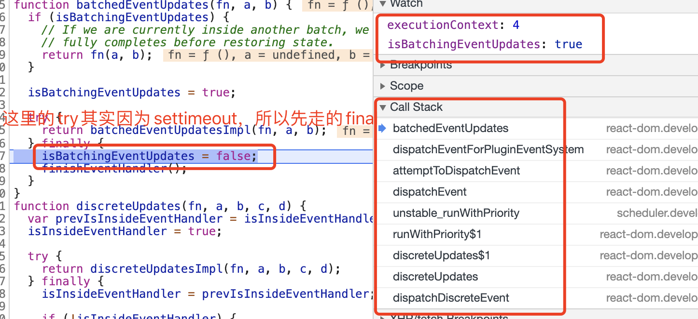
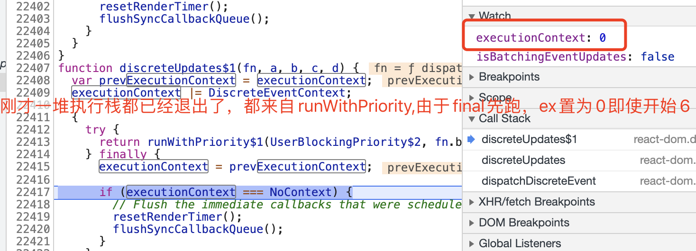
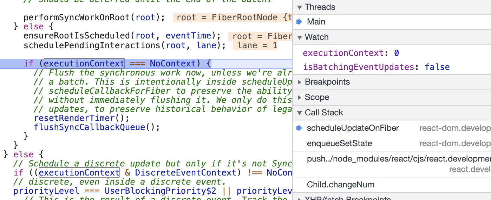

### 常见问题

1. 什么是控制反转？

    <details open>

    控制反转是指把对象的依赖管理从内部转移至外部，降低内部耦合，依赖注入，hoc，render props 都算控制反转。

2. HOOK 的实践(非常重要！！！)

    <details open>

    那有了 HOOK 之后，其实很多上述的一些方法可以用 `HOOK` 来改写，更加的直观。

    使用 `hook` 的话，配合`react context`，可以更加快速方便的管理状态。比之前也更加容易一点。

    - useCallback: 返回一个记忆持久化的函数
    - useContext: 获取上下文,
    - useEffect: 每次进来后都会执行，如果有第二个参数根据第二个参数是否发生变化决定执行与否,
    - useImperativeHandle: 配合 forwardRef 使用，具体没用过
    - useLayoutEffect: `useLayoutEffect` 与 `useEffect` 的不同在于，`useLayoutEffect` 会在 `DOM` 渲染之前执行，而 `useEffect` 会在 `DOM` 渲染之后执行，所以我们可以利用这个特性，避免一些由于 `DOM` 渲染之后进行操作导致的白屏问题。 `useLayoutEffect` 会阻塞渲染，请谨慎使用。
    - useMemo: 返回一个记忆持久化的值
    - useReducer: useState 的加强版,
    - useRef: ref 传递,
    - useState: 状态管理,
    - useDebugValue: debugger 方法

3. hooks 缺陷

    <details open>

    1. 使用 `Hooks` 编写代码时候，你必须清楚代码中 `useEffect` 和 `useCallback` 的“依赖项数组”的改变时机。有时候，你的 `useEffect` 依赖某个函数的不可变性，这个函数的不可变性又依赖于另一个函数的不可变性，这样便形成了一条依赖链。一旦这条依赖链的某个节点意外地被改变了，你的 `useEffect` 就被意外地触发了。
    2. 一旦用了 `hooks`，代码量稍微多一点的情况下，大家要介入修改的话必须要整体的看完这些代码，因为 `useEffect` 相当于断挡了，看代码会费劲，不像 `this` 的时候，`this.xxx`，可以很容易的找到调用链。
    3. 为什么说是缓存雪崩呢？ 造成这个问题主要是因为 `Hooks` 函数运行是独立的，每个函数都有一份独立的作用域。函数的变量是保存在运行时的作用域里面，这里也可以理解成闭包。每次都会创建闭包数据，从性能角度来讲，此时缓存就是必要的了。而缓存就会牵扯出一堆问题。另外当我们有异步操作的时候，经常会碰到异步回调的变量引用是之前的，也就是旧的，于是就导致无法批量更新。
    4. 然后遇到实在需要存储的变量的时候，类似于挂在 `this` 上的时候，就需要使用 `useRef + ref.current`，不是很优雅

4. 为什么写 JSX 的时候，即使没用 React 也必须 import react 呢？

    <details open>

    因为即使写的是函数式代码，实际上 Babel 都会转译成 `React.createElement`,不引入的话就不能使用了。

5. this.setState 里参数是函数的时候和 Object 区别是什么

    <details open>

    不管是函数还是对象，最后都是合成了一个新的状态对象。`return Object.assign({}, prevState, partialState)`;

    只是在求这个 partialSate 的时候，Object 是直接赋值，function 的话`partialState = payload.call(instance, prevState, nextProps);`

    主要的区别就是，普通的 object 里要是想使用上一次这个 state.xx 的值的话，会不准的，而通过函数式的话，人家代码内部给你上一次真实的 prevState，那就铁定不会错了。

    都还是批处理异步的。

6. this.forceUdate 是干嘛用的

    <details open>

    正常，`state`或者是`props`变化时，会触发`render`渲染，但是如果有些情况需要其他数据，那就可以用`forceUpdate`，调用它后会让组件强制调用`render`方法。

7. 为什么函数式组件不能使用`ref`，想用怎么办？

    <details open>

    因为`ref`是放在`class`实例下的，函数式组件没有实例，所以就不能使用`ref`。

    老版本里，可以再把`ref`改个名字，作为`props`传递过去。

    新版本的话,可以利用`React.forwardRef`包裹原有函数，创建一个`React`组件，加一个`ref`参数，实际上就是在`render`的时候，把这个`ref`转发下去。

    在渲染`beginwork`开始的时候，对于最外面的这个是`class`还是`function`是不知道的，当然，通过`forwardRef`的会把里面标记为`forwardRef`组件。然后在`update`的时候，`forwardRef`会把`ref`提出来，而其他`renderWithHooks`的对应位置参数是`context`，后面的和无状态组件就一样了

8. ref 是怎么把 dom 塞进 current 属性里的？

    <details open>

    React.createRef 生成一个只含有 current 的对象。

    然后在组件挂载的时候，给这个 current 属性存入 DOM 元素，并在卸载的时候传入 null。ref 会在 didmount 和 didupdate 触发前更新。在渲染出来后，会执行 `commitAttachRef` 方法，卸载的时候执行 `detach` 方法解除 ref。

    这个方法目前就两种方式，里面有这个 Fiber 对象节点和 ref 的对象，它会把 `Fiber.stateNode` 赋值给 `ref.current`，如果 ref 是函数的话，直接把 `Fiber.stateNode` 作为参数调用那个方法

    ```js
    instanceToUse = fiber.stateNode;
    typeof ref === "function"
        ? ref(instanceToUse)
        : (ref.current = instanceToUse);
    ```

9. 什么是虚拟 dom

    <details open>

    虚拟 DOM 就是一个 JS 对象模拟 DOM 树。

    ```js
    {
         tag: 'div',
         props: {
             id: 'app'
         },
         chidren: [
         {
             tag: 'p',
             props: {
             className: 'text'
         },
             chidren: [
                 'hello world!!!'
             ]
         }
         ]
    }
    ```

    因为原生操作 `dom` 的方式可维护性不高

    如果大批量的 `innerHTML` 会增大绘制时间。同时，触发回流的频率更高。

    使用虚拟 `dom` 相当于可以用 `js` 完成 `UI` 的驱动。可以跨平台。

    `Virtual DOM` 在牺牲(牺牲很关键)部分性能的前提下，增加了可维护性，这也是很多框架的通性。

    `DOM` 属性特别多，大部分属性对于做 `Diff` 是没有任何用处的，所以如果用更轻量级的 `JS` 对象来代替复杂的 `DOM` 节点，然后把对 `DOM` 的 `diff` 操作转移到 `JS` 对象，就可以避免大量对 `DOM` 的查询操作。

    这个更轻量级的 `JS` 对象就称为 `Virtual DOM` 。

    它的优势有

    1. 将 `Virtual DOM` 作为一个兼容层，让我们还能对接非 `Web` 端的系统，实现跨端开发。
    2. 同样的，通过 `Virtual DOM` 我们可以渲染到其他的平台，比如实现 `SSR`、同构渲染等等。
    3. 实现组件的高度抽象化

10. React.Children.map 这个方法是干嘛用的

    <details open>

    `React.Children` 提供了用于处理 `this.props.children` 不透明数据结构的方法，并且利用 `traverseAllChildrenImplf` 方法打平数组，返回的一定是一个一纬数组。

    ```js
    React.Children.map(this.props.children, child => {
        return React.cloneElement(child, {
            key: child.id,
            currentIdx: this.state.currentIdx,
            onTabClick: this.onTabClick
        });
    });
    ```

    比如我这个架子里，`this.props.children`是不透明的，又需要注入一些 props，就只能通过这个方法。

11. react context

    <details open>

    React.createContext 其实就是返回了一个 ctx 对象，标记它的 ctx 类型

    然后添加了两个属性，一个是 Provider，一个是 Consumer，Provider 下有两个属性，一个是 provider 类型，一个是\_context 指向 ctx。Consumer 指向 ctx

    可以利用 context 来做状态管理。封装 createPage 和 inject。

    有了 hooks 后，就不需要 consumer 了

    参考[react-context](https://github.com/JansenZ/react-context/blob/main/state/connect.js)

12. react 所有生命周期的作用。

    <details open>

    - constructor 是 class 本身的，和 react 无关，但是可以作为 react 的一个初始化的函数。
    - componentWillMount 组件将要挂载
    - render 渲染
    - componentDidMount 组件挂载完成
    - static getDerivedStateFromProps 传入 nextprops 和 prevState, return 的值就是更新的 state,return null 就是不更新
      配合 componentDidUpdate 使用更佳 getDerivedStateFromProps 是一个静态方法，而组件实例无法继承静态方法，所以该生命周期钩子内部无法通过使用 this 获取组件实例的属性/方法。
    - shouldComponentUpdate 询问组件是否要更新 ->yes? componentWillUpdate-> render -> componentdidUpdate
    - componentWillUnmount 组件卸载之前

13. React 如何判断是类组件还是 function 组件

    <details open>

    `ClassComponent.prototype.isReactComponent = {};` 类组件原型有这个，function 没有

14. 为什么要废弃一些生命周期

    <details open>

    - [UNSAFE_]componentWillMount（弃用）
    - [UNSAFE_]componentWillReceiveProps（弃用）
    - getDerivedStateFromProps
    - shouldComponentUpdate
    - [UNSAFE_]componentWillUpdate（弃用）

    由于 **调和**阶段是可中断的，一旦中断之后恢复的时候又会重新执行,所以在 调和 阶段的生命周期的方法是不稳定的，这就是 React 为什么要废弃 `componentWillMount`和 `componentWillReceiveProps`方法而改为静态方法 `getDerivedStateFromProps`的原因。

    而那些 didxxx 因为是在 commit 阶段执行，所以不会被打断，所以也是安全的

15. react concurrent 模式的思想是什么

    <details open>

    1. useTransition
    2. useDeferredValue
    3. Suspense

    我们从研究得知悬停和文本输入之类的交互需要在很短的时间内处理，而点击和页面转换可以等待稍长时间而不会感到迟缓。Concurrent 模式在内部使用不同的“优先级”，大致对应于人类感知研究中的交互类别。

    总结就是 A 点跳 B 的时候，先停留在 A 页面一会，先预加载 B，然后多少 ms 后跳转到 B 去，如果速度快这个时候 B 就已经出来了，如果速度慢，这个时候再出加载也没啥问题。

16. React.createElement

    <details open>

    正常写 jsx 的代码会被 babel 转译成该方法，方法接收三+个参数，一个是 type,一个是 prop obj,一个是 children
    第一个参数如果是 html 标签，那就是个普通的 type，如果是一个 React 组件的话，会去判断这个 type 下有没有 defaultProps 属性，如果有的话，会给对应的 props 上默认值。
    第二个参数上来会剔除 key 和 ref，然后赋值给 prop，还有 children 也是。
    第三个+以后的参数就是 children 了，源码里会判断它的 length，如果只有一个的话 children=它，否则话 children=[]；
    最后生成一个 ReactElement 出来。
    这个对象会有一个属性\$\$typeof 标记它是一个 React 对象，type,key,ref,prop 都有

17. React 有 Component 和 pureComponent，我们写的类都是继承它的，这样我们就拥有了 setState,和 forceUpdate 方法。

    在`PureCompent`和`Component`的区别就是，`PureComponent`就是继承自`Component`,然后添加了一个原型属性`isPureComponent`代表它是`pure`，具体的判断应该就是在 react-dom 里面了。

### React 合成事件

1. 合成事件特点

    <details open>

    React 是自己实现的一套事件机制，主要是因为

    1. 抹平浏览器之间的兼容性差异
    2. 对某些原生事件`（change，select，beforeInput等）`的升级和改造，这类事件注册时会附带注册一些依赖项

        例如，给 input 注册了 onchange 事件，那么 "blur", "change", "click", "focus", "input", "keydown", "keyup", "selectionchange" 这些事件全都会被注册

        原生只注册一个 onchange 的话，需要在失去焦点的时候才能触发这个事件，所以这个原生事件的缺陷 react 也帮我们弥补了。

    3. 可以跨平台了
    4. 使用事件委托，简化了 DOM 事件的处理逻辑，减少了内存开销
    5. 对事件进行归类，可以优先级分级干预

2. 合成事件流程

    <details open>

    详细流程： [参考](https://juejin.cn/post/6922444987091124232)

    当我们为一个元素绑定事件时，会这样写：

    `<div onClick={() => {/*do something*/}}>React</div>`

    这个 div 节点最终要对应一个 fiber 节点，onClick 则作为它的 prop。

    当这个 fiber 节点进入 render 阶段的 complete 阶段时，也就是`diff`完毕后，名称为 onClick 的 prop 会被识别为事件进行处理。

    进入设置属性的函数`setInitialDOMProperties`，这个函数的作用是判断你的`propKey`类型并决定是设置属性。还是绑定事件。

    不管是标签页好，nativeEvent 也好，最终都是会进入 `addTrappedEventListener` 方法，会有参数是否是捕获还是冒泡进来。

    而添加好的事件，以前会存到数组中，现在直接存到一个 Set 集合中

    ```js
    if (!listenerSet.has(listenerSetKey)) {
        addTrappedEventListener(
            targetElement,
            domEventName,
            IS_NON_DELEGATED,
            isCapturePhaseListener
        );
        listenerSet.add(listenerSetKey);
    }
    ```

    这个方法会根据你的 keyname 来分配不同的 `listener`

    这个 listener 就是比如点击执行的回调函数，既然是回调函数，也就是说最终 事件 触发会进入这个 listener，所以它会根据事件类型的优先级，创建出不同的分发事件执行机

    ```js
    function createEventListenerWrapperWithPriority(
        targetContainer,
        domEventName,
        eventSystemFlags
    ) {
        // 事件的基本优先级，存在了一个Map对象下
        var eventPriority = getEventPriorityForPluginSystem(domEventName);
        var listenerWrapper;

        switch (eventPriority) {
            // 0 处理离散事件
            case DiscreteEvent:
                listenerWrapper = dispatchDiscreteEvent;
                break;
            // 1 处理用户阻塞事件
            case UserBlockingEvent:
                listenerWrapper = dispatchUserBlockingUpdate;
                break;
            // 2 处理连续事件
            case ContinuousEvent:
            default:
                listenerWrapper = dispatchEvent;
                break;
        }
        return listenerWrapper.bind(
            null,
            domEventName,
            eventSystemFlags,
            targetContainer
        );
    }
    ```

    
    

    OK，我们先不看具体的执行时机，接下来获取到了 listener 后，就会根据是捕获还是冒泡，真实的的给 dom 节点添加事件。形如下面

    ```js
    function addEventBubbleListener(target, eventType, listener) {
        target.addEventListener(eventType, listener, false);
        return listener;
    }
    function addEventCaptureListener(target, eventType, listener) {
        target.addEventListener(eventType, listener, true);
        return listener;
    }
    ```

    当执行的时候，以用户阻塞的优先级级别为例： `dispatchUserBlockingUpdate`, 这个方法会直接执行 scheduler 中的`runWithPriority`函数

    通过调用它，将优先级记录到利用 scheduler 中，所以调度器才能在调度的时候知道当前任务的优先级

3. 合成事件流程（老）

    <details open>

    以下是老版本的。可以不看了

    如果你是一个事件，它内部会有一个对象包含事件属性，比如你是一个`onClick`，会进入`ensureListeninTo`方法。

    `ensureListeninTo`方法会确定事件委托的地方，比如`body`,然后调用`listenTo`方法。

    `listenTo`方法进本就是事件的入口方法，它里会获取已订阅的事件列表和依赖组，并且判断当前的事件类型有没有已经在订阅事件列表里，如果有就不再注册了，也就是说，事件处理器只需在`Document`订阅一次，所以相比在每个元素上订阅事件会节省很多资源.

    接下来会判读昂当前事件类型，是冒泡还是捕获，然后分配`trapCapturedEvent`还是`trapBubbledEvent`。像`scroll`,`focus`之类的属于捕获，而`onclick`这一的属于冒泡。

    `trapBubbleEvent`方法里会根据当前事件的优先级分配不同的`dispatch`，然后把这个`dispatch`作为`listener`真正的加入`dom`的监听事件。

    当点击的时候，都会调用`dispatchEvent`函数. `dispatchEvent`中会从`DOM`原生事件对象获取事件触发的`target`，再根据这个`target`获取关联的`React`节点实例。然后执行对应的方法。

### React Fiber

1. 设计理念

    <details open>

    我们知道，JS 可以操作 DOM，GUI 渲染线程与 JS 线程是互斥的。所以 JS 脚本执行和浏览器布局、绘制不能同时执行。

    而我们的 React 是主 JS 的，那么，当 JS 执行时间过长，超出了 16.6ms， 就没有时间执行**样式布局**和**样式绘制**了。这样就会卡顿

    所以，就需要有打断的这个概念， 也就是**时间分片**

    每次运行的时候，每次循环都会调用`shouldYield`来判断当前是否有剩余时间

    ```js
    function workLoopConcurrent() {
        // Perform work until Scheduler asks us to yield
        while (workInProgress !== null && !shouldYield()) {
            workInProgress = performUnitOfWork(workInProgress);
        }
    }
    ```

    而这个`shouldYield`的判断呢，其实就是需不需要把控制权交还给 UI，初始预留给 js 的时间是 [5ms(源码查看)](https://github.com/facebook/react/blob/8e5adfbd7e605bda9c5e96c10e015b3dc0df688e/packages/scheduler/src/forks/SchedulerHostConfig.default.js#L115)

    具体里面的打断逻辑我们到调度器说。

2. Fiber 的含义

    <details open>

    1. 作为架构来说，之前 React15 的 Reconciler 采用递归的方式执行，数据保存在递归调用栈中，所以被称为 stack Reconciler。React16 的 Reconciler 基于 Fiber 节点实现，被称为 Fiber Reconciler。

    2. 作为静态的数据结构来说，每个 Fiber 节点对应一个 React element，保存了该组件的类型（函数组件/类组件/原生组件...）、对应的 DOM 节点等信息。

    3. 作为动态的工作单元来说，每个 Fiber 节点保存了本次更新中该组件改变的状态、要执行的工作（需要被删除/被插入页面中/被更新...）。

3. Fiber 结构

    <details open>

    ```js
    function FiberNode(
        tag: WorkTag,
        pendingProps: mixed,
        key: null | string,
        mode: TypeOfMode
    ) {
        // 作为静态数据结构的属性
        this.tag = tag;
        this.key = key;
        this.elementType = null;
        this.type = null;
        // dom节点
        this.stateNode = null;

        // 用于连接其他Fiber节点形成Fiber树
        this.return = null;
        // 子孩子节点
        this.child = null;
        // 右边的第一个兄弟节点，也就说，last节点只有return，没有sibling
        this.sibling = null;
        // 它在自己这个层级的index
        this.index = 0;

        this.ref = null;

        // 作为动态的工作单元的属性
        this.pendingProps = pendingProps;
        // 记忆属性
        this.memoizedProps = null;
        // 更新队列,正常结构如下
        /*
        updateQueue {
            baseState
            effects: null
            firstBaseUpdate: null
            lastBaseUpdate: null
        }
        */

        this.updateQueue = null;
        this.memoizedState = null;
        this.dependencies = null;

        this.mode = mode;

        this.effectTag = NoEffect;
        this.nextEffect = null;

        this.firstEffect = null;
        this.lastEffect = null;

        // 调度优先级相关
        this.lanes = NoLanes;
        this.childLanes = NoLanes;

        // 指向该fiber在另一次更新时对应的fiber
        this.alternate = null;
    }
    ```

4. 双缓存树

    <details open>

    在 React 中最多会同时存在两棵 Fiber 树。当前屏幕上显示内容对应的 Fiber 树称为 current Fiber 树，正在内存中构建的 Fiber 树称为 workInProgress Fiber 树。

    current Fiber 树中的 Fiber 节点被称为 current fiber，workInProgress Fiber 树中的 Fiber 节点被称为 workInProgress fiber，他们通过 alternate 属性连接。

    ```js
    currentFiber.alternate === workInProgressFiber;
    workInProgressFiber.alternate === currentFiber;
    ```

    React 应用的根节点通过 current 指针在不同 Fiber 树的 rootFiber 间切换来实现 Fiber 树的切换。

    当 workInProgress Fiber 树构建完成交给 Renderer 渲染在页面上后，应用根节点的 current 指针指向 workInProgress Fiber 树，此时 workInProgress Fiber 树就变为 current Fiber 树。

    每次状态更新都会产生新的 workInProgress Fiber 树，通过 current 与 workInProgress 的替换，完成 DOM 更新。

    而通过每个 fiber 节点的 alternate 属性对比，决定是否复用的过程，就是 Diff 算法，diff 单独讲

5. FiberRoot RootFiber

    <details open>

    FiberRoot 是整个应用的根节点，通过它的 current 指向当前的 current Fiber，也就是 rootFiber `fiberRootNode.current = rootFiber;`

### 调度器 Scheduler

1. 如何判断当前用户的输入是否被挂起？

    <details open>

    `navigator.scheduling.isInputPending`这个 API 可以判断

2. React 调度如何判断是否需要交还控制权给 UI？

    <details open>

    [SchedulerHostConfig.js](https://github.com/facebook/react/blob/1fb18e22ae66fdb1dc127347e169e73948778e5a/packages/scheduler/src/forks/SchedulerHostConfig.default.js#L228-L234)

    这个问题分几个步骤来看

    1. 如果是不支持 `MessageChannel` 或者是无 `Window`,也就是没有 UI 的浏览器，退化到同步模式，是否需要打断永远返回 `false`
    2. 如果支持 `MessageChannel`
       首先，默认的可执行时间是 **5ms**
        1. 支持 `isInputPending`，那么会在过期后去判断是否有**需要绘制的任务**，以及**是否有用户输入挂起**
            - 如果有，立马返回 `true`,也就是要打断
            - 如果没有，那么，再判断当前时间和最大打断时间 300ms 比较，最大程度的跑代码
        2. 如果不支持 `isInputPending`,那就当没有优化 300ms 这回事，依然每跑 5ms 就交还控制权。

3. React 同一时间任务很多，它是怎么做的？

    <details open>

    采用两个队列，一个是还没过期的任务，一个是过期任务

    - timerQueue：保存未就绪任务
    - taskQueue：保存已就绪任务

    每当有新的未就绪的任务被注册，我们将其插入 `timerQueue` 并根据开始时间重新排列 `timerQueue` 中任务的顺序。

    当 `timerQueue` 中有任务就绪，即 `startTime <= currentTime`，我们将其取出并加入 `taskQueue`。

    取出 `taskQueue` 中最早过期的任务并执行他。

    那么这两个队列，采用的是**小顶堆**的模式，这样方便排序，以及每次取顶部的那个，获取最早过期的复杂度 O(1)

4. 任务是怎么按时间分片执行的

    <details open>

    ```js
    const performWorkUntilDeadline = () => {
        if (scheduledHostCallback !== null) {
            // 获取当前时间
            const currentTime = getCurrentTime();

            // 计算deadline，deadline会参与到
            // shouldYieldToHost（根据时间片去限制任务执行）的计算中
            deadline = currentTime + yieldInterval;
            // hasTimeRemaining表示任务是否还有剩余时间，
            // 它和时间片一起限制任务的执行。如果没有时间，
            // 或者任务的执行时间超出时间片限制了，那么中断任务。

            // 它的默认为true，表示一直有剩余时间
            // 因为MessageChannel的port在postMessage，
            // 是比setTimeout还靠前执行的宏任务，这意味着
            // 在这一帧开始时，总是会有剩余时间
            // 所以现在中断任务只看时间片的了
            const hasTimeRemaining = true;
            try {
                // scheduledHostCallback去执行任务的函数，
                // 当任务因为时间片被打断时，它会返回true，表示
                // 还有任务，所以会再让调度者调度一个执行者
                // 继续执行任务
                const hasMoreWork = scheduledHostCallback(
                    hasTimeRemaining,
                    currentTime
                );

                if (!hasMoreWork) {
                    // 如果没有任务了，停止调度
                    isMessageLoopRunning = false;
                    scheduledHostCallback = null;
                } else {
                    // 如果还有任务，继续让调度者调度执行者，便于继续
                    // 完成任务
                    port.postMessage(null);
                }
            } catch (error) {
                port.postMessage(null);
                throw error;
            }
        } else {
            isMessageLoopRunning = false;
        }
        needsPaint = false;
    };
    ```

    `performWorkUntilDeadline` 内部调用的是 `scheduledHostCallback`，它早在开始调度的时候就被 `requestHostCallback` 赋值为了 `flushWork`

    `flushWork` 作为真正去执行任务的函数，它会循环 `taskQueue`，逐一调用里面的任务函数

    它调用了 `workLoop`，并将其调用的结果 `return` 了出去。那么现在任务执行的核心内容看来就在 `workLoop` 中了。`workLoop` 的调用使得任务最终被执行。

    `workLoop` 中可以分为两大部分：循环 `taskQueue` 执行任务 和 任务状态的判断。

    取出 `taskQueue` 中最早过期的任务并执行他。若任务函数返回值为函数，那么就说明当前任务尚未完成，需要继续调用任务函数，否则任务完成。`workLoop` 就是通过这样的办法判断单个任务的完成状态。

5. React 中有哪些优先级

    <details open>

    ```js
    switch (priorityLevel) {
        // 立刻
        case ImmediatePriority:
        // 用户输入
        case UserBlockingPriority:
        // 普通
        case NormalPriority:
        // 低
        case LowPriority:
        // 闲时
        case IdlePriority:
            break;
        default:
            priorityLevel = NormalPriority;
    }
    // Times out immediately
    var IMMEDIATE_PRIORITY_TIMEOUT = -1;
    // Eventually times out
    var USER_BLOCKING_PRIORITY_TIMEOUT = 250;
    var NORMAL_PRIORITY_TIMEOUT = 5000;
    var LOW_PRIORITY_TIMEOUT = 10000;
    // Never times out
    var IDLE_PRIORITY_TIMEOUT = maxSigned31BitInt;
    ```

    - 过期任务或者同步任务使用同步优先级

    - 用户交互产生的更新（比如点击事件）使用高优先级

    - 网络请求产生的更新使用一般优先级

    - Suspense 使用低优先级

6. 什么是 Lane 模型

    <details open>

    [LANE](https://github.com/facebook/react/blob/1fb18e22ae66fdb1dc127347e169e73948778e5a/packages/react-reconciler/src/ReactFiberLane.js#L77-L107)

    lane 模型借鉴了同样的概念，使用 31 位的二进制表示 31 条赛道，位数越小的赛道优先级越高，某些相邻的赛道拥有相同优先级。

    越低优先级的更新越容易被打断，导致积压下来，所以需要更多的位。相反，最高优的同步更新的 SyncLane 不需要多余的 lanes

    所以低优先级的会需要更多的赛道，高优先级的不需要

### 协调器/调和器 Reconciler

1. 调和的主要工作有

    <details open>

    每当有更新发生时，`Reconciler` 会做如下工作：

    - 调用函数组件、或 `class` 组件的 `render` 方法，将返回的 `JSX` 转化为虚拟 `DOM`
    - 将虚拟 `DOM` 和上次更新时的虚拟 `DOM` 对比
    - 通过对比找出本次更新中变化的虚拟 `DOM`
    - 通知 `Renderer` 将变化的虚拟 `DOM` 渲染到页面上

2. stack Reconciler 特点

    <details open>

    由于递归执行，一旦任务开始进行，就无法中断，那么 `js`将一直占用主线程， 一直要等到整棵 `Virtual DOM` 树计算完成之后，才能把执行权交给渲染引擎，那么这就会导致一些用户交互、动画等任务无法立即得到处理，就会有卡顿，非常的影响用户体验。

    Reconciler 与 Renderer 是交替工作

3. Fiber Reconciler 特点

     <details open>

    可打断，根据 `shouldYield` 判断， 因为可打断，所以不能交替渲染工作，需要整个 `Scheduler` 与 `Reconciler` 的工作都在内存中进行。只有当所有组件都完成 `Reconciler` 的工作，才会统一交给 `Renderer`。

    在 React16 中，`Reconciler` 与 `Renderer` 不再是交替工作。当 `Scheduler` 将任务交给 `Reconciler` 后，`Reconciler` 会为变化的虚拟 `DOM` 打上代表增/删/更新的标记

4. React 16 渲染器

    <details open>

    Renderer 根据 Reconciler 为虚拟 DOM 打的标记，**同步**执行对应的 DOM 操作。

    更新流程为
    

    其中红框中的步骤随时可能由于以下原因被中断：

    - 有其他更高优任务需要先更新
    - 当前帧没有剩余时间

    由于红框中的工作都在内存中进行，不会更新页面上的 DOM，所以即使反复中断，用户也不会看见更新不完全的 DOM。

5. render 方法的执行过程

    <details open>

    ```js
    // performSyncWorkOnRoot会调用该方法
    function workLoopSync() {
        while (workInProgress !== null) {
            performUnitOfWork(workInProgress);
        }
    }

    // performConcurrentWorkOnRoot会调用该方法
    function workLoopConcurrent() {
        while (workInProgress !== null && !shouldYield()) {
            performUnitOfWork(workInProgress);
        }
    }
    ```

    简单来说，通过 `performUnitOfWork`，`performUnitOfWork` 方法会创建下一个 `Fiber` 节点并赋值给 `workInProgress`，并将 `workInProgress` 与已创建的 `Fiber` 节点连接起来构成 `Fiber` 树。

    通过 `beginwork` 和 `completeWork` 这一递一归，来完成整个 `fiber` 树的构建，`DFS`，深度遍历

    ```
    A {
        b
        c
        d {
            e
            f
        }
    }
    ```

    这个是就是 A-begin,b-begin,b-complete,c-begin,c-complete,d-begin,e-begin,e-complete,f-begin,f-complete,d-complete,A-complete

    大体流程如下

    ```js
    function performUnitOfWork(fiber) {
        // 执行beginWork

        if (fiber.child) {
            performUnitOfWork(fiber.child);
        }

        // 执行completeWork

        if (fiber.sibling) {
            performUnitOfWork(fiber.sibling);
        }
    }
    ```

### 调和器 beginWork

1. beginWork 干哪些事

    <details open>

    `beginWork` 的工作是传入当前 `Fiber` 节点，创建子 `Fiber` 节点，我们从传参来看看具体是如何做的

    ```js
    function beginWork(
        current: Fiber | null,
        workInProgress: Fiber,
        renderLanes: Lanes
    ): Fiber | null {
        // ...省略函数体
    }
    ```

    - 第一个参数，就是当前页面上渲染的对应的这个 Fiber 节点，也就是 `workInProgress.alternate`
    - 第二个参数，就是当前组件对应的 Fiber 节点
    - 第三个参数，优先级相关

    那么 mount 的时候，current 肯定是 null,如果不为 null,就说明是更新阶段

    update 时：如果 `current` 存在，在满足一定条件时可以复用 `current` 节点，这样就能克隆 `current.child` 作为 `workInProgress.child`，而不需要新建 `workInProgress.child`。

    mount 时：除 fiberRootNode 以外，current === null。会根据 `fiber.tag` 不同，创建不同类型的子 Fiber 节点, 和子节点联通的代码片段为

    ```js
    var type = workInProgress.type;
    var nextProps = workInProgress.pendingProps;
    var prevProps = current !== null ? current.memoizedProps : null;
    var nextChildren = nextProps.children;
    ```

    pendingProps 里保存的就是对应的 reactElement

2. 更新的时候，如何判断可以复用 current 节点呢？

    <details open>

    - oldProps === newProps && workInProgress.type === current.type，即 props 与 fiber.type 不变
    - !includesSomeLane(renderLanes, updateLanes)，即当前 Fiber 节点优先级不够

    那么，props 前后是啥呢？举个例子就是它们的 children 是否一样，如果你是个文本标签，那你前后就是对应的文本
    
    如果你是个 div 标签，里面又有子标签，那前后就是这个来对比
    

    经过观察，发现，除了根节点外的一些东西，里面的只要大的改动了，即使 props 前后字面一样，也不会相等，所以基本没啥用，后面还是会去 reconcileChildren 来 diff。

3. mount 的时候组件类型有哪些

    <details open>

    [类型集合](https://github.com/facebook/react/blob/1fb18e22ae66fdb1dc127347e169e73948778e5a/packages/react-reconciler/src/ReactWorkTags.js)

    对于我们常见的组件类型，如`（FunctionComponent/ClassComponent/HostComponent）`，最终会进入 `reconcileChildren` 方法。

4. reconcileChildren 方法

    <details open>

    ```js
    function reconcileChildren(
        current,
        workInProgress,
        nextChildren,
        renderLanes
    ) {
        if (current === null) {
            workInProgress.child = mountChildFibers(
                workInProgress,
                null,
                nextChildren,
                renderLanes
            );
        } else {
            // 跑完这个diff后，workInProgress的child就有啦，因为它的结构没有children,是child.sibling的形式，所以孩子等等一轮就得搞出来。
            workInProgress.child = reconcileChildFibers(
                workInProgress,
                current.child,
                nextChildren,
                renderLanes
            );
        }
    }
    ```

    可以看到，也是根据 current 来判断，进入 mount 还是 update

    对于 update 的组件，他会将当前组件与该组件在上次更新时对应的 Fiber 节点比较（也就是俗称的 Diff 算法），将比较的结果生成新 Fiber 节点

    mountChildFibers 与 reconcileChildFibers 这两个方法的逻辑基本一致。唯一的区别是：reconcileChildFibers 会为生成的 Fiber 节点带上 `effectTag` 属性，而 mountChildFibers 不会。

    render 阶段的工作是在内存中进行，当工作结束后会通知 Renderer 需要执行的 DOM 操作。要执行 DOM 操作的具体类型就保存在 `fiber.effectTag` 中。
    比如

    ```js
    // DOM需要插入到页面中
    export const Placement = /*                */ 0b00000000000010;
    // DOM需要更新
    export const Update = /*                   */ 0b00000000000100;
    // DOM需要插入到页面中并更新
    export const PlacementAndUpdate = /*       */ 0b00000000000110;
    // DOM需要删除
    export const Deletion = /*                 */ 0b00000000001000;
    ```

    那么，如果要通知 `Renderer` 将 `Fiber` 节点对应的 `DOM` 节点插入页面中，需要满足两个条件：

    1. `fiber.stateNode` 存在，即 `Fiber` 节点中保存了对应的 `DOM` 节点

    2. `(fiber.effectTag & Placement) !== 0`，即 `Fiber` 节点存在 `Placement effectTag`

    整体的流程为
    

### 调和器 completeWork

1. completeWork 干哪些活

    <details open>

    进入 `completeWork` 后，目前只有 `fiber` 形态变了，对于原生 `DOM` 组件（HostComponent）和文本节点（HostText）的 fiber 来说，对应的 DOM 节点（fiber.stateNode）并未变化。

    经过 `Diff` 生成的新的 `workInProgress` 节点持有了 `flag`(即 effectTag)

    基于这两个特点，`completeWork` 的工作主要有：

    1. 构建或更新 `DOM` 节点，
    2. 构建过程中，会自下而上将子节点的第一层第一层插入到当前节点。
    3. 更新过程中，会计算 `DOM` 节点的属性，一旦属性需要更新，会为 `DOM` 节点对应的 `workInProgress` 节点标记 `Update` 的 `effectTag`。
    4. 自下而上收集 `effectList`，最终收集到 `root` 上

2. 它是怎么收集 effectList，这样的好处是什么？

    <details open>

    作为 `DOM` 操作的依据，`commit` 阶段需要找到所有有 `effectTag` 的 `Fiber` 节点并依次执行 `effectTag` 对应操作。难道需要在 `commit` 阶段再遍历一次 `Fiber` 树寻找 `effectTag !== null` 的 Fiber 节点么？

    为了不再次 `DFS`，就需要在 `complete` 的时候，创建 `effectList`，最后挂到 `root` 上, 这样，在 `commit` 阶段只需要遍历 `effectList` 就能执行所有 `effect` 了。

    每个 `workInProgress` 节点都有一个 `firstEffect` 和 `lastEffect`，是一个单向链表，来表示它自身以及它的子节点上所有持有 `effectTag` 的 `workInProgress` 节点。`completeWork` 阶段在向上遍历的过程中也会逐层收集 `effect` 链，最终收集到 `root` 上，供接下来的 `commit` 阶段使用。

    实现上相对简单，对于某个 `workInProgress` 节点来说，**先将它已有的 effectList 并入到父级节点，再判断它自己有没有 effectTag，有的话也并入到父级节点。**

    ```js
    /*
     * effectList是一条单向链表，每完成一个工作单元上的任务，
     * 都要将它产生的effect链表并入
     * 上级工作单元。
     * */
    // 将当前节点的effectList并入到父节点的effectList
    if (returnFiber.firstEffect === null) {
        returnFiber.firstEffect = completedWork.firstEffect;
    }
    if (completedWork.lastEffect !== null) {
        if (returnFiber.lastEffect !== null) {
            returnFiber.lastEffect.nextEffect = completedWork.firstEffect;
        }
        returnFiber.lastEffect = completedWork.lastEffect;
    }

    // 将自身添加到effect链，添加时跳过NoWork 和
    // PerformedWork的effectTag，因为真正
    // 的commit用不到
    const effectTag = completedWork.effectTag;

    if (effectTag > PerformedWork) {
        if (returnFiber.lastEffect !== null) {
            returnFiber.lastEffect.nextEffect = completedWork;
        } else {
            returnFiber.firstEffect = completedWork;
        }
        returnFiber.lastEffect = completedWork;
    }
    ```

### Commit 阶段

在 `rootFiber.firstEffect` 上保存了一条需要执行副作用的 `Fiber` 节点的单向链表 `effectList`，这些 `Fiber` 节点的 `updateQueue` 中保存了变化的 `props`。

这些副作用对应的 `DOM` 操作在 `commit` 阶段执行。

除此之外，一些生命周期钩子（比如 `componentDidXXX`）、`hook`（比如 `useEffect`）需要在 `commit` 阶段执行。

`commit` 阶段的主要工作（即 `Renderer` 的工作流程）分为三部分：

1. before mutation 阶段（执行 DOM 操作前）

    - 处理 DOM 节点渲染/删除后的 autoFocus、blur 逻辑。

    - 调用 `getSnapshotBeforeUpdate` 生命周期钩子。

    - 调度 `useEffect`。

2. mutation 阶段（执行 DOM 操作）

    主要执行`commitMutationEffects`，而它会遍历effectList，对每个Fiber节点执行如下三个操作：

    1. 根据ContentReset effectTag重置文字节点
    2. 更新ref
    3. 根据effectTag分别处理，其中effectTag包括(Placement | Update | Deletion | Hydrating)

    遇到删除操作的时候会有如下步骤

    1. 递归调用 Fiber 节点及其子孙 Fiber 节点中 fiber.tag 为 ClassComponent 的 componentWillUnmount (opens new window)生命周期钩子，从页面移除 Fiber 节点对应 DOM 节点
    2. 解绑 ref
    3. 调度 useEffect 的销毁函数

3. layout 阶段（执行 DOM 操作后）

    主要执行 `commitLayoutEffects`

    对于 ClassComponent，他会通过`current === null`区分是 mount 还是 update

    调用componentDidMount 或componentDidUpdate, 所以这两个执行时机其实是一样的。 [源码](https://github.com/facebook/react/blob/970fa122d8188bafa600e9b5214833487fbf1092/packages/react-reconciler/src/ReactFiberCommitWork.new.js#L592)

    对于 FunctionComponent 及相关类型，他会调用 useLayoutEffect hook 的回调函数， 调度 useEffect 的销毁与回调函数

    1. 赋值 ref，因为 dom 已经出来了
    2. 执行 setstate 回调, 执行 useLayoutEffect 的回调函数 或者是 didxxx
    3. 其他一些需要后续的操作

### React Diff

1. 新的 diff 的预设限制是啥，为什么？

    <details open>

    由于 Diff 操作本身也会带来性能损耗，React 文档中提到，即使在最前沿的算法中，将前后两棵树完全比对的算法的复杂程度为 O(n 3 )，其中 n 是树中元素的数量。

    如果在 React 中使用了该算法，那么展示 1000 个元素所需要执行的计算量将在十亿的量级范围。这个开销实在是太过高昂。

    为了降低算法复杂度，React 的 diff 会预设三个限制：

    1. 只对同级元素进行 `Diff`。如果一个 `DOM` 节点在前后两次更新中跨越了层级，那么 `React` 不会尝试复用他。
    2. 两个不同类型的元素会产生出不同的树。如果元素由 `div` 变为 p，`React` 会销毁 `div` 及其子孙节点，并新建 p 及其子孙节点。
    3. 开发者可以通过 `key prop` 来暗示哪些子元素在不同的渲染下能保持稳定。考虑如下例子：

    ```js
    // 更新前
    <div>
        <p key="J">J</p>
        <h3 key="K">K</h3>
    </div>

    // 更新后
    <div>
        <h3 key="K">K</h3>
        <p key="J">J</p>
    </div>
    ```

    如果没有 `key`，`React` 会认为 `div` 的第一个子节点由 p 变为 h3，第二个子节点由 h3 变为 p。这符合限制 2 的设定，会销毁并新建。

    但是当我们用 `key` 指明了节点前后对应关系后，`React` 知道 `key` === "J"的 p 在更新后还存在，所以 `DOM` 节点可以复用，只是需要交换下顺序。

    这就是 `React` 为了应对算法性能瓶颈做出的三条限制。

2. Diff 入口函数干了哪些事

    <details open>

    `function reconcileChildFibers(returnFiber, currentFirstChild, newChild, lanes)`

    1. 第一个参数就是 workinprogress
    2. 第二个参数就是 current.child
    3. 第三个参数就是 workinprogress 的 reactelement children

    ```js
    // 根据newChild类型选择不同diff函数处理
    function reconcileChildFibers(
        returnFiber: Fiber,
        currentFirstChild: Fiber | null,
        newChild: any
    ): Fiber | null {
        const isObject = typeof newChild === "object" && newChild !== null;
        // 如果是数组，比如是div下的多个p节点，isObject一样是true，但是，newChild.$$typeof就没有值了，因为它是数组
        if (isObject) {
            // object类型，可能是 REACT_ELEMENT_TYPE 或 REACT_PORTAL_TYPE
            switch (newChild.$$typeof) {
                case REACT_ELEMENT_TYPE:
                // 调用 reconcileSingleElement 处理
                // // ...省略其他case
            }
        }

        if (typeof newChild === "string" || typeof newChild === "number") {
            // 调用 reconcileSingleTextNode 处理
            // ...省略
        }

        if (isArray(newChild)) {
            // 调用 reconcileChildrenArray 处理
            // ...省略
        }

        // 一些其他情况调用处理函数
        // ...省略

        // 以上都没有命中，删除节点
        return deleteRemainingChildren(returnFiber, currentFirstChild);
    }
    ```

    

    当 newChild 类型为 object、number、string，代表同级只有一个节点

    当 newChild 类型为 Array，同级有多个节点

3. Diff 入口函数的删除

    <details open>

    因为只要进了 `diff`，肯定是递归调用的，`todo` 猜测

    举个例子，如果某个节点，本来有 `child` 的，比如 p=>span 或者本来没有 child，比如直接就是个文本节点， 然后它 setstate 的时候删除了对应的子节点，或者是没变化。

    那么它的 newChild 是 null，也就是`reconcileChildFibers`方法只会执行到`deleteRemainingChildren`，那么这样就相当于直接清理 child。当前节点的 fiber，workInProgress 节点生成

4. 单 Child 节点 Diff

    <details open>

    ```js
    function reconcileSingleElement(
        returnFiber: Fiber,
        currentFirstChild: Fiber | null,
        element: ReactElement
    ) {}
    ```

    我们再重复一下它的参数，

    1. 第一个 returnFiber 就是当前正在构建的 workinProgress 节点
    2. 第二个就是当前页面上的 returnFiber 的子节点，也就是 current.child
    3. 第三个就是要和 currentFirstChild 对比的那个新的 ReactElement

    ```js
    while (child !== null) {
        // ...
    }
    var _created4 = createFiberFromElement(element, returnFiber.mode, lanes);
    _created4.return = returnFiber;
    return _created4;
    ```

    我们省略了一些步骤，可以看到，假如 `child` 上来就是 `null`，说明啥，说明当前页面上没有这个节点，`reactelement` 是新的，所以直接创建新的 `fiber`，把它的 `return` 指向 `workinProgress` 节点

    那么假如 `child` 不是 `null` 的情况下，我们去判断 `child` 节点是否可以复用

    ```js
    // 首先判断是否存在对应DOM节点
    while (child !== null) {
        // 上一次更新存在DOM节点，接下来判断是否可复用

        // 首先比较key是否相同
        if (child.key === key) {
            // key相同，接下来比较type是否相同

            switch (child.tag) {
                // ...省略case

                default: {
                    if (child.elementType === element.type) {
                        // type相同则表示可以复用
                        // 返回复用的fiber
                        var existing = useFiber(child, element.props);
                        return existing;
                    }

                    // type不同则跳出switch
                    break;
                }
            }
            // 代码执行到这里代表：key相同但是type不同
            // 将该fiber及其兄弟fiber标记为删除
            deleteRemainingChildren(returnFiber, child);
            break;
        } else {
            // key不同，将该fiber标记为删除
            deleteChild(returnFiber, child);
        }
        // 继续查看child的兄弟元素们
        child = child.sibling;
    }
    ```

    1. 单节点会比较 `key` 是否相等(`null === null`，就是没有 key 的情况下)，然后如果 type 一样，直接复用。

    2. key 一样，type 不一样，说明复用不了了，还要把兄弟节点一起标记删除，代表都不能复用。这种情况没有去找复用的原因是，他们的`key`相同，如果节点类型不同的话，`React`会认为你已经把这个节点重新覆盖了，所以就不会再去找剩余的节点是否可以复用。

    最终都没有找到可复用的节点的话，就会创建新节点。

    3. key 不一样，type 一样的话，只标记当前 child 节点，然后继续往下判断

    那么可能会有疑问了，如果我改了标签上的类名，`onclick` 等等呢？ 并不影响 `Fiber` 大节点的复用，只需要把对应 `Fiber` 的 `pendingprops` 指向新的 `element` 的 `props` 即可

    `var existing = useFiber(child, element.props);`

    相当于 Obj 复用，只是 obj.props = newElement.pops， 这样理解

### 多节点 Diff

<details open>

如果现在进入了数组逻辑，也就是`function reconcileChildrenArray(returnFiber, currentFirstChild, newChildren, lanes)`

我们再来说说这参数，无限加深记忆

1. 当前的 workInProgress 节点
2. current.child，当前页面上渲染的节点的第一个孩子，也就是 1 的的 alternate 的第一个孩子
3. 新的 reactElements 数组

那么，我们准备进入比对了

首先，如果是开发环境的话，我们会去进入一层遍历，用来判断是否有无效的 `key`，就是两个 `key` 相等啊这样的东西

它的内部是使用 `Set` 集合来维护，`Set.has` 了直接 `break`，然后报错。

```js
{
    // DEV
    // First, validate keys.
    var knownKeys = null;

    for (var i = 0; i < newChildren.length; i++) {
        var child = newChildren[i];
        knownKeys = warnOnInvalidKey(child, knownKeys, returnFiber);
    }
}
```

现在，我们进入比对了，需要两轮遍历

第一轮遍历，属于处理更新节点，第二轮，处理不属于更新的节点

第一轮做的事情有[这里是源码](https://github.com/facebook/react/blob/1fb18e22ae66fdb1dc127347e169e73948778e5a/packages/react-reconciler/src/ReactChildFiber.new.js#L818)

1. let i = 0，遍历 `newChildren`，将 `newChildren[i]`与 `oldFiber` 比较，判断 `DOM` 节点是否可复用。是否可以复用和单节点一致，只要 `key` 和 `type` 一样，直接复用
2. 如果可复用，i++，继续比较 `newChildren[i]`与 `oldFiber.sibling`，可以复用则继续遍历。
3. 如果不可复用，分两种情况：
    1. `key` 不同导致不可复用，立即跳出整个遍历，第一轮遍历结束。
    2. `key` 相同 `type` 不同导致不可复用，会将 `oldFiber` 标记为 `DELETION`，并继续遍历
4. 如果 `newChildren` 遍历完（即 `i === newChildren.length - 1`）或者 `oldFiber` 遍历完（即 `oldFiber.sibling === null`），跳出遍历，第一轮遍历结束。

第一轮结束后，会出现 3 种情况

1. 第一个情况，新节点遍历完毕，说明它是做了`pop`这样的操作。那么直接把旧节点的剩余节点给删除就可以了。
2. 第二个情况，老节点遍历完了，说明它是做了`push`这样的操作。那么直接循环创建剩下的新节点就可以了。
3. 第三个情况，新老节点都没遍历完，意思它要么做了替换操作，要么就是移动了顺序，要么就是`unshift`或者`shift`之类的操作。
    - 遇到这样的情况，它会通过`mapRemainingChildren`方法，把剩下没跑完的`oldFiber`变成一个`Map`对象。key 值是`key`，没有 key 的话用`index`。
    ```js
    function mapRemainingChildren(
        returnFiber: Fiber,
        currentFirstChild: Fiber
    ): Map<string | number, Fiber> {
        const existingChildren: Map<string | number, Fiber> = new Map();
        let existingChild = currentFirstChild;
        while (existingChild !== null) {
            if (existingChild.key !== null) {
                existingChildren.set(existingChild.key, existingChild);
            } else {
                existingChildren.set(existingChild.index, existingChild);
            }
            existingChild = existingChild.sibling;
        }
        return existingChildren;
    }
    ```
    - 然后遍历新数组，在遍历的过程中会寻找新的节点的 `key`是否存在于这个 `Map`中，存在即可复用，不存在就创建一个新的。就相当于又回到了第一部分。
    - 然后还会去判断是否需要移动节点，如果 `oldFiber` 的 `index > lastPlacedIndex`,不动,并且把 `lastPlacedIndex = oldFiber.index`
    - 如果 `oldFiber` 的 `index < lastPlacedIndex` 就要右移了

完成后这一层的`diff`就完成，继续下一个工作单元 `performUnitOfWork`。直到全部结束。

那么，它是如何去跑下一个工作单元的呢？函数`performUnitOfWork`内有一项重要的代码

```js
// 这个next就是上面diff后返回的WorkinProgress.child
if (next === null) {
    // If this doesn't spawn new work, complete the current work.
    completeUnitOfWork(unitOfWork);
} else {
    // 递归吧
    workInProgress = next;
}
```

以下是比较完整的多节点 diff 代码

[filename](../js/diff.js ':include :type=code')

</details>

### Hooks

1. useCallback， useMemo 是怎么记忆化的？

    <details open>

    首先，这两位几乎没区别，唯一的区别就是一个是记忆化值，一个是记忆化函数

    以 useCallback 为例子

    ```js
    // mount 阶段
    function mountCallback<T>(
        callback: T,
        deps: Array<mixed> | void | null
    ): T {
        // 创建并返回当前hook
        const hook = mountWorkInProgressHook();
        // 约等于下面这个
        var hook = {
            memoizedState: null,
            baseState: null,
            baseQueue: null,
            queue: null,
            next: null
        };
        // 可以发现的就是，不管是useState，还是其它，都使用的一个hook对象，而这些hook对象，会连起来。
        const nextDeps = deps === undefined ? null : deps;
        // 将value与deps保存在hook.memoizedState
        hook.memoizedState = [callback, nextDeps];
        return callback;
    }
    // update 阶段特别简单
    // 判断update前后value是否变化
    if (areHookInputsEqual(nextDeps, prevDeps)) {
        // 未变化
        // 这个prevState剧是hook.memoizedState
        return prevState[0];
    }
    hook.memoizedState = [callback, nextDeps];
    return callback;
    ```

2. useState 原理

    <details open>

    useState 也和上述的 mount 差不多，只是多了 update

    ```js
    // mount
    function mountState(initialState) {
        // 创建并返回当前的hook
        var hook = mountWorkInProgressHook();
        // ...赋值初始state,省略函数情况
        hook.memoizedState = hook.baseState = initialState;
        // 创建queue
        var queue = (hook.queue = {
            pending: null,
            dispatch: null,
            lastRenderedReducer: basicStateReducer,
            lastRenderedState: initialState
        });
        // ...创建dispatch
        var dispatch = (queue.dispatch = dispatchAction.bind(
            null,
            currentlyRenderingFiber$1,
            queue
        ));
        return [hook.memoizedState, dispatch];
    }
    // 更新
    function dispatchAction(fiber, queue, action) {
        // ...创建update
        var update = {
            lane: lane,
            action: action,
            eagerReducer: null,
            eagerState: null,
            next: null
        };
        // 这个和class那个一样，就是搞一个 update 链表出来。
        var pending = queue.pending;
        if (pending === null) {
            // This is the first update. Create a circular list.
            update.next = update;
        } else {
            update.next = pending.next;
            pending.next = update;
        }
        // 将update加入queue.pending
        queue.pending = update;

        var alternate = fiber.alternate;

        if (
            fiber === currentlyRenderingFiber$1 ||
            (alternate !== null && alternate === currentlyRenderingFiber$1)
        ) {
            // render阶段触发的更新
            didScheduleRenderPhaseUpdateDuringThisPass = didScheduleRenderPhaseUpdate = true;
        } else {
            if (
                fiber.lanes === NoLanes &&
                (alternate === null || alternate.lanes === NoLanes)
            ) {
                // ...fiber的updateQueue为空，优化路径
            }

            // 这里就和class的setState一样了后面
            scheduleUpdateOnFiber(fiber, lane, eventTime);
        }
    }
    ```

3. 为啥不能条件句里写 hook？

    <details open>

    看下 `mountWorkInProgressHook` 方法, 每个`hook`的`mount`的时候，进来都会调用这个创建一个`hook`

    ```js
    function mountWorkInProgressHook() {
        var hook = {
            memoizedState: null,
            baseState: null,
            baseQueue: null,
            queue: null,
            next: null
        };

        if (workInProgressHook === null) {
            // This is the first hook in the list
            currentlyRenderingFiber$1.memoizedState = workInProgressHook = hook;
        } else {
            // 这个，就是链表，每个hook之间，就这么用next连起来的
            // 所以使用的时候，也是按顺序使用的，一旦用了条件语句，除非永远一致，否则就会出错。
            // Append to the end of the list
            workInProgressHook = workInProgressHook.next = hook;
        }

        return workInProgressHook;
    }
    ```

    每次执行到一个`hook update`的时候，它都会去执行`updateWorkInProgressHook`方法

    这个方法会让 `currentlyRenderingFiber$1.memoizedState` 往后移动一位，一旦用了条件语句，它的指向就会出错。

    ```js
    function updateWorkInProgressHook() {
        // This function is used both for updates and for re-renders triggered by a
        // render phase update.
        var nextCurrentHook;

        if (currentHook === null) {
            var current = currentlyRenderingFiber$1.alternate;
            if (current !== null) {
                nextCurrentHook = current.memoizedState;
            } else {
                nextCurrentHook = null;
            }
        } else {
            nextCurrentHook = currentHook.next;
        }
        //..后面省略
    }
    ```

4. hooks 是怎么区分是 update 还是 mount 的呢？

    <details open>

    在`FunctionComponent render`时，会从`ReactCurrentDispatcher.current`（即当前`dispatcher`）中寻找需要的`hook`。

    ```js
    ReactCurrentDispatcher.current =
        current === null || current.memoizedState === null
            ? HooksDispatcherOnMount
            : HooksDispatcherOnUpdate;
    ```

5. useEffect, useCallback 等第二个参数可以传引用类型吗？

    <details open>

    可以传引用类型，但是不合适，因为调用的方式会使它不可控

    首先，要说明的是，依赖数组它是直接 for 循环，然后判断 `nextDeps[i] === prevDeps[i]`

    举个例子

    ```js
    const [obj, setobj] = useState({});
    useEffect(()=>{
        // dosth
    }, [obj]);

    xxfun() {
        // 这种情况下，也是用的最多的一种，那obj肯定是不等于的。
        setobj({
            ...obj
        })
    }

    bbfun() {
        // 这种情况下，和obj多深无关，就改表层的，一样不会触发
        obj.name = 'sadasd';
        setobj(obj);
    }
    ```

6. useReducer 为啥是作弊的 useState？

    <details open>

    [useEffect 指南](https://overreacted.io/zh-hans/a-complete-guide-to-useeffect/)

    [demo](https://codesandbox.io/s/xzr480k0np?file=/src/index.js)

7. useEffect 和 useLayoutEffect 有什么区别？

    <details open>

    首先，这两个 hook 的执行流程都是遵循 **全部销毁**再**全部执行**的顺序。

    也就是说，在阶段一，会遍历并执行所有的 useEffect 的销毁函数， 在阶段二，会遍历并执行所有 useEffect的回调函数

    而 useEffect 执行的时机要比 useLayoutEffect 靠前， useLayoutEffect 的销毁要在 commit阶段的 mutation阶段才会执行。

    useLayoutEffect hook从上一次更新的销毁函数调用到本次更新的回调函数调用是同步执行的。而useEffect则需要先调度，在Layout阶段完成后再异步执行。

    这就是useLayoutEffect与useEffect的区别。

### SetState

事件 => setstate => 调度 => 调和 begin => diff => 调和 complete => commit

1. setState 的流程是啥？

    <details open>

    this.setState 内会调用 `this.updater.enqueueSetState` 方法。

    ```js
    enqueueSetState(inst, payload, callback) {
        // 通过组件实例获取对应fiber
        const fiber = getInstance(inst);

        const eventTime = requestEventTime();
        const suspenseConfig = requestCurrentSuspenseConfig();

        // 获取优先级
        const lane = requestUpdateLane(fiber, suspenseConfig);

        // 创建update
        const update = createUpdate(eventTime, lane, suspenseConfig);

        // 这个payload就是我们的state里面的第一个参数，也就是{a: 1} 这样的
        update.payload = payload;

        // 赋值回调函数
        if (callback !== undefined && callback !== null) {
            update.callback = callback;
        }

        // 将update插入updateQueue
        enqueueUpdate(fiber, update);
        // 调度update
        scheduleUpdateOnFiber(fiber, lane, eventTime);
    }
    ```

    然后`enqueueUpdate` 这个方法，会把 `update` 对象通过`next`做一个循环单链表，然后挂在`fiber`的 `updateQueue` 的`shared.pending` 下

    最后开始调用 `scheduleUpdateOnFiber`，然后把`state`更新到`updateQueue`上后，移交到调度那边去

2. update 对象内容

    <details open>

    [update 对象详解](https://react.iamkasong.com/state/update.html);

    他这个 update 有一段就是循环链表

    ```js
    if (pending === null) {
        // This is the first update. Create a circular list.
        update.next = update;
    } else {
        update.next = pending.next;
        pending.next = update;
    }
    ```

3. setState 啥时候是异步的，啥时候是同步的？

    <details open>

    [讲清楚的很少，这个还不错](https://zhuanlan.zhihu.com/p/350332132)

    实际上，`setState`为了保证性能，它是使用了批处理，和异步其实没啥关系，因为他是 调用`setState`函数后读取 `this.state` 从来就没有说是 `this.state = xx`， 然后读取 `this.state` 对吧。

    它的内部主要利用了一个 `executionContext` 的概念，`executionContext` 代表了目前 react 所处的阶段，而 `NoContext` 你可以理解为是 react 已经没活干了的状态。而 `flushSyncCallbackQueue` 就是开始干活的意思。

    当 react 进入它自己的调度步骤时，会给这个 `executionContext` 赋予不同的值，表示不同的操作以及当前所处的状态，而 `executionContext` 的初始值就是 `NoContext` ，所以只要你不进入 react 的调度流程，这个值就是 NoContext ，那你的 setState 就是同步的。

    ```js
    var NoContext = 0;
    var BatchedContext = 1;
    var EventContext = 2;
    var DiscreteEventContext = 4;
    var LegacyUnbatchedContext = 8;
    var RenderContext = 16;
    var CommitContext = 32;
    var RetryAfterError = 64;
    var executionContext = NoContext;
    ```

    而当你用了`settimeout`后，直接就会去执行`final`， 也就是还没开始呢，就结束了，导致`executionContext`就是`NoContext`。

    用了 合成事件、 生命周期 就会赋值 `executionContext`， 而进入 原生事件的话，因为`react`没有拦截，所以直接就是用的默认的，所以也就是同步执行，但是`settimeout`的话，虽然进入合成事件，但是因为延迟了，导致`final`直接执行，所以和原生事件一样表现。

    ```js
    componentDidMount() {
        document.body.addEventListener('click', this.changeCount, false)
    }
    changeCount = () => {
        this.setState({ count: this.state.count + 1 });
        console.log(this.state.count); // 输出的是更新后的count --> 1
    }
    ```

    但是如果是在`concurrent`模式下，就不行了，因为有个条件就是`if (lane === SyncLane) {`

    以上，解释最简单的就是 3 个调用栈的图

    1. 默认的两次 setState
       
       可以看到，默认的调用栈不管到哪，他的`executionContext`都不是 0，`isBatchingEventUpdates` 也是 true
    2. setTimeout 的两次 setState
       
       能看到 isBatching 赋值为 false 的地方
       
       能看到 executionContext 赋值为 0 的地方，这里初始写错了，是 4.
    3. 直接用原生事件里调用 setState
       
       可以看到，调用栈特别干净，上来就是 `changeNum` 函数，根本没进任何 react 能控制的地方，所以两个值都是默认的，一个 0，一个 false

    我用一段代码来大概的解释 setState 的工作原理，一看就明白。

    当然，一定要对`try catch final` 有深刻的理解

    ```js
    var NoContext = 0;
    var DiscreteEventContext = 4;
    var executionContext = NoContext;

    var a = 0;
    var updateQueue = [];

    function setState(payload) {
        updateQueue.push(payload);
        if (executionContext === NoContext) {
            flushSyncCallbackQueue();
        }
    }

    function scheduleUpdateOnFiber(fn) {
        var prevExecutionContext = executionContext;
        executionContext = DiscreteEventContext;
        updateQueue = [];
        try {
            return fn();
        } finally {
            executionContext = prevExecutionContext;
            if (executionContext === NoContext) {
                flushSyncCallbackQueue();
            }
        }
    }

    const onChangeBatchA = () => {
        setState({ a: 1 });
        console.log(a);
        setState({ a: 3 });
        console.log(a);
    };
    const onChangeUnBatchA = () => {
        setTimeout(() => {
            setState({ a: 5 });
            console.log(a);
            setState({ a: 6 });
            console.log(a);
        }, 0);
    };

    var flushSyncCallbackQueue = function() {
        a = updateQueue.reduce((accumulator, currentValue) => {
            return currentValue.a || accumulator;
        }, a);
    };

    // 走你
    scheduleUpdateOnFiber(onChangeBatchA);
    console.log(a);
    scheduleUpdateOnFiber(onChangeUnBatchA);
    console.log(a);
    // 0， 0 ，3
    // 3， 5， 6
    ```

### 其他

4. setState 工作流（旧）

    <details open>

    `setState`在调用的时候，会先判断它的第一个参数是不是一个`Obj`,或者一个`function`，如果都不是会报错，抛出一个第一个参数不能瞎传的错。

    然后会调用`react`的一个`updater`实例下的方法 `enqueueSetState`(this, partialState, callback, 'setState')

    顺便提一下，`updater`下其他几个方法本质上都是差不多的，通过`tag`来标记不同，因为在调度`beginwork`的时候，一堆差异性都是根据`tag`来做不同的操作，比如如果你是个`state`，它会更新`state`

    然后`updater`下的`enqueueSetState`的方法下，每次创建一个`update`对象，计算过期时间，把`update`对象塞进队列中，标记`next`关系，然后会走到和`render`一样的`scheduleWork`下去。

    `state`自己的话遍历更新队列，把`update`跑完，跑出最新的状态，然后在，更新到组件实例中；

    根据标识`shouldUpdate`来决定是否对组件实例进行重新渲染，而标识`shouldUpdate`的值则取决于`PureComponent`组件浅比较结果或者生命周期函数`shouldComponentUpdate`执行结果；

5. React.render()方法全过程

    <details open>

    它会先判断第一个参数是不是一个 dom 元素，不合适直接报错。

    然后进入 legacyRenderSubtreeIntoContainer，进去后先创建一个 ReactRoot 对象。

    这个对象下有`render,unmount,legacy_renderSubtreeIntoContainer,createBatch`四个方法。

    其中，render 方法和 legacy_renderSubtreeIntoContainer，和 unmount 方法就是一个参数的区别，就是有没有 parentNode，没有调用 render 方法，有就调用 legacy_renderSubtreeIntoContainer 方法，调用 unmount，children 直接设为 null。最终都会调用一个 updateContainer 方法。

    ```js
    dom._reactRootContainer = reactRoot;
    reactRoot._internalRoot = FiberRoot;
    FiberRoot.containerInfo = dom;
    FiberRoot.current = Fiber;
    Fiber.stateNode = FiberRoot;
    ```

    Fiber 下面的树通过，`child,return,sibling`构建整颗树。

    拿到了这个`ReactRoot`后，其实就相当于和`domcontainer`绑起来了，然后就可以`render children`了，会去`unbatchUpdates`（因为`root`就一个，没必要批量更新。）的去执行对象下的`render`方法。传入`children`和`callback`。

    调用`updateContainer`方法后，会去通过一个算法求一个过期时间，这个时间越大，代表优先级越高。交互事件权重高，过期时间求出来的会更大，非交互时间权重低，求出来的会更小，你的`currentTime`越大，求出来的会越小。

    接下来带上这个过期时间，和其他参数，给`FiberRoot`对象加个`context`，然后把`Fiber`对象作为参数调用`scheduleRootUpdate`。
    `scheduleRootUpdate`方法里会创建一个`update`对象，把要渲染的`ele`放到`payload`里，通过`enqueueUpdate`把`update`插入队列中，等待执行。最后调用`scheduleWork`方法，传入`Fiber`对象和过期时间。等待调度。

    1. 创建 fiberRootNode、rootFiber、updateQueue（`legacyCreateRootFromDOMContainer`）
    2. 创建 Update 对象（`updateContainer`）
    3. 从 fiber 到 root（`markUpdateLaneFromFiberToRoot`）
    4. 调度更新（`ensureRootIsScheduled`）
    5. render 阶段（`performSyncWorkOnRoot` 或 `performConcurrentWorkOnRoot`）
    6. commit 阶段（`commitRoot`）

6. scheduleWork()调度的原理。

     <details open>

    JS 和渲染引擎是一个互斥关系。（不然就乱了）。如果 JS 在执行代码，那么渲染引擎工作就会被停止。假如我们有一个很复杂的复合组件需要重新渲染，那么调用栈可能会很长

    scheduleWork 里会获取 fiberd 对象的 root，以及标记优先级，然后进入 requestWork

    判断当前任务是不是批量任务，是的话，直接 return（这个时候 root 已经被加到队列里了），等待执行。

    如果是批量任务并且不需要批量执行了，说明到下个单元任务是 null，进入 perform

    如果不是批量任务，但是是一个同步任务，直接进入 performwork

    最后，如果是一个异步任务的话，进入 performwork

    在上一个任务没执行完的情况下，判断当前任务优先级和上一个任务谁高，如果上一个高，直接等下一帧，如果当前的高，把上面的打断。
    并且高优先级的任务还可以打断低优先级的任务（因此会造成某些生命周期函数多次被执行）

    采用`react`官方自己写的`requestIdleCallback`来实现一个调度。因为本身兼容性不好，而且有一个一秒执行 20 次的限制，万一真比较空闲的话，执行不够用。所以他会去计算`requestAnimationFrame`每帧有没有空闲，有就执行自己执行任务。通过`MessageChannel`+`postMessage`来执行任务，它是个宏任务，空闲后会先执行宏任务。

    channel.port1.onmessage 会在渲染后被调用，在这个过程中我们首先需要去判断当前时间是否小于下一帧时间。如果小于的话就代表我们尚有空余时间去执行任务；如果大于的话就代表当前帧已经没有空闲时间了，这时候我们需要去判断是否有任务过期，过期的话不管三七二十一还是得去执行这个任务。如果没有过期的话，那就只能把这个任务丢到下一帧看能不能执行了

    不管是通过调度还是同步事件，还是优先级高的，最终都会调用`performWorkOnRoot`函数。
    在`performWorkOnRoot`函数里标记完成和取消的任务，进行中的调用`RenderRoot`,开始准备渲染了这个函数在异步模式下可能会被多次执行，因为在异步模式下可以打断任务。打断也就意味着每次都得回到 `root`再开始从上往下循环。

    `renderRoot`里标记下一个渲染节点，然后调用`workLoop`循环更新节点。然后`workLoop`里会判断下一个节点单元是否存在，存在就不停的调用 performUnitOfWork(nextUnitOfWork);这个方法会返回下一个节点单元。
    然后就是到了渲染自己的单元，就需要进入 beginwork 函数(后续属于真正的 diff 阶段)。判断 tag 类型来做不同的操作，比如 setState 的话就会去把实例的状态发生改变。直到下一个节点是 null 以及兄弟节点是 null 的时候，代表 work 结束。最后退出 renderRoot 代表这颗 Fiber 树已经 diff 完毕。

    renderRoot 阶段可以理解为就是 Diff 的过程，得出 Change(Effect List)，会执行声明如下的声明周期方法：

    - [UNSAFE_]componentWillMount（弃用）
    - [UNSAFE_]componentWillReceiveProps（弃用）
    - getDerivedStateFromProps
    - shouldComponentUpdate
    - [UNSAFE_]componentWillUpdate（弃用）

    由于 `reconciliation`阶段是可中断的，一旦中断之后恢复的时候又会重新执行,所以在 `reconciliation`阶段的生命周期的方法是不稳定的，我想这也是 `React`为什么要废弃 `componentWillMount`和 `componentWillReceiveProps`方法而改为静态方法 `getDerivedStateFromProps`的原因吧。

    后面的操作就是`commitRoot`后续, 把`Diff`的结果反映到真实 `DOM`的过程。

7. react hook 原理（old）

    <details open>

    React 下的 hook 就是封装了所有的方法，利用 dispatcher.useState 之类的直接调用。

    它在`mount`阶段主要做三件事

    1. 我们需要初始化状态，并返回修改状态的方法，这是最基本的。（这个不用说，就是方法）
       我们要区分管理每个`Hooks`。 （用 HOOK.next，workinprogresshook 来区分）
       提供一个数据结构去存放更新逻辑，以便后续每次更新可以拿到最新的值。（执行`dispatchAction`里实际上保留了之前的那个`hook`的`queue`就会创建一个保存着此次更新信息的`update`对象，添加到更新链表`queue`上。然后每个`Hooks`节点就会有自己的一个`queque`）
       每个`Hook`节点通过循环链表记住所有的更新操作
       在`update`阶段会依次执行`update`循环链表中的所有更新操作，最终拿到最新的`state`返回

    2. 使用循环链表是比如像`effect`需要从头到尾遍历链表执行
       有在最尾插入节点的需求
       循环链表只需要将表头指向最新的节点，就可以最小算法复杂度的去同时满足这两个需求

        这也是为什么不能在循环，条件或嵌套函数中调用 `Hook`， 确保总是在你的 `React`函数的最顶层调用他们。因为我们是根据调用`hook`的顺序依次将值存下去的，如果在判断逻辑循环嵌套中，就有可能导致更新时不能获取到对应的值，从而导致取值混乱。

        首先，如果这个`function component`是第一次调用进入，那`current`就是引用`mount`的那个对象。
        写多个`useState`也好，多个`useReducer`也好，会根据里面的核心`mountWorkInProgressHook`来通过链表`next`的形式，创建各个位置的`hook`的引用。

    3. 当点击了`setState`触发事件后，会执行添加进队列的那个`dispatchAction`方法，然后根据新值，赋值给`update`对象，然后触发`schedulework`，接下来，重新进入`renderHooks`函数，然后这个时候，`current`其实就已经有值了，`current`就会指向`update`的那个对象。然后`useState`也好，其它的也好，都会调用`update`对应的方法，而且会把指针指向最新的那个变更过的状态值。
